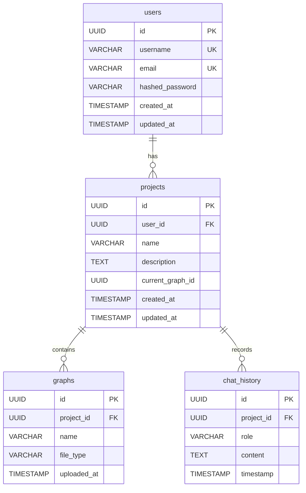

# データベーススキーマ

本システムはポリグロット永続化戦略を採用しており、PostgreSQL、Neo4j、Redisの3種類のデータストアを使用する。それぞれのデータストアの主要なスキーマとデータ構造を以下に記述する。

## 1. PostgreSQLスキーマ

PostgreSQLは、ユーザーアカウント、プロジェクトメタデータ、チャット履歴などのリレーショナルデータを管理する。

### `users` テーブル
- `id` (UUID, Primary Key): ユーザーの一意なID
- `username` (VARCHAR(255), Unique): ユーザー名
- `email` (VARCHAR(255), Unique): メールアドレス
- `hashed_password` (VARCHAR(255)): ハッシュ化されたパスワード
- `created_at` (TIMESTAMP): 作成日時
- `updated_at` (TIMESTAMP): 更新日時

### `projects` テーブル
- `id` (UUID, Primary Key): プロジェクトの一意なID
- `user_id` (UUID, Foreign Key to `users.id`): プロジェクトオーナーのユーザーID
- `name` (VARCHAR(255)): プロジェクト名
- `description` (TEXT): プロジェクトの説明
- `current_graph_id` (UUID, Nullable): 現在選択されているグラフのID
- `created_at` (TIMESTAMP): 作成日時
- `updated_at` (TIMESTAMP): 更新日時

### `graphs` テーブル
- `id` (UUID, Primary Key): グラフデータの一意なID
- `project_id` (UUID, Foreign Key to `projects.id`): 所属するプロジェクトのID
- `name` (VARCHAR(255)): グラフデータの名称
- `file_type` (VARCHAR(50)): 元のファイル形式（例: CSV, JSON）
- `uploaded_at` (TIMESTAMP): アップロード日時

### `chat_history` テーブル
- `id` (UUID, Primary Key): チャット履歴の一意なID
- `project_id` (UUID, Foreign Key to `projects.id`): 所属するプロジェクトのID
- `role` (VARCHAR(50)): メッセージの送信者（例: user, assistant）
- `content` (TEXT): メッセージ内容
- `timestamp` (TIMESTAMP): メッセージ送信日時

## 2. Neo4jデータ構造

Neo4jはグラフのトポロジー（ノード、エッジ、およびそれらのプロパティ）を管理する。

### ノード (Nodes)
- **ラベル**: `Node`
- **プロパティ**:
  - `id` (String, Unique): ノードの一意な識別子（元のデータセットのID）
  - `project_id` (String): 所属するプロジェクトのID
  - `graph_id` (String): 所属するグラフのID
  - その他のユーザー定義プロパティ（例: `name`, `category`, `value`など）

### エッジ (Relationships)
- **タイプ**: `RELATES_TO`, `CONNECTS`, `HAS_INTERACTION`など、グラフデータの意味に応じたタイプ
- **プロパティ**:
  - `project_id` (String): 所属するプロジェクトのID
  - `graph_id` (String): 所属するグラフのID
  - その他のユーザー定義プロパティ（例: `weight`, `type`など）

## 3. Redisデータ構造

Redisは、高速キャッシュ、WebSocket接続状態管理、JWT失効リストなどに使用される。

### 1. 計算済みメトリクスとレイアウト座標
- **キーの命名規則**: `project:{project_id}:graph:{graph_id}:metric:{metric_type}`
  - 例: `project:uuid1:graph:uuid2:metric:degree_centrality`
- **データ型**: Hash (`HSET`)
  - **フィールド**: ノードID
  - **値**: 計算されたメトリクス値（例: `nodeA: 0.5, nodeB: 0.8`）

- **キーの命名規則**: `project:{project_id}:graph:{graph_id}:layout:{layout_type}`
  - 例: `project:uuid1:graph:uuid2:layout:force_directed`
- **データ型**: Hash (`HSET`)
  - **フィールド**: ノードID
  - **値**: レイアウト座標（例: `nodeA: {x: 10, y: 20}, nodeB: {x: 30, y: 40}`）

### 2. WebSocket接続状態
- **キーの命名規則**: `websocket:user:{user_id}`
- **データ型**: Set (`SADD`)
  - **メンバー**: 接続中のWebSocketセッションID（またはサーバーインスタンスIDとセッションIDの組み合わせ）

- **Pub/Subチャンネル**: `channel:user_id:{user_id}`
  - ユーザー固有のチャネルで状態変更をPublish/Subscribeする。

### 3. JWT失効リスト
- **キーの命名規則**: `jwt:blacklist:{jti}`
- **データ型**: String (`SET`)
  - **値**: `true` (失効済みを示す)
  - **TTL (Time To Live)**: リフレッシュトークンの有効期限に合わせる