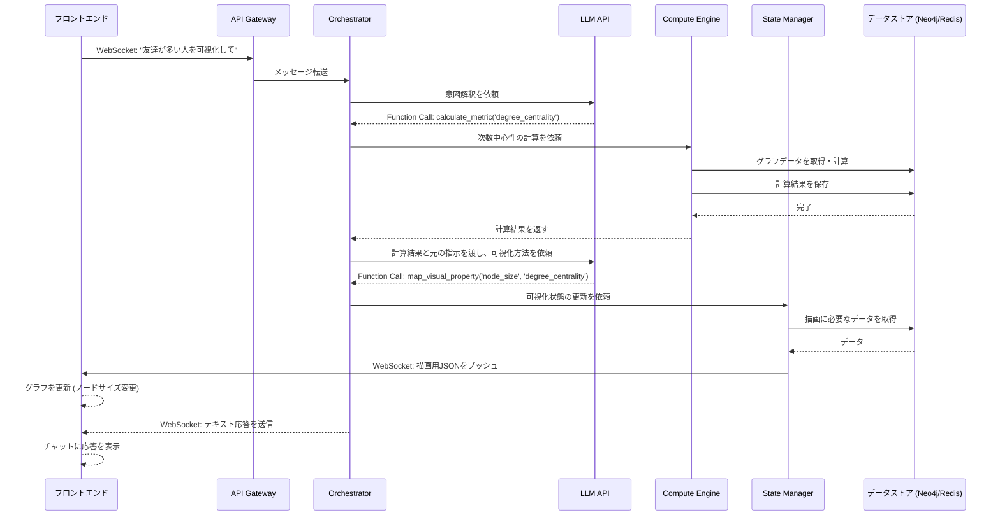

## 4. データフローの具体例

このセクションで説明されているシナリオの詳細は、[6. プロンプト入力から画面更新までの一連のシーケンス](sequence-diagram.md)のシーケンス図を参照してください。

**シナリオ: ユーザーが「友達が多い人を可視化して」と入力**

1.  **フロントエンド**: ユーザー入力をWebSocketで **API Gateway** に送信。
2.  **API Gateway**: 認証後、 **Orchestrator** にメッセージを転送。
3.  **Orchestrator**:
    -   LLMに「"友達が多い人を可視化して"」と問い合わせる。
    -   **LLMがユーザーの意図を解釈し、グラフ分析の必要性を判断** → `Function Call: calculate_metric(metric='degree_centrality')`
4.  **Orchestrator** が **Compute Engine** に「次数中心性」の計算を依頼(Celeryタスクをディスパッチ)。
5.  **Compute Engine**:
    -   **Redis**をチェック(結果はまだ無い)。
    -   **Neo4j**からグラフデータを取得し、次数中心性を計算。
    -   結果を**Redis**に保存。
    -   計算結果を **Orchestrator** に返す。
6.  **Orchestrator**:
    -   LLMに「計算結果は ... です。元の指示は『可視化して』です。」と再度問い合わせる。
    -   **LLMが計算結果と元の指示を総合的に判断し、可視化への反映方法を決定** → 「友達が多い(次数中心性が高い)」を「可視化(サイズ割り当て)」と判断。
    -   LLMが応答 → `Function Call: map_visual_property(property='node_size', metric='degree_centrality')`
7.  **Orchestrator** が **State Manager** に「ノードサイズを次数中心性にマッピング」するよう依頼。
8.  **State Manager**:
    -   内部の可視化状態を `{ node_size: 'degree_centrality' }` に更新。
    -   **Neo4j** (ノードリスト) と **Redis** (次数中心性の値, 既存のレイアウト座標) からデータを取得・マージ。
    -   最終的な描画JSON(差分)を生成し、WebSocketで **フロントエンド** にプッシュする。
9.  **フロントエンド**: 新しい描画JSONを受信し、画面のグラフを更新(ノードサイズが変わる)。
10. **Orchestrator**: (並行して)LLMからのテキスト応答「次数中心性をノードサイズに割り当てました。」をフロントエンドに送信。
11. **フロントエンド**: チャット欄に応答テキストを表示する。

