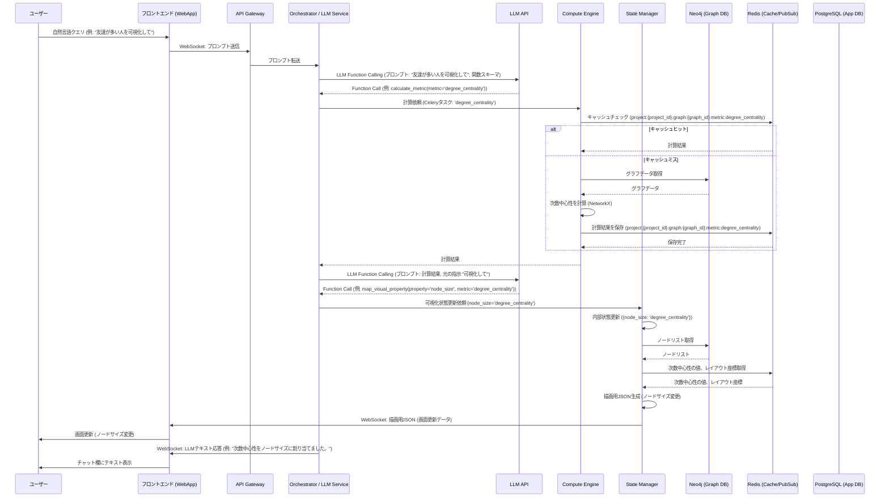

## 6. プロンプト入力から画面更新までの一連のシーケンス

ユーザーが「友達が多い人を可視化して」と入力するシナリオを想定したシーケンス図です。

```mermaid
sequenceDiagram
    participant User as ユーザー
    participant FE as フロントエンド (WebApp)
    participant BE_API as API Gateway
    participant BE_Orch as Orchestrator / LLM Service
    participant LLM as LLM API
    participant BE_Compute as Compute Engine
    participant BE_State as State Manager
    participant Neo4j as Neo4j (Graph DB)
    participant Redis as Redis (Cache/PubSub)
    participant Postgres as PostgreSQL (App DB)

    User->>FE: 自然言語クエリ (例: "友達が多い人を可視化して")
    FE->>BE_API: WebSocket: プロンプト送信
    BE_API->>BE_Orch: プロンプト転送
    BE_Orch->>LLM: LLM Function Calling (プロンプト: "友達が多い人を可視化して", 関数スキーマ)
    LLM-->>BE_Orch: Function Call (例: calculate_metric(metric='degree_centrality'))

    BE_Orch->>BE_Compute: 計算依頼 (Celeryタスク: 'degree_centrality')
    BE_Compute->>Redis: キャッシュチェック (project:{project_id}:graph:{graph_id}:metric:degree_centrality)
    alt キャッシュヒット
        Redis-->>BE_Compute: 計算結果
    else キャッシュミス
        BE_Compute->>Neo4j: グラフデータ取得
        Neo4j-->>BE_Compute: グラフデータ
        BE_Compute->>BE_Compute: 次数中心性を計算 (NetworkX)
        BE_Compute->>Redis: 計算結果を保存 (project:{project_id}:graph:{graph_id}:metric:degree_centrality)
        Redis-->>BE_Compute: 保存完了
    end
    BE_Compute-->>BE_Orch: 計算結果

    BE_Orch->>LLM: LLM Function Calling (プロンプト: 計算結果, 元の指示 "可視化して")
    LLM-->>BE_Orch: Function Call (例: map_visual_property(property='node_size', metric='degree_centrality'))

    BE_Orch->>BE_State: 可視化状態更新依頼 (node_size='degree_centrality')
    BE_State->>BE_State: 内部状態更新 ({node_size: 'degree_centrality'})
    BE_State->>Neo4j: ノードリスト取得
    Neo4j-->>BE_State: ノードリスト
    BE_State->>Redis: 次数中心性の値、レイアウト座標取得
    Redis-->>BE_State: 次数中心性の値、レイアウト座標
    BE_State->>BE_State: 描画用JSON生成 (ノードサイズ変更)
    BE_State->>FE: WebSocket: 描画用JSON (画面更新データ)
    FE->>User: 画面更新 (ノードサイズ変更)

    BE_Orch->>FE: WebSocket: LLMテキスト応答 (例: "次数中心性をノードサイズに割り当てました。")
    FE->>User: チャット欄にテキスト表示
```
