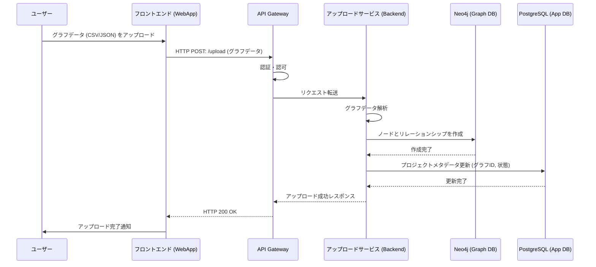

## 7. グラフデータアップロードのシーケンス

ユーザーが初期のグラフデータ（CSV/JSON形式）をシステムにアップロードする際の一連のシーケンスです。

```mermaid
sequenceDiagram
    participant User as ユーザー
    participant FE as フロントエンド (WebApp)
    participant BE_API as API Gateway
    participant BE_Upload as アップロードサービス (Backend)
    participant Neo4j as Neo4j (Graph DB)
    participant Postgres as PostgreSQL (App DB)

    User->>FE: グラフデータ (CSV/JSON) をアップロード
    FE->>BE_API: HTTP POST: /upload (グラフデータ)
    BE_API->>BE_API: 認証・認可
    BE_API->>BE_Upload: リクエスト転送

    BE_Upload->>BE_Upload: グラフデータ解析
    BE_Upload->>Neo4j: ノードとリレーションシップを作成
    Neo4j-->>BE_Upload: 作成完了
    BE_Upload->>Postgres: プロジェクトメタデータ更新 (グラフID, 状態)
    Postgres-->>BE_Upload: 更新完了

    BE_Upload-->>BE_API: アップロード成功レスポンス
    BE_API-->>FE: HTTP 200 OK
    FE->>User: アップロード完了通知
```
