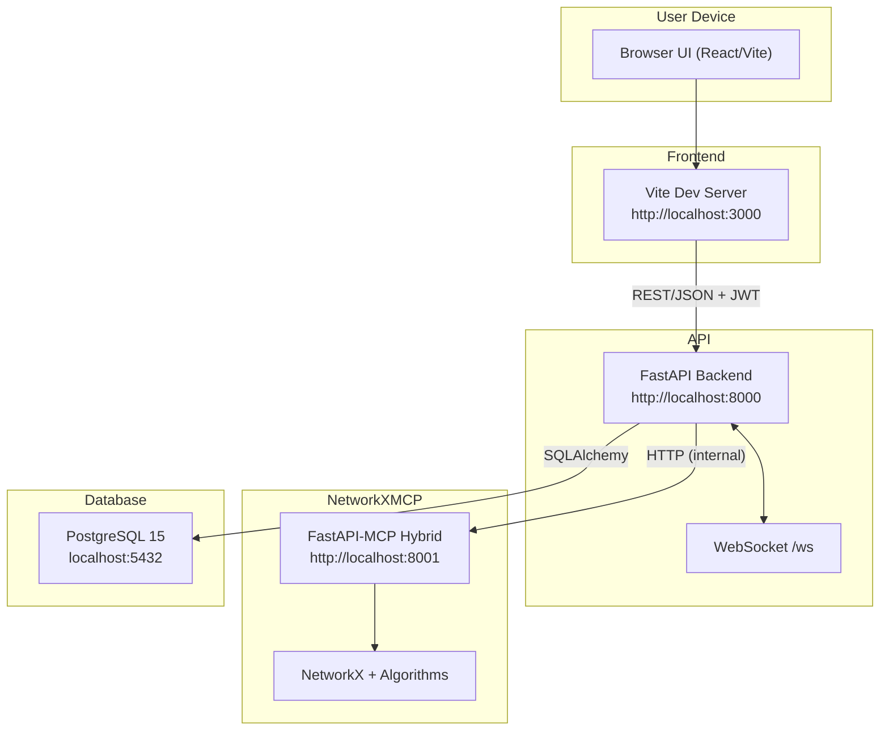
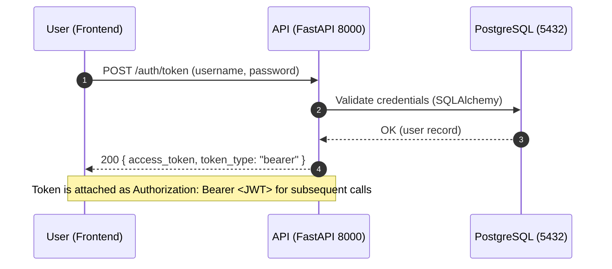
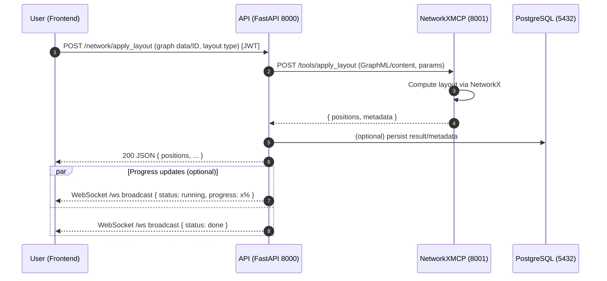
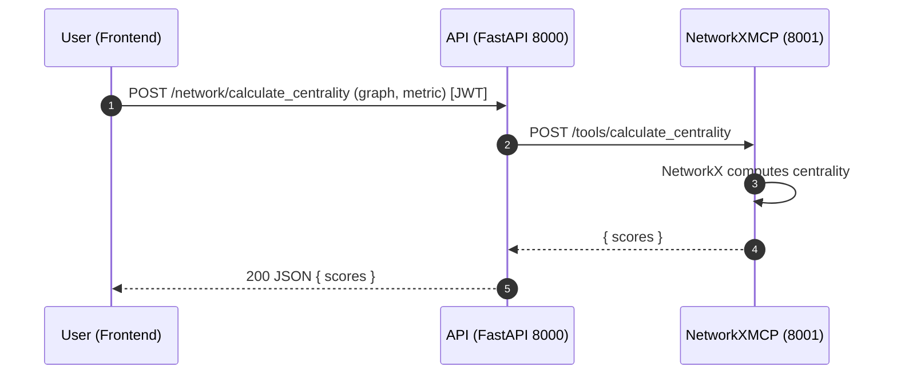

# LLMGraphvis Architecture

This document provides a complete view of the system architecture, including components, deployment topology, mechanisms, data flow, and the end-to-end flow from input to output. It also includes the diagram source so you can render or modify it easily.

## Overview

LLMGraphvis is a containerized, multi-service application for interactive graph analysis and visualization. It consists of:

- Frontend: React + Vite UI (port 3000)
- API: FastAPI backend with auth, chat, network analysis orchestration, and WebSocket notifications (port 8000)
- NetworkXMCP: NetworkX-based analysis server exposing tools/resources following MCP best practices (port 8001)
- Database: PostgreSQL for users, sessions, and persisted artifacts (port 5432)

## System context diagram



Notes

- Services run in Docker; internal service names are resolvable within the compose network (e.g., api -> networkx-mcp).
- The API talks to the analysis service via HTTP using the env var NETWORKX_MCP_URL.

## Deployment topology (Docker Compose)

Relevant excerpt (see `docker-compose.yml`):

- db (postgres:15) → 5432:5432
- api (FastAPI) → 8000:8000; depends_on db (healthy)
- networkx-mcp (FastAPI-MCP) → 8001:8001
- frontend (Vite dev server) → 3000:3000; depends_on api, networkx-mcp

All services mount their source directories for hot reload during development.

## Component responsibilities

- Frontend
  - Auth UI (login), graph upload, layout selection, visualization rendering
  - Calls API endpoints and subscribes to WebSocket for progress/events
- API (FastAPI)
  - Auth (JWT), rate limiting, REST endpoints, WebSocket broadcasting
  - Orchestrates graph operations by calling NetworkXMCP
  - Persists users/metadata in PostgreSQL
- NetworkXMCP
  - Provides tools: network creation, layout computation, centrality metrics, graph I/O, visualization helpers
  - Implements MCP-style tool/resource semantics (FastAPI hybrid)
  - Uses NetworkX for computation
- PostgreSQL
  - System of record for users and application state persisted by the API

## Request lifecycles and data flow

### 1) Authentication (JWT)



### 2) Graph layout computation (input → output)



### 3) Centrality calculation (typical)



## Mechanisms and cross-cutting concerns

- Authentication & Authorization
  - OAuth2 password flow generating JWT; protect API routes via dependencies
  - WebSocket connections require a token as a query parameter; API validates and registers the client in the connection manager
- Rate limiting
  - slowapi configured in `API/main.py`; integrated handler for RateLimitExceeded
- Persistence
  - SQLAlchemy models and migrations bootstrapped on API startup; `init.sql` seeds base schema
- Orchestration
  - API constructs requests to NetworkXMCP using NETWORKX_MCP_URL, passing graph data and algorithm parameters
- Error handling
  - Consistent JSON error responses from API; NetworkXMCP returns structured error payloads for failures (invalid graph, unsupported params)
- Observability
  - Container logs via `docker compose logs`; NetworkXMCP logs to stderr (MCP-friendly); API logs include connection and DB status

## Ports, env vars, and configuration

- Ports
  - Frontend: 3000
  - API: 8000
  - NetworkXMCP: 8001
  - PostgreSQL: 5432

- Key environment variables
  - API
    - DATABASE_URL=postgresql://postgres:postgres@db:5432/graphvis
    - SECRET_KEY=<your-secret>
    - ALGORITHM=HS256
    - ACCESS_TOKEN_EXPIRE_MINUTES=30
    - NETWORKX_MCP_URL=http://networkx-mcp:8001
  - NetworkXMCP
    - LOG_LEVEL=DEBUG (optional)
  - Compose
    - env_file: ./.env for API secrets and DB URL

Example .env (do not commit secrets)

```
DATABASE_URL=postgresql://postgres:postgres@db:5432/graphvis
SECRET_KEY=change-me
ALGORITHM=HS256
ACCESS_TOKEN_EXPIRE_MINUTES=30
NETWORKX_MCP_URL=http://networkx-mcp:8001
```

## Build and run

Development (recommended) using Docker Compose v2

```bash
# Build images
docker compose build

# Start all services
docker compose up -d

# Tail logs
docker compose logs -f

# Service URLs
# Frontend:   http://localhost:3000
# API:        http://localhost:8000 (Swagger: /docs)
# NetworkXMCP:http://localhost:8001 (Swagger: /docs)
```

Testing

```bash
# API tests
docker compose exec api pytest -q

# NetworkXMCP tests
docker compose exec networkx-mcp python -m pytest -q
```

Local development without Docker (optional)

- Ensure Python 3.12+ and Node.js 20+
- API: uv/uvicorn with hot reload
- Frontend: npm dev server
- NetworkXMCP: uv/uvicorn

## Diagram rendering tips

- This document uses Mermaid; GitHub and many Markdown renderers support it natively.
- VS Code: install “Markdown Preview Mermaid Support” extension to preview.
- CLI (optional): `@mermaid-js/mermaid-cli` can export to images.

## Additional references (in-repo)

- docs/README_MCP_ARCHITECTURE.md — MCP server design and best practices
- docs/FASTMCP_MIGRATION.md — FastMCP 2.0 migration notes
- docs/LLM_PROVIDER_GUIDE.md — LLM provider configuration and usage
- docs/README_network_layout.md — Network layout features and parameters
- API/main.py — API wiring, routers, WebSocket manager, rate limiter
- NetworkXMCP/README.md — Analysis service features and endpoints/tools
- docker-compose.yml — Deployment topology and service definitions

## Security considerations

- Keep secrets in `.env` and never commit them
- Use unique `SECRET_KEY` per environment
- Restrict CORS to known origins for production
- Prefer separate DB users/roles for least privilege

## Future improvements

- Background job queue for long-running analyses
- Caching layer for repeated computations
- Structured tracing across API ↔ MCP requests
- Authentication between API and NetworkXMCP for defense in depth

---

Authoritative source of truth for running topology is `docker-compose.yml`. This document aligns with the current `feature/layout` branch configuration and will be updated as services evolve.
