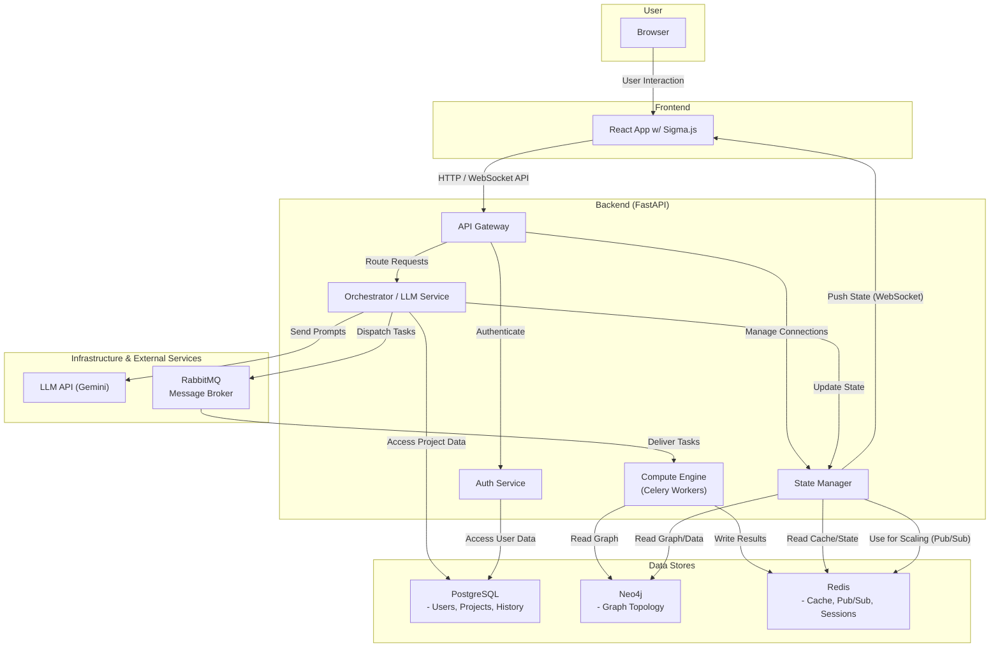

## 2. アーキテクチャ設計

### 2.1. 設計原則

- **厳格な役割分離**: フロントエンドは描画とユーザー入出力のみを担当し、一切の計算処理やビジネスロジックを持たない。
- **バックエンド集中処理**: すべてのビジネスロジック、データ処理、LLM連携、認証はバックエンドで完結させる。
- **ステートフルな可視化**: バックエンドは、ユーザーセッションごとに現在の可視化設定(例：ノードサイズ＝次数中心性)を状態(ステート)として管理する。
- **非同期・ノンブロッキング**: 計算負荷の高い処理は非同期タスクキューで実行し、システムの応答性を確保する。
- **計算結果の永続化**: 一度計算したネットワーク指標やレイアウト座標はデータベースに永続化し、再計算のコストを削減する。
- **セキュリティ・バイ・デザイン**: 認証・認可、およびLLMとの連携において、セキュリティを最優先に考慮した設計を行う。

### 2.2. 高レベルアーキテクチャ

本システムは、単一の技術選定が他の技術選定に影響を与える、相互に関連した要件を持つ。インタラクティブな体験にはリアルタイム更新(**WebSocket**)が不可欠であり、これは非同期フレームワーク(**FastAPI**)で効率的に扱われる。複雑なグラフ分析はバックグラウンドタスク(**Celery**)を必要とし、これも非同期で管理される。このため、システム全体として非同期処理を前提としたコンポーネント群で構成される。

