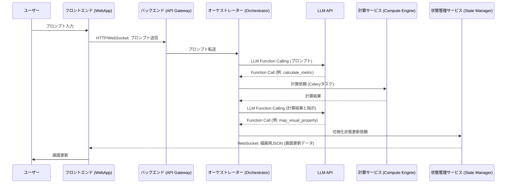

## 6. プロンプト入力から画面更新までの一連のシーケンス

```mermaid
sequenceDiagram
    participant User as ユーザー
    participant FE as フロントエンド (WebApp)
    participant BE_API as バックエンド (API Gateway)
    participant BE_Orch as オーケストレーター (Orchestrator)
    participant LLM as LLM API
    participant BE_Compute as 計算サービス (Compute Engine)
    participant BE_State as 状態管理サービス (State Manager)

    User->>FE: プロンプト入力
    FE->>BE_API: HTTP/WebSocket: プロンプト送信
    BE_API->>BE_Orch: プロンプト転送
    BE_Orch->>LLM: LLM Function Calling (プロンプト)
    LLM-->>BE_Orch: Function Call (例: calculate_metric)
    BE_Orch->>BE_Compute: 計算依頼 (Celeryタスク)
    BE_Compute-->>BE_Orch: 計算結果
    BE_Orch->>LLM: LLM Function Calling (計算結果と指示)
    LLM-->>BE_Orch: Function Call (例: map_visual_property)
    BE_Orch->>BE_State: 可視化状態更新依頼
    BE_State-->>FE: WebSocket: 描画用JSON (画面更新データ)
    FE->>User: 画面更新
```