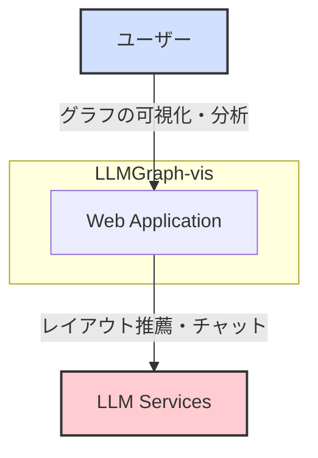
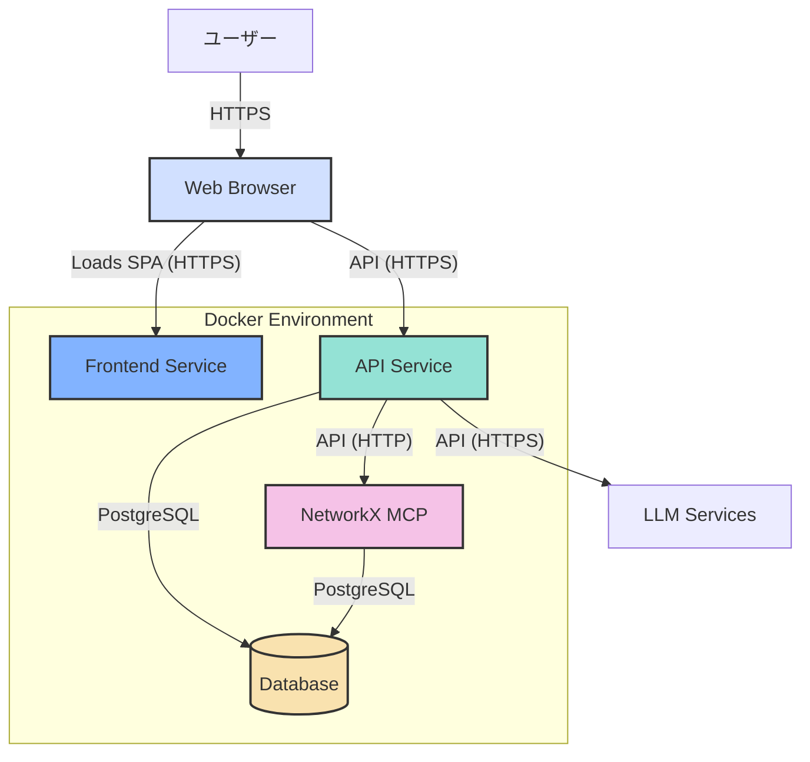

# 1. アーキテクチャ設計

## 1.1. C4モデル

### 1.1.1. コンテキスト図 (Context Diagram)

システム全体の概観を示します。ユーザーがどのようにシステムとやり取りし、どの外部システムと連携するかを表します。

| 要素 | 説明 |
|:---|:---|
| **ユーザー** | グラフの可視化や分析を行う研究者や開発者。 |
| **Web Application** | 本システムのコア機能を提供するWebアプリケーション。 |
| **LLM Services** | グラフのレイアウト推薦やチャット機能のために利用する外部の大規模言語モデルサービス。(OpenAI API, Google Geminiなど) |

### 1.1.2. コンテナ図 (Container Diagram)

アプリケーションを構成する主要なコンテナ（サービス）と、それらの間のデータの流れを示します。

| コンテナ | 説明 | 技術スタック |
|:---|:---|:---|
| **Frontend Service** | ユーザーにUIを提供するためのSPA（Single Page Application）を配信するWebサーバー。 | React, Vite, react-force-graph-2d, Zustand, axios |
| **API Service** | ビジネスロジック、認証、外部API連携を担当するバックエンド。`NetworkXMCP`へのリクエストをプロキシする。 | FastAPI, SQLAlchemy, (LLM SDKs) |
| **NetworkX Model Context Protocol (NetworkXMCP)** | グラフ計算やレイアウト処理に特化した**ステートフルな**計算サービス。データベースに接続し、計算結果をキャッシュする。 | FastAPI, NetworkX, Python, SQLAlchemy |
| **Database** | ユーザー情報、グラフデータ、計算結果のキャッシュなどを永続化するデータベース。 | PostgreSQL |

## 1.2. データ永続化

本システムにおけるデータの永続化は、以下の2つの仕組みによって実現されています。

- **サーバーサイド (Database)**:
    - **技術**: PostgreSQL
    - **永続化されるデータ**:
        - ユーザーアカウント情報（ハッシュ化されたパスワードを含む）
        - 各ユーザーの会話履歴
        - メッセージ（ユーザーの発言、LLMの応答）
        - GraphMLデータ本体
        - 計算結果のキャッシュ（レイアウト座標、中心性指標など）
    - **役割**: アプリケーションのコアとなるデータを安全に保管し、ユーザーセッションを跨いで状態を維持します。

- **クライアントサイド (Web Browser)**:
    - **技術**: `localStorage`
    - **永続化されるデータ**:
        - 認証用のJSON Web Token (JWT)
    - **役割**: ユーザーがアプリケーションを再訪問した際に、再ログインの手間を省き、シームレスな認証状態を維持します。トークンの有効期限が切れた場合は、再認証が要求されます。
