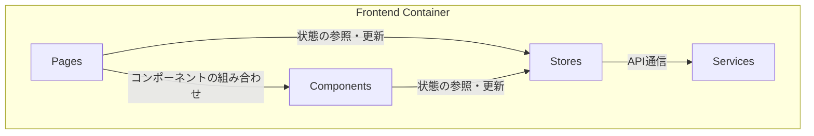

# 2.2. フロントエンド仕様

React (Vite) で構築されたシングルページアプリケーション (SPA)。ユーザーインターフェースの提供とバックエンドAPIとの通信を担います。

## コンポーネント図

| コンポーネント | 説明 |
|:---|:---|
| **Pages** | 各画面（ページ）を構成するコンポーネント。 |
| **Components** | ボタンやナビゲーションバーなど、再利用可能なUI部品。 |
| **Stores** | Zustandを使用してアプリケーション全体の状態（認証、グラフデータ等）を管理する。 |
| **Services** | APIクライアントなど、外部との通信処理をまとめたモジュール。 |

## 画面一覧

| 画面 | パス | 認証 | 説明 |
|:---|:---|:---:|:---|
| **HomePage** | `/` | 不要 | アプリケーションのトップページ。ログインや新規登録への導線。 |
| **LoginPage** | `/login` | 不要 | ログインフォーム画面。 |
| **RegisterPage** | `/register` | 不要 | 新規ユーザー登録フォーム画面。 |
| **NetworkChatPage** | `/chat` | **必要** | グラフ可視化とチャットUIを統合したメイン画面。 |

## 状態管理 (Zustand)

状態は機能ごとにストアに分割されています。

- **`authStore.js`**: ユーザーの認証状態、アクセストークンを管理。`login`, `logout`等のアクションを提供。
- **`networkStore.js`**: 表示中のグラフデータ (Cytoscape形式)、レイアウト情報等を管理。`fetchNetwork`, `calculateLayout`等のアクションを提供。
- **`chatStore.js`**: 会話履歴、メッセージ一覧等を管理。`sendMessage`, `fetchHistory`等のアクションを提供。

## API連携

- `axios`をベースにしたAPIクライアント (`services/api.js`) が、全てのリクエストに認証トークンを付与します。
- トークンが失効している場合は、自動的にログインページにリダイレクトします。
