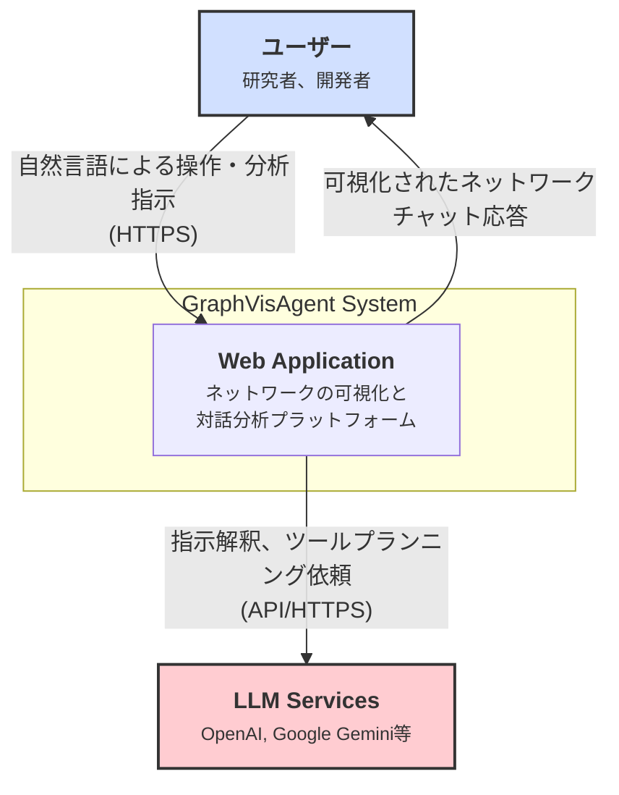

# 0. アーキテクチャ設計

**前提知識レベル:**

- C4モデルに関する基本的な理解
- Webアプリケーションの一般的な構成（フロントエンド、バックエンド、DB）に関する知識

## 0.1. C4モデル

本ドキュメントでは、システムの構造を段階的に理解しやすくするために「C4モデル」という考え方を採用し、概観（コンテキスト）から詳細（コンテナー）へと掘り下げて説明します。

### 0.1.1. コンテキスト図 (Context Diagram)

システム全体の概観を示します。ユーザーがどのようにシステムとやり取りし、どの外部システムと連携するかを表します。



| 要素                | 説明                                                                                             |
| :------------------ | :----------------------------------------------------------------------------------------------- |
| **ユーザー**        | ネットワークの可視化や分析を行う研究者や開発者。                                                 |
| **Web Application** | 本システムのコア機能を提供するWebアプリケーション。                                              |
| **LLM Services**    | ユーザーの指示解釈、ツールプランニング、応答生成のために利用する外部の大規模言語モデルサービス。 |

### 0.1.2. コンテナー図 (Container Diagram)

アプリケーションを構成する主要なコンテナー（サービス）と、それらの間のデータの流れ、および利用技術を示します。

```mermaid
graph TD
    user[ユーザー] -- "HTTPS" --> webBrowser["<div style='font-weight:bold'>Web Browser</div><div style='font-size: 80%;'>SPAクライアント</div>"]

    subgraph "Docker Environment"
        frontendService["<div style='font-weight:bold'>Frontend Service</div><div style='font-size: 80%;'>UIを提供</div>"]
        apiService["<div style='font-weight:bold'>API Service</div><div style='font-size: 80%;'>ビジネスロジック担当</div>"]
        networkXMCP["<div style='font-weight:bold'>NetworkX MCP</div><div style='font-size: 80%;'>ネットワーク計算担当</div>"]
        database[("<div style='font-weight:bold'>Database</div><div style='font-size: 80%;'>データ永続化</div>")]
    end

    llmService[<div style='font-weight:bold'>LLM Services</div><div style='font-size: 80%;'>外部API</div>]

    webBrowser -- "Loads SPA (HTTPS)" --> frontendService
    note for frontendService "<b>Tech Stack:</b><br/>- React, Vite<br/>- Zustand<br/>- react-force-graph-2d<br/>- axios"
    note for apiService "<b>Tech Stack:</b><br/>- FastAPI (Python)<br/>- SQLAlchemy<br/>- Pydantic<br/>- LLM SDKs"
    note for networkXMCP "<b>Tech Stack:</b><br/>- FastAPI (Python)<br/>- NetworkX<br/>- SQLAlchemy"
    note for database "<b>Tech Stack:</b><br/>- PostgreSQL"
    webBrowser -- "API Calls (HTTPS)" --> apiService

    apiService -- "ネットワーク計算依頼 (HTTP)" --> networkXMCP
    apiService -- "データ永続化 (SQL)" --> database
    networkXMCP -- "計算結果の属性を保存 (SQL)" --> database
    apiService -- "LLM呼び出し (HTTPS)" --> llmService

    style webBrowser fill:#d1e0ff,stroke:#333,stroke-width:2px
    style frontendService fill:#82b3ff,stroke:#333,stroke-width:2px
    style apiService fill:#94e2d5,stroke:#333,stroke-width:2px
    style networkXMCP fill:#f5c2e7,stroke:#333,stroke-width:2px
    style database fill:#f9e2af,stroke:#333,stroke-width:2px
```

## 0.2. データ永続化

本システムにおけるデータの永続化は、目的の異なる2つの仕組みによって実現されています。

- **サーバーサイド (Database)**:
  - **目的**: アプリケーションのコアとなるデータを安全に保管し、ユーザーセッションを跨いで状態を維持する。
  - **技術**: PostgreSQL
  - **永続化されるデータ**:
    - ユーザーアカウント情報（ハッシュ化されたパスワードを含む）
    - 各ユーザーの会話履歴
    - メッセージ（ユーザーの発言、LLMの応答）
    - GraphMLデータ本体
    - ネットワークの永続的な属性データ（元データ由来、または計算によって追加されたレイアウト座標や中心性指標など）
  - **補足**: 主要なテーブルの構造については、[データベーススキーマ仕様](./4_Database.md)で詳細を定義しています。

- **クライアントサイド (Web Browser)**:
  - **目的**: ユーザーの利便性向上。再ログインの手間を省き、シームレスな認証状態を維持する。
  - **技術**: `HttpOnly`属性を付与したCookie
  - **永続化されるデータ**:
    - 認証用のJSON Web Token (JWT)
  - **役割**: API Serviceが発行したJWTをブラウザがCookieとして安全に保存する。以降のAPIリクエストでは、ブラウザが自動的にCookieをリクエストヘッダーに含めて送信するため、クライアントサイドのJavaScriptがトークンにアクセスする必要はない。
  - **セキュリティ**: `HttpOnly`属性により、JavaScriptからのCookieへのアクセスが禁止されるため、XSS（クロスサイトスクリプティング）攻撃によるトークン窃取のリスクを大幅に軽減します。これは、`localStorage`を利用する方法よりも安全です。

## 0.3. リアルタイム通信方針

本システムでは、サーバーからクライアントへの非同期な情報通知のために、**WebSocket** を利用します。

- **採用理由**: 双方向通信が可能であり、リアルタイムなデータ更新やインタラクティブな機能（例: LLMの思考プロセスのストリーミング、グラフの動的な更新通知）に柔軟に対応できます。また、共同編集機能など、将来的な拡張性も考慮しています。

- **主な用途**:
  - ネットワーク操作（計算・可視化適用）の完了通知
  - 大規模ネットワークにおけるレイアウト計算などの進捗通知
  - LLMの思考プロセスやツール実行状況のストリーミング

- **将来的な展望**: WebSocketの採用により、共同編集機能など、クライアントからのリアルタイムな双方向通信が必須となる機能の実装が容易になります。

## 0.4. 非機能要件

### 0.4.1. パフォーマンス

- **レンダリングデータ取得API (`/network/{network_id}/visdata`)**:
  - **目標**: 95パーセンタイルのリクエストにおいて、2秒以内にレスポンスを完了する。
  - **条件**: ノード数1,000、エッジ数5,000までのネットワークデータにおいて。
- **LLM連携処理 (`/chat/process`)**:
  - **目標**: ユーザーのメッセージ受信からLLMの最終応答（ストリーミング終了）までの中央値を5秒とする。
  - **補足**: この時間は外部LLMサービスの応答時間に大きく依存するため、あくまで目標値とする。

### 0.4.2. 可用性

- **目標稼働率**: 99.5%
- **メンテナンス**: 定期メンテナンスは事前に通知の上、週末の深夜帯に実施する。

### 0.4.3. 拡張性

- **ステートレス設計**: APIサービスおよびNetworkX MCPはステートレスに設計し、コンテナーの水平スケールアウトを容易にする。
- **非同期処理**: 時間のかかるネットワーク計算（大規模なレイアウト計算など）は、バックグラウンドで非同期に処理し、完了をWebSocketで通知するアーキテクチャを採用する。

### 0.4.4. セキュリティ

- **認証**: [認証仕様](./5_Authentication.md)で定義されたJWTとHttpOnly Cookieによるセキュアな認証方式を実装する。
- **データ保護**: パスワードはハッシュ化して保存し、平文では保持しない。
- **脆弱性対策**: 主要なWeb脆弱性（XSS, CSRF, SQLインジェクション）に対する基本的な対策をフレームワークの機能を用いて実施する。
