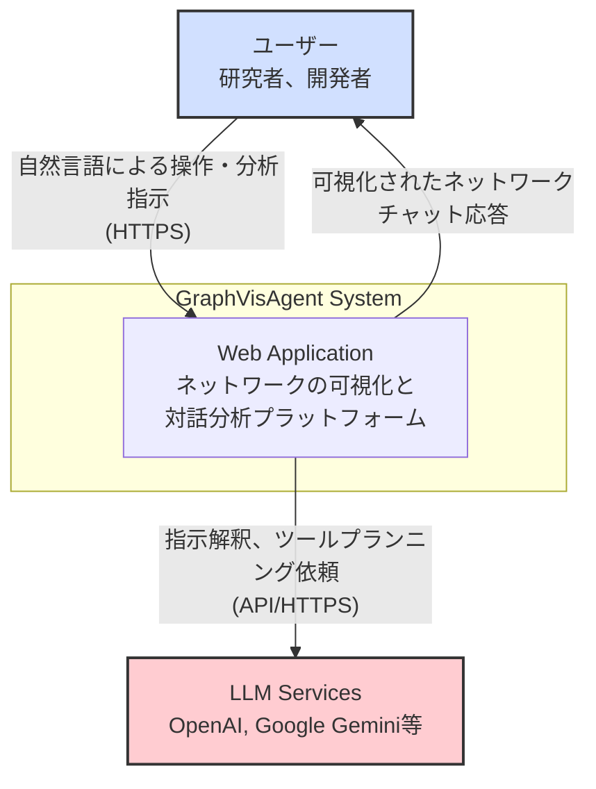
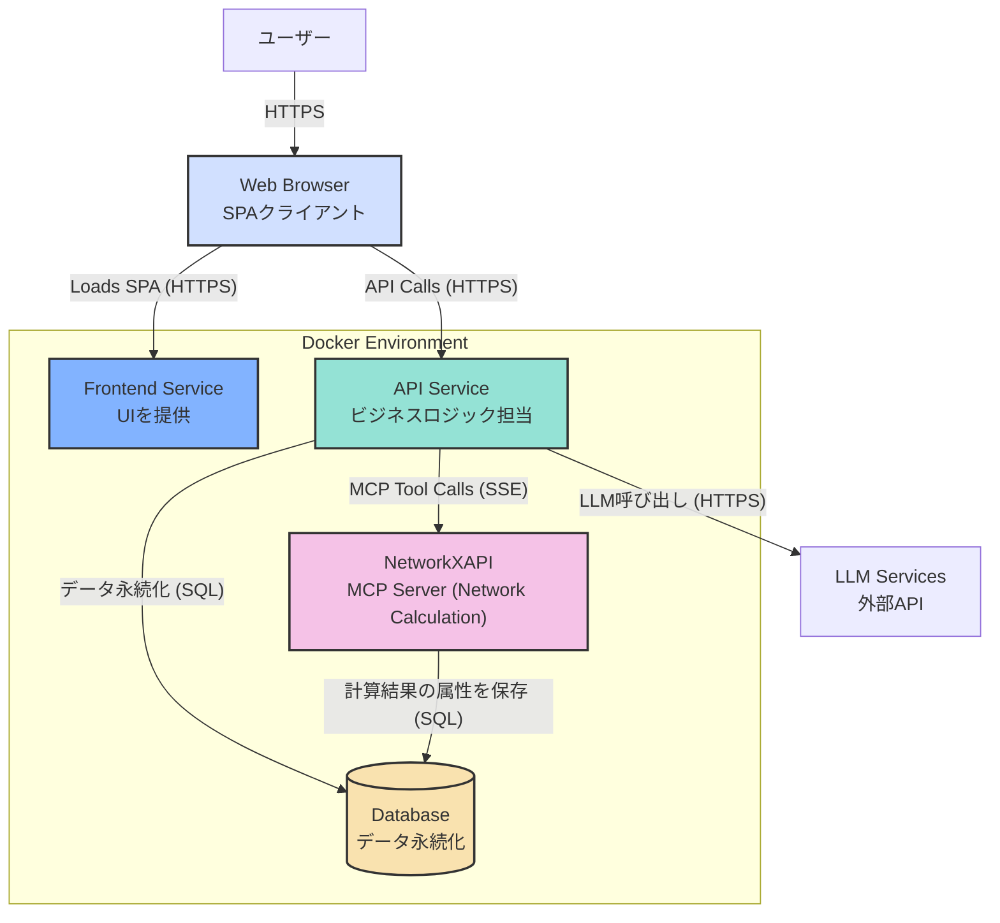
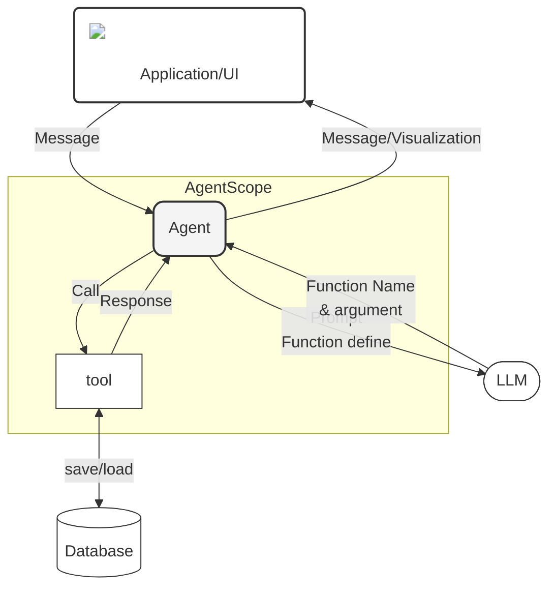

# 0. アーキテクチャ設計

**前提知識レベル:**

- C4モデルに関する基本的な理解
- Webアプリケーションの一般的な構成（フロントエンド、バックエンド、DB）に関する知識

## 0.1. C4モデル

本ドキュメントでは、システムの構造を段階的に理解しやすくするために「C4モデル」という考え方を採用し、概観（コンテキスト）から詳細（コンテナー）へと掘り下げて説明します。

### 0.1.1. コンテキスト図 (Context Diagram)

システム全体の概観を示します。ユーザーがどのようにシステムとやり取りし、どの外部システムと連携するかを表します。

| 要素                | 説明                                                                                             |
| :------------------ | :----------------------------------------------------------------------------------------------- |
| **ユーザー**        | ネットワークの可視化や分析を行う研究者や開発者。                                                 |
| **Web Application** | 本システムのコア機能を提供するWebアプリケーション。                                              |
| **LLM Services**    | ユーザーの指示解釈、ツールプランニング、応答生成のために利用する外部の大規模言語モデルサービス。 |

### 0.1.2. コンテナー図 (Container Diagram)

アプリケーションを構成する主要なコンテナー（サービス）と、それらの間のデータの流れ、および利用技術を示します。

### 0.1.3. エージェントコンセプトモデル (Agent Concept Model)

ユーザー（UI）、LLM、Agent、およびツール間の相互作用の概念モデルを示します。
AgentはLLMを頭脳として利用し、ツールを通じて外部世界（DB等）と作用しながらユーザーの要求に応えます。

## 0.2. データ永続化

本システムにおけるデータの永続化は、目的の異なる2つの仕組みによって実現されています。

- **サーバーサイド (Database)**:
  - **目的**: アプリケーションのコアとなるデータを安全に保管し、ユーザーセッションを跨いで状態を維持する。
  - **技術**: PostgreSQL
  - **永続化されるデータ**:
    - ユーザーアカウント情報（ハッシュ化されたパスワードを含む）
    - 各ユーザーの会話履歴
    - メッセージ（ユーザーの発言、LLMの応答）
    - GraphMLデータ本体
    - ネットワークの永続的な属性データ（元データ由来、または計算によって追加されたレイアウト座標や中心性指標など）
  - **補足**: 主要なテーブルの構造については、[データベーススキーマ仕様](./4_Database.md)で詳細を定義しています。

- **クライアントサイド (Web Browser)**:
  - **目的**: ユーザーの利便性向上。再ログインの手間を省き、シームレスな認証状態を維持する。
  - **技術**: `HttpOnly`属性を付与したCookie
  - **永続化されるデータ**:
    - 認証用のJSON Web Token (JWT)
  - **役割**: API Serviceが発行したJWTをブラウザがCookieとして安全に保存する。以降のAPIリクエストでは、ブラウザが自動的にCookieをリクエストヘッダーに含めて送信するため、クライアントサイドのJavaScriptがトークンにアクセスする必要はない。
  - **セキュリティ**: `HttpOnly`属性により、JavaScriptからのCookieへのアクセスが禁止されるため、XSS（クロスサイトスクリプティング）攻撃によるトークン窃取のリスクを大幅に軽減します。これは、`localStorage`を利用する方法よりも安全です。

## 0.3. リアルタイム通信方針

サーバーからクライアントへの非同期な情報通知には、**HTTP Streaming (Server-Sent Events)** を利用する。

- **採用理由**:
  - **シンプルさ**: WebSocketのような双方向通信プロトコルは、今回の要件に対して過剰である。共同編集機能のようなクライアントからのリアルタイムな操作はスコープ外であり、サーバーからの一方向の通知で十分である。
  - **軽量さと実装の容易さ**: SSEは標準的なHTTP上で動作するため、既存のインフラストラクチャとの親和性が高く、実装が容易である。クライアント側もブラウザ標準の`EventSource` APIで簡単に扱うことができる。
  - **要件への適合**: LLMの思考プロセスのストリーミングや、計算完了通知といった現在の要件は、サーバーからクライアントへのプッシュ通知で完結する。SSEはこれらの要件を効率的に満たす。

- **主な用途**:
  - ネットワーク操作（計算・可視化適用）の完了通知と、更新されたレンダリングデータの送信。
  - 大規模ネットワークにおけるレイアウト計算などの進捗通知。
  - LLMの思考プロセスやツール実行状況のストリーミング。

この決定は、「実装を不必要に複雑にしない」という全体方針に合致する。

## 0.4. 非機能要件

### 0.4.1. パフォーマンス

- **LLM連携処理 (`/chat/process`)**:
  - **目標**: ユーザーのメッセージ受信からLLMの最終応答（ストリーミング終了）までの中央値を5秒とする。
  - **補足**: この時間は外部LLMサービスの応答時間に大きく依存するため、あくまで目標値とする。

### 0.4.2. 可用性

- **目標稼働率**: 99.5%
- **メンテナンス**: 定期メンテナンスは事前に通知の上、週末の深夜帯に実施する。

### 0.4.3. 拡張性

- **ステートレス設計**: APIサービスおよびNetworkXAPIは、セッション情報や計算結果といった状態をサービスインスタンス内に保持しません。すべての状態は外部のデータベースに集約・永続化されるため、各サービスはステートレスなコンポーネントとして動作します。これにより、コンテナーの水平スケールアウトを容易に実現します。
- **非同期処理**: 時間のかかるネットワーク計算（大規模なレイアウト計算など）は、バックグラウンドで非同期に処理し、完了を**Server-Sent Events (SSE)**でクライアントに通知するアーキテクチャを採用します。

### 0.4.4. セキュリティ

- **認証**: [認証仕様](./5_Authentication.md)で定義されたJWTとHttpOnly Cookieによるセキュアな認証方式を実装する。
- **データ保護**: パスワードはハッシュ化して保存し、平文では保持しない。
- **脆弱性対策**: 主要なWeb脆弱性（XSS, CSRF, SQLインジェクション）に対する基本的な対策をフレームワークの機能を用いて実施する。

### 0.4.5. 接続安定性

- **再試行ロジック**: ネットワークの一時的な切断やタイムアウトに対して、フロントエンド側で指数バックオフを用いた自動再試行（リトライ）を行う。
- **タイムアウト設定**: LLM処理などの長時間タスクを考慮し、適切なタイムアウト値を設定する（例: 60秒）。
- **自動復旧**: データベース接続やコンテナの障害時に自動的に再起動・再接続を行う構成とする（Docker restart policy, DB pool pre-ping）。

## 0.5. Agent Policy (Core Principles)

本システムのエージェントは、以下の原則に従って設計・実装される。

### 0.5.1. Chat-Based Visual Analytics
- 従来のWIMPインターフェースをチャット駆動の操作に置き換える。
- エージェントはユーザーの意図をツール呼び出しに変換する実行エンジンとして振る舞う。

### 0.5.2. Minimalism & Precision
- **原則**: ユーザーが明示的に要求したこと「のみ」を実行する。
- **装飾の禁止**: 明示的な指示がない限り、色やサイズなどの視覚属性を自動的に割り当てない（デフォルトはUniform）。
- **例**: "Analyze largest component" という指示に対しては、サブグラフ作成とレイアウト計算のみを行い、勝手な色付けは行わない。

### 0.5.3. User Agency (ユーザー主体性)
- **提案ベース**: 可視化マッピング（色、サイズ）を変更する場合は、適用する前にユーザーに提案を行う。ただし、ユーザーが「見やすくして」のように曖昧に依頼した場合は、エージェントの判断で最適なマッピングを適用して事後報告すること許容される。
- **状態の保存**: 部分的な更新（例：レイアウトのみ変更）を行う際、既存の視覚設定（色など）は可能な限り維持する。 `get_visualization_state` を用いて現在のユーザーが見ている状態を把握してから変更を加える。

### 0.5.4. Action First & Verification
- **即時実行**: 計画を語るだけでなく、可能な限りそのターンでツールを実行する。
- **検証**: 属性に基づいて操作を行う際は、`get_node_attributes` 等を用いてデータの存在確認を行うことが推奨される。
