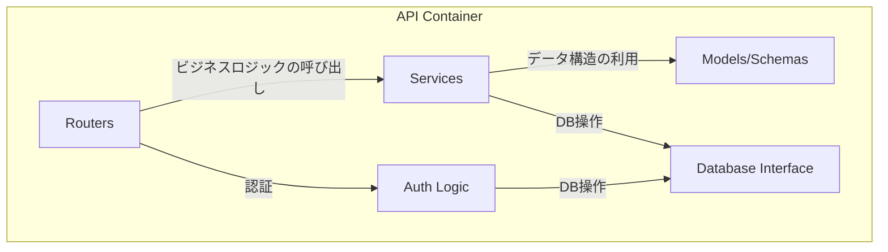
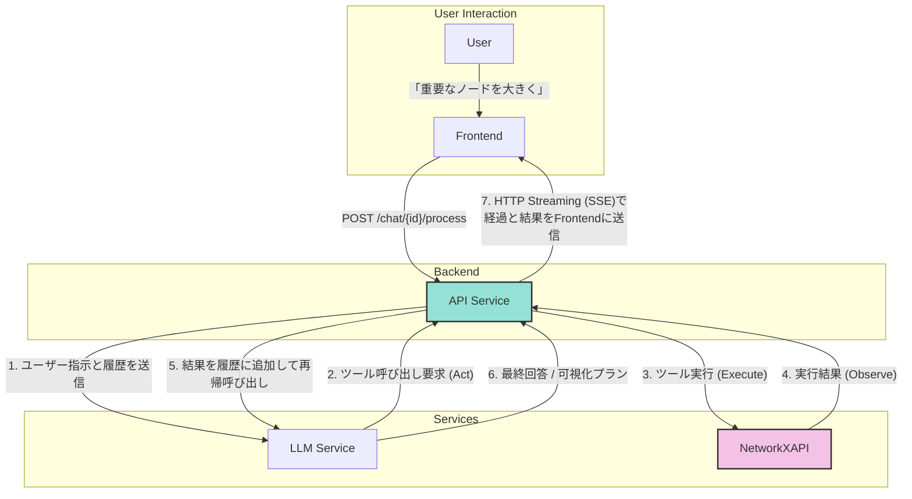

# 1. バックエンド仕様 (API)

**前提知識レベル:**

- FastAPI, Pydantic, SQLAlchemyに関する開発経験
- REST API, OAuth2, JWTに関する知識

FastAPIで構築されたバックエンドAPI。主な責務は、認証、ビジネスロジックの実行、外部サービス連携です。

## 1.1. コンポーネント図



| コンポーネント         | 説明                                                                      |
| :--------------------- | :------------------------------------------------------------------------ |
| **Routers**            | APIエンドポイントを定義し、リクエストを適切なサービスにルーティングする。 |
| **Services**           | ビジネスロジックを実装する。LLMサービス連携やNetworkXAPIの呼び出しなど。  |
| **Models/Schemas**     | Pydanticモデルとデータベーススキーマを定義する。                          |
| **Database Interface** | SQLAlchemyを使用してデータベースとのやり取りを抽象化する。                |
| **Auth Logic**         | OAuth2/JSON Web Tokenによるユーザー認証・認可のロジックを実装する。       |

## 1.2. APIエンドポイント一覧

### 1.2.1. 認証 (`/auth`)

| Method | Path        | 説明                                                            |
| :----- | :---------- | :-------------------------------------------------------------- |
| `POST` | `/register` | 新規ユーザーを登録する。                                        |
| `POST` | `/token`    | ユーザー名とパスワードで認証し、JWTアクセストークンを発行する。 |
| `GET`  | `/users/me` | 現在認証中のユーザー情報を取得する。                            |

### 1.2.2. 運用

| Method | Path      | 説明                             |
| :----- | :-------- | :------------------------------- |
| `GET`  | `/health` | サービスのヘルスチェックを行う。 |

### 1.2.3. チャット・ネットワーク機能 (`/chat`)

| Method | Path                           | 説明                                                                                                                         |
| :----- | :----------------------------- | :--------------------------------------------------------------------------------------------------------------------------- |
| `POST` | `/chat`               | 新しい空のチャットと、それに紐づくネットワークを作成する。レスポンスとして`chat_id`と`network_id`を返す。 |
| `POST` | `/chat/{id}/upload`   | 指定されたチャットに紐づくネットワークのGraphMLデータをアップロードする。処理は非同期で実行される。 |
| `GET`  | `/chat`               | ユーザーのチャット一覧を取得する。                                                                                               |
| `GET`  | `/chat/{id}`          | 特定のチャットの詳細（関連するネットワーク情報と**現在の可視化データ**を含む）を取得する。                                                              |
| `GET`  | `/chat/{id}/messages` | 特定のチャットのメッセージ一覧を取得する。                                                                                       |
| `POST` | `/chat/{id}/process`           | 特定のチャットのコンテキストでメッセージを処理し、LLMやツール呼び出しを実行する。                                          |
| `GET`  | `/chat/{id}/stream`   | Server-Sent Events (SSE) の接続を確立するエンドポイント。                                                                    |
| `GET`  | `/chat/{id}/stream`   | Server-Sent Events (SSE) の接続を確立するエンドポイント。                                                                    |
| `GET`  | `/chat/{id}/export`   | チャットに対応するネットワークをGraphMLファイルとしてダウンロードする。                                                        |

### 1.2.4. ネットワーク操作 (`/networks`)

チャットに紐づくネットワークに対して、サブグラフ作成や分析を行うエンドポイント群です。これらの操作を実行するには、そのネットワーク（またはその親）に紐づくチャットの所有権が必要です。

| Method | Path | 説明 |
| :----- | :--- | :--- |
| `GET` | `/networks/{network_id}/subgraphs` | 親ネットワークから作成されたサブグラフの一覧を取得する。 |
| `POST` | `/networks/{network_id}/subgraphs/ego` | 指定ノードを中心としたEgo Network（指定ホップ数以内のノード群）を作成する。 |
| `POST` | `/networks/{network_id}/subgraphs/from_nodes` | 指定されたノードIDのリストからサブグラフを作成する。 |
| `POST` | `/networks/{network_id}/subgraphs/path` | 指定された2ノード間の最短経路をサブグラフとして作成する。 |
| `POST` | `/networks/{network_id}/subgraphs/k_core` | K-Core（次数k以上のノード群）を抽出し、サブグラフを作成する。 |
| `POST` | `/networks/{network_id}/subgraphs/largest_component` | 最大連結成分を抽出し、サブグラフを作成する。 |
| `POST` | `/networks/{network_id}/subgraphs/component_containing_node` | 指定されたノードを含む連結成分を抽出し、サブグラフを作成する。 |
| `GET` | `/networks/{network_id}/nodes/top` | 指定された中心性指標（degree, betweenness等）に基づいて、上位k個のノードを取得する。 |

#### `/chat/{id}/process` の詳細

- **Request Body:**

```json
{
  "message": {
    "content": "次数中心性を計算して、重要なノードを大きく表示してください。"
  }
}
```

- **Response:**
  - Status Code: `202 Accepted`

```json
{
  "status": "accepted"
}
```

※ 実際のLLMからの応答メッセージは、SSE (`/chat/{id}/stream`) の `message` イベントを通じて非同期に送信されます。

このエンドポイントが呼び出された際の、Backend、LLM、NetworkXAPI間のより詳細な連携フローについては、以下のドキュメントを参照してください。

- **[6. 主要な処理フローとデータ生成](./6_Core_Workflows.md)**: 全体のやり取りをシーケンス図で解説しています。このシーケンス図が、フロントエンドとバックエンド間の非同期通信における唯一の信頼できる情報源（Single Source of Truth）となります。

### 1.3. Backendの役割: LLMとツールのオーケストレーター

新アーキテクチャにおいて、Backendの役割はレンダリングデータを自ら組み立てることではなく、LLMと専門ツール（NetworkXAPI）間の指示を調整する**オーケストレーター（指揮者）**に特化します。

Backendは、ユーザーの入力に対して「思考(Think) → 行動(Act) → 観察(Observe)」のサイクル（ReActループ）を実行します。これにより、LLMはツール実行結果を見て次のアクションを決定できるため、動的柔軟な対応が可能になります。

#### データ変換フロー図



プロセスは以下のステップで実行されます。詳細は **[6. 主要な処理フローとデータ生成](./6_Core_Workflows.md)** の「6.13. LLMツール実行ループとコンテキスト管理詳細」を参照してください。

1.  **Thinking & Planning**:
    - Backendはユーザーの入力をLLMに渡します。
    - LLMはシステムプロンプトに従い、まず「何をするべきか」を思考し、必要なツール（`list_node_attributes`など）を選択します。

2.  **Tool Execution Loop**:
    - BackendはLLMが要求したツール（MCPツールまたはローカルツール）を実行します。
    - **Context Awareness**: 実行時に現在の `network_id` を自動的に注入します。
    - **Verification First**: LLMは計算や可視化の前に、必ず `read_resource` や `list_attributes` を呼び出してデータの存在確認を行うよう指示されています。

3.  **Visualization & Response**:
    - LLMが `generate_visualization` を呼び出すと、NetworkXAPIがレンダリングデータを生成します。
    - Backendはこのデータを即座にSSEでクライアントにプッシュします。
    - 最後にLLMが生成したテキスト（考察や説明）をユーザーに送信します。

この設計により、Backendは視覚化の具体的なロジックに関与せず、LLMの知能とNetworkXAPIの計算能力を最大限に引き出すことに集中できます。


### 1.3.1. Context Injection Mechanism

LLMが「現在のネットワーク状態」を正確に把握し、効率的にツールを選択できるよう、Backendは独自の**コンテキスト注入メカニズム**を実装しています。

- **概要**: ユーザーの各メッセージの直前に、現在のネットワークのメタ情報（ID, ノード数, エッジ数, 利用可能な属性リスト）を自動的に挿入します。
- **目的**:
  1.  **Verification Firstの高速化**: 属性リストが既に提示されているため、単純な可視化指示であれば `read_resource` による確認ステップをスキップ可能にします。
  2.  **ハルシネーション防止**: 存在しない属性を使用しようとするLLMのミスを防ぎます。
  3.  **状態追従**: サブグラフへのコンテキスト切り替えが発生した場合でも、次のターンで最新のサブグラフ情報が注入されるため、LLMは常に正しい対象を分析できます。

**注入される情報の例:**

```text
[Current Network Context]
Network ID: 5
Stats: 150 Nodes, 300 Edges
Available Node Attributes:
- department (string)
- tenure (integer)
```

### 1.3.2. Skills (手続き知識の外部化)

エージェントの振る舞いに関する指示は、性質によって置き場所を分ける。

| 種別 | 置き場所 | 適用 |
|:---|:---|:---|
| 常に真である方針（役割・最小主義・ユーザー主体性・ツール実行規則） | `app/services/llm/prompts.py` | 毎ターン |
| 手続き知識（分析の進め方・可視化の割り当て方・レイアウト調整・エラー回復） | `app/services/llm/skills/definitions/*.md` | 必要時のみ |

**動機**: 以前は `prompts.py` が「部分グラフ作成戦略」「レイアウトのチューニング
パラメータ一覧」といった手続き書を、リクエストの内容に関係なく全量注入していた。
ノード数を尋ねるだけの質問でも全ての手順書が送られていた。

**プログレッシブ・ディスクロージャ**:
1. システムプロンプトにはスキルの**索引**（名前と1行説明）のみを載せる。
2. モデルは `skill_load(name)` ツールで必要な手順書の本文を取得する。
3. `TURN_START` フックがユーザー発話とスキルの `triggers` を突き合わせ、
   関連しそうなスキル名を1行だけ示唆する。索引は常に存在するので、キーワードが
   外れてもモデルは自力で選べる（示唆は誘導であって門番ではない）。

**効果**: 常時プロンプトが 16,217 → 7,496 文字（53.8% 削減）。一方で手順書は
合計 23,358 文字と以前より充実し、必要なターンでのみ読み込まれる。

**スキルの定義形式**: Markdown + 最小限の frontmatter（`name`, `description`,
`triggers`, `related_tools`）。`definitions/` に置けば自動的に検出される。
`triggers` には**日英両方**のキーワードを必ず含める。本アプリの利用者は日本語を
書くため、英語のみの trigger リストは日本語リクエストから不可視になる
（`tests/test_skills_loader.py` がこれを検査する）。

現在のスキル: `conversation-flow`, `analysis-planning`, `visual-encoding`,
`layout-tuning`, `subgraph-workflow`, `error-recovery`。

### 1.3.3. Hooks (実行時の強制と副作用)

プロンプトの文章は無視され得る。安全上の制約と副作用は、エージェントループの
各点で発火する**登録式フック**として機構化する（`app/services/llm/hooks/`）。

| イベント | 発火点 | できること |
|:---|:---|:---|
| `TURN_START` | 最初の generate() 前に1回 | システムプロンプトへのブロック追加 |
| `PRE_TOOL` | 全ツール呼び出しの直前 | **許可 / 引数の修正 / 拒否** |
| `POST_TOOL` | 呼び出し成功後 | 描画、表示ネットワークの切替 |
| `TOOL_ERROR` | 失敗または拒否の後 | ターンの中断 |
| `NO_TOOL_CALLS` | ツールを呼ばずに終わろうとした時 | もう1周の要求 |
| `TURN_END` | ループ終了後に1回 | ターン集計のログ出力 |

**優先度帯**（昇順に実行）:

```
10-39  normalize     引数の書き換え
40-69  guards        検証と拒否（修正後の引数を見る）
90-100 audit         集計とログ
```

順序は本質的である。ガードは正規化後の引数を検証しなければならない。

**拒否の意味論**: `PRE_TOOL` が `deny` を返した場合、エンジンはツールを呼ばず、
`{"error": 理由, "blocked_by": フック名}` を**通常のツール結果として履歴に積む**。
モデルは理由を読んで次のイテレーションで自己修正できる。例外ではないため会話は
継続し、かつプロンプトの指示と違って迂回できない。

**フックは fail-open**: 例外を投げたフックはログと集計に記録された上で「意見なし」
として扱う。1つのガードのバグが全ツール呼び出しを止めることを防ぐため。

**組み込みフック**:

| フック | イベント | 役割 |
|:---|:---|:---|
| `normalize_network_id` | PRE | 現在のネットワークIDを補完（以前は `engine.py` に直書き） |
| `normalize_attribute_case` | PRE | 大文字小文字のみの差異を補正。曖昧な場合は補正せずガードに委ねる |
| `normalize_numeric_params` | PRE | 範囲外の数値をクランプし、補正内容を結果に注記する |
| `guard_repeat_call` | PRE | 同一ツール・同一引数の反復を拒否 |
| `guard_expensive_computation` | PRE | 閾値超のグラフに対する超線形計算を拒否し、代替を提示 |
| `guard_attribute_exists` | PRE | 存在しない属性名での呼び出しを拒否し、実在する候補を列挙 |
| `guard_consecutive_failures` | ERROR | 同一ツールの連続失敗でターンを中断 |
| `on_new_network_id` / `on_view_switch` / `on_label_update` / `on_visualization_payload` | POST | 描画と表示切替（以前の `_handle_side_effects` の if/elif を置換） |
| `nudge_stalled_intent` / `force_final_summary` | NO_TOOL_CALLS | 宣言のみで終わったターンの継続要求 |
| `inject_skill_index` / `inject_skill_suggestions` / `inject_iteration_budget` | START | プロンプトへの文脈追加 |

**`guard_expensive_computation` の意義**: ツール実行経路にはタイムアウトが一切
存在しない。大規模グラフへの媒介中心性計算はリクエストを占有し続け、利用者には
チャットのハングとして現れる。このガードは実行前に拒否し、近似パラメータ（`k`）
や代替指標を案内する。環境変数 `AGENT_EXPENSIVE_NODE_THRESHOLD`（既定 2000）と
`AGENT_EXPENSIVE_GUARD_ENABLED` で調整・無効化できる。

**`nudge_stalled_intent` について**: 「次に…します」と宣言してツールを呼ばずに
終わるケースを検出する。以前の実装は `will` / `let me` という英語キーワードのみを
見ており、本アプリの主要 UX 言語である日本語では**一度も機能していなかった**。
現在は日英双方のパターンを持つ。ただし本質的にヒューリスティックであり、
「提案して承認を待つ」のは `conversation-flow` が求める正当な完結ターンなので、
疑問形・選択肢提示を検出した場合は発火しない。継続はターンあたり1回まで。

## 1.4. 主要なデータモデル (Pydantic Schemas)

APIで送受信される主要なデータ構造です。

- **User**

| フィールド名 | 型    | 説明                        |
| :----------- | :---- | :-------------------------- |
| `id`         | `int` | ユーザーID (Auto-increment) |
| `username`   | `str` | ユーザー名                  |

- **Token**

| フィールド名   | 型    | 説明                        |
| :------------- | :---- | :-------------------------- |
| `access_token` | `str` | JWTアクセストークン         |
| `token_type`   | `str` | トークン種別 (例: "bearer") |

- **Chat**

| フィールド名 | 型         | 説明                           |
| :----------- | :--------- | :----------------------------- |
| `id`         | `int`      | 会話ID                         |
| `name`       | `str`      | 会話のタイトル                 |
| `user_id`    | `int`      | この会話を所有するユーザーのID |
| `network_id` | `int`      | 関連するネットワークのID（**現在のアクティブなコンテキスト**）。サブグラフ分析中は、そのサブグラフのIDに更新されます。       |
| `created_at` | `datetime` | 作成日時                       |
| `updated_at` | `datetime` | 更新日時                       |

- **ChatMessage**

| フィールド名      | 型         | 説明                                 |
| :---------------- | :--------- | :----------------------------------- |
| `id`              | `int`      | メッセージID                         |
| `chat_id` | `int`      | 所属するチャットのID                     |
| `role`            | `str`      | 発言者の役割 (`user` or `assistant`) |
| `content`         | `str`      | メッセージの本文                     |
| `meta_data`       | `dict`     | 拡張用のメタデータ (JSON)            |
| `created_at`      | `datetime` | 作成日時                             |

- **Network** (DBモデル)

`networks`テーブルのスキーマ定義は、このドキュメント群における唯一の信頼できる情報源（Single Source of Truth）である **[4. データベーススキーマ仕様](./4_Database.md)** を参照してください。

`chats`テーブルが`network_id`を保持し、`networks`テーブルへの1対1の参照を持ちます。

## 1.5. 外部サービス連携

- **NetworkXAPI**: グラフ計算と可視化データ生成のために、MCP (Model Context Protocol) サーバーとして接続します。通信は `http://networkx-api:8001/mcp/sse` への SSE 接続を通じて行われます。`app/services/llm/mcp_client.py` がクライアントとして機能します。
- **LLMサービス**: ユーザーの指示解釈、ツールコール変換、結果の要約のために外部LLM（Google Gemini 2.5 Flash）のAPIを呼び出します。Google AI Studio (API Key) と Vertex AI の両方をサポートしています。`VERTEX_PROJECT_ID` 環境変数が設定されている場合、自動的に Vertex AI が使用されます。

## 1.6. エラーハンドリング

APIは、エラー発生時にHTTPステータスコードと、詳細情報を含むJSONオブジェクトを返却します。

- **エラーレスポンス形式:**

```json
{
  "detail": {
    "error_code": "RESOURCE_NOT_FOUND",
    "message": "指定されたチャットが見つかりません。",
    "context": {
      chat_id: "unknown_id"
    }
  }
}
```

| フィールド名 | 型     | 説明                                         |
| :----------- | :----- | :------------------------------------------- |
| `error_code` | `str`  | エラーの種類を一意に識別するコード。         |
| `message`    | `str`  | 開発者向けのエラー詳細メッセージ。           |
| `context`    | `dict` | エラーが発生した際の関連情報（デバッグ用）。 |

- **主要なHTTPステータスコード:**

| コード                      | 説明                                                                   | 主な用途 |
| :-------------------------- | :--------------------------------------------------------------------- | :------- |
| `400 Bad Request`           | リクエストの形式が不正（例: 必須パラメータの欠如、データ型の不一致）。 |
| `401 Unauthorized`          | 認証が必要なリソースに対し、認証なしでアクセスした場合。               |
| `403 Forbidden`             | 認証済みだが、リソースへのアクセス権限がない場合。                     |
| `404 Not Found`             | 指定されたリソースが存在しない場合。                                   |
| `500 Internal Server Error` | サーバー内部で予期せぬエラーが発生した場合。                           |

## 1.7. 内部実装構造 (Refactoring Notes)

### 1.7.1. LLM Engine (`app.services.llm.engine`)
- **目的**: 複雑化していたツール実行ループとストリーミング処理を整理するため、`execute_tool_loop` 関数を機能単位で分割しました。
- **構成**:
  - `_consume_stream`: LLMからのストリーミングレスポンスを消費し、テキストチャンクの送信と関数呼び出しの集約を行う。
  - `_execute_tool_loop`: ReAct ループ本体。イテレーションごとにストリーム消費 → ツール並列実行 → 次の生成を行う。
  - `_run_tool_with_events`: 1ツール分のラッパー。`PRE_TOOL` フックの実行、拒否時の短絡、SSEイベントの送出を担う。
  - `_dispatch_tool_hooks`: ツール単位イベント（PRE / POST / ERROR）の `HookContext` 構築とディスパッチ。
  - `_run_tool`: Local ツールと MCP ツールの振り分けのみを行う。
- **フックへ移譲された処理**: 以前この層に直書きされていた副作用（自動描画・
  ネットワーク切替・`network_id` 補完・宣言のみで終わったターンの検出・強制
  サマリ生成）は全て `app.services.llm.hooks.builtin` に移設された。1.3.3 を参照。
- **ターン状態**: `hooks.new_turn_state()` が生成する辞書を1ターン通して共有し、
  反復呼び出しカウント・失敗カウント・中断フラグ・現在のネットワークIDを保持する。

### 1.7.2. Emitters (`app.services.llm.emitters`)
SSEイベントの送出関数群。フックはキューを持つがエージェントのインスタンスを
持たないため、エンジンとフックが同一のイベント形状を送れるよう切り出されている。
フロントエンド側の契約は `frontend/src/hooks/useChatConnection.js` を参照。
