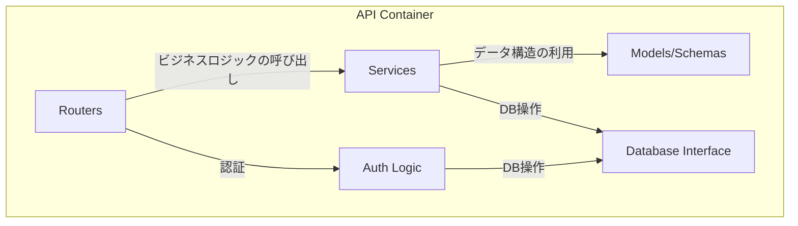
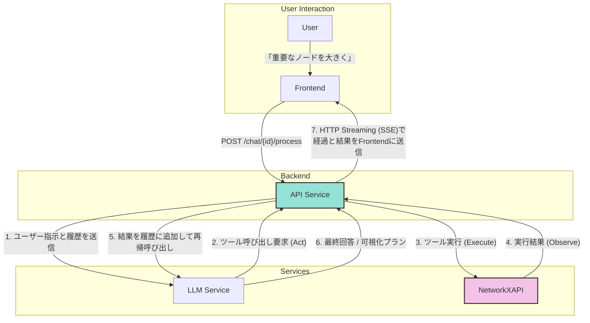

# 1. バックエンド仕様 (API)

**前提知識レベル:**

- FastAPI, Pydantic, SQLAlchemyに関する開発経験
- REST API, OAuth2, JWTに関する知識

FastAPIで構築されたバックエンドAPI。主な責務は、認証、ビジネスロジックの実行、外部サービス連携です。

## 1.1. コンポーネント図



| コンポーネント         | 説明                                                                      |
| :--------------------- | :------------------------------------------------------------------------ |
| **Routers**            | APIエンドポイントを定義し、リクエストを適切なサービスにルーティングする。 |
| **Services**           | ビジネスロジックを実装する。LLMサービス連携やNetworkXAPIの呼び出しなど。  |
| **Models/Schemas**     | Pydanticモデルとデータベーススキーマを定義する。                          |
| **Database Interface** | SQLAlchemyを使用してデータベースとのやり取りを抽象化する。                |
| **Auth Logic**         | OAuth2/JSON Web Tokenによるユーザー認証・認可のロジックを実装する。       |

## 1.2. API の設計方針

エンドポイントの一覧・シグネチャ・スキーマは FastAPI が実装から生成する。**唯一の情報源は `/docs`（OpenAPI）と `backend/app/api/` である。** ここでは、その形を決めている方針だけを述べる。

### 1.2.1. 分析操作は「チャットの所有権」で認可する

ネットワークとサブグラフは常に何らかのチャットに紐づく。ネットワークに対する操作の認可は、ネットワーク自身ではなく **そのネットワーク（またはその祖先）を保持するチャットの所有者であるか** で判定する。サブグラフは親を辿れるため、この一本の規則だけで階層全体の認可が閉じる。ネットワーク単位の ACL を持たないのはこのためである。

### 1.2.2. LLM 処理は受理と結果配信を分離する

対話処理の起動は即座に受理を返し、実際の応答・思考・可視化更新は SSE ストリームで届ける。LLM とツール実行の所要時間は事前に見積もれず、HTTP のリクエスト／レスポンスに載せるとタイムアウトと再送の設計が必要になるためである。

したがって **対話処理の HTTP レスポンスには結果が含まれない**。結果は必ずストリーム側に現れる。この非対称性がフロントエンドとの契約の中核であり、[2_Frontend.md](./2_Frontend.md) と [6_Core_Workflows.md](./6_Core_Workflows.md) で定義する。

### 1.2.3. サブグラフ操作は MCP ツールと REST の両方から届く

同じサブグラフ生成ロジックに、エージェント経由（MCP ツール）と直接操作（REST）の 2 つの入口がある。ロジックは `networkx-api/app/logic/` に一本化し、両者はその薄い入口として実装する。片方にしか存在しない機能を作らないこと。

#### 非同期契約の確認

対話処理の呼び出しは受理のみを返し、応答・思考・可視化更新は SSE ストリームに現れる。リクエストとレスポンスの正確な形は OpenAPI を参照すること。

この非同期のやり取りの全体像は **[6. 主要な処理フローとデータ生成](./6_Core_Workflows.md)** のシーケンス図で定義する。フロントエンドとバックエンド間の非同期通信については、この図が唯一の信頼できる情報源（Single Source of Truth）となる。

### 1.3. Backendの役割: LLMとツールのオーケストレーター

新アーキテクチャにおいて、Backendの役割はレンダリングデータを自ら組み立てることではなく、LLMと専門ツール（NetworkXAPI）間の指示を調整する**オーケストレーター（指揮者）**に特化します。

Backendは、ユーザーの入力に対して「思考(Think) → 行動(Act) → 観察(Observe)」のサイクル（ReActループ）を実行します。これにより、LLMはツール実行結果を見て次のアクションを決定できるため、動的柔軟な対応が可能になります。

#### データ変換フロー図



プロセスは以下のステップで実行されます。詳細は **[6. 主要な処理フローとデータ生成](./6_Core_Workflows.md)** の「6.13. LLMツール実行ループとコンテキスト管理詳細」を参照してください。

1.  **Thinking & Planning**:
    - Backendはユーザーの入力をLLMに渡します。
    - LLMはシステムプロンプトに従い、まず「何をするべきか」を思考し、必要なツール（`network_list_node_attributes` など）を選択します。

2.  **Tool Execution Loop**:
    - BackendはLLMが要求したツール（MCPツールまたはローカルツール）を実行します。
    - **Context Awareness**: 実行時に現在の `network_id` を自動的に注入します（PRE フックが担当。1.3.3 参照）。
    - **Verification First**: LLMは計算や可視化の前に、必ず `read_resource` や `network_list_node_attributes` を呼び出してデータの存在確認を行うよう指示されています。

3.  **Visualization & Response**:
    - LLMが `visualization_generate` を呼び出すと、NetworkXAPIがレンダリングデータを生成します。
    - Backendはこのデータを即座にSSEでクライアントにプッシュします。
    - 最後にLLMが生成したテキスト（考察や説明）をユーザーに送信します。

この設計により、Backendは視覚化の具体的なロジックに関与せず、LLMの知能とNetworkXAPIの計算能力を最大限に引き出すことに集中できます。


### 1.3.1. Context Injection Mechanism

LLMが「現在のネットワーク状態」を正確に把握し、効率的にツールを選択できるよう、Backendは独自の**コンテキスト注入メカニズム**を実装しています。

- **概要**: ユーザーの各メッセージの直前に、現在のネットワークのメタ情報（ID, ノード数, エッジ数, 利用可能な属性リスト）を自動的に挿入します。
- **目的**:
  1.  **Verification Firstの高速化**: 属性リストが既に提示されているため、単純な可視化指示であれば `read_resource` による確認ステップをスキップ可能にします。
  2.  **ハルシネーション防止**: 存在しない属性を使用しようとするLLMのミスを防ぎます。
  3.  **状態追従**: サブグラフへのコンテキスト切り替えが発生した場合でも、次のターンで最新のサブグラフ情報が注入されるため、LLMは常に正しい対象を分析できます。

**注入される情報の例:**

```text
[Current Network Context]
Network ID: 5
Stats: 150 Nodes, 300 Edges
Available Node Attributes:
- department (string)
- tenure (integer)
```

### 1.3.2. Skills (手続き知識の外部化)

エージェントの振る舞いに関する指示は、性質によって置き場所を分ける。

| 種別 | 置き場所 | 適用 |
|:---|:---|:---|
| 常に真である方針（役割・最小主義・ユーザー主体性・ツール実行規則） | `app/services/llm/prompts.py` | 毎ターン |
| 手続き知識（分析の進め方・可視化の割り当て方・レイアウト調整・エラー回復） | `app/services/llm/skills/definitions/*.md` | 必要時のみ |

**動機**: 以前は `prompts.py` が「部分グラフ作成戦略」「レイアウトのチューニング
パラメータ一覧」といった手続き書を、リクエストの内容に関係なく全量注入していた。
ノード数を尋ねるだけの質問でも全ての手順書が送られていた。

**プログレッシブ・ディスクロージャ**:
1. システムプロンプトにはスキルの**索引**（名前と1行説明）のみを載せる。
2. モデルは `skill_load(name)` ツールで必要な手順書の本文を取得する。
3. `TURN_START` フックがユーザー発話とスキルの `triggers` を突き合わせ、
   関連しそうなスキル名を1行だけ示唆する。索引は常に存在するので、キーワードが
   外れてもモデルは自力で選べる（示唆は誘導であって門番ではない）。

**効果**: 常時送られるプロンプトは索引の分だけに縮み、手順書は総量を増やしながら
必要なターンでのみ読み込まれる。プロンプトの分量と手順書の充実がトレードオフで
なくなることが、この分割の眼目である。

**スキルの定義形式**: Markdown + 最小限の frontmatter（`name`, `description`,
`triggers`, `related_tools`）。`definitions/` に置けば自動的に検出される。
`triggers` には**日英両方**のキーワードを必ず含める。本アプリの利用者は日本語を
書くため、英語のみの trigger リストは日本語リクエストから不可視になる
（`tests/test_skills_loader.py` がこれを検査する）。

frontmatter のパーサは意図的に最小で、スカラーと文字列リストのみを解釈する。
仕様書やビルドに YAML の依存を持ち込まないためであり、それ以上の構造が必要に
なった時点で、その情報は frontmatter ではなく本文に書くべきものである。

現在存在するスキルは `app/services/llm/skills/definitions/` を参照すること。

### 1.3.3. Hooks (実行時の強制と副作用)

プロンプトの文章は無視され得る。安全上の制約と副作用は、エージェントループの
各点で発火する**登録式フック**として機構化する（`app/services/llm/hooks/`）。

| イベント | 発火点 | できること |
|:---|:---|:---|
| `TURN_START` | 最初の generate() 前に1回 | システムプロンプトへのブロック追加 |
| `PRE_TOOL` | 全ツール呼び出しの直前 | **許可 / 引数の修正 / 拒否** |
| `POST_TOOL` | 呼び出し成功後 | 描画、表示ネットワークの切替 |
| `TOOL_ERROR` | 失敗または拒否の後 | ターンの中断 |
| `NO_TOOL_CALLS` | ツールを呼ばずに終わろうとした時 | もう1周の要求 |
| `TURN_END` | ループ終了後に1回 | ターン集計のログ出力 |

**優先度帯**（昇順に実行）:

```
10-39  normalize     引数の書き換え
40-69  guards        検証と拒否（修正後の引数を見る）
90-100 audit         集計とログ
```

順序は本質的である。ガードは正規化後の引数を検証しなければならない。

**拒否の意味論**: `PRE_TOOL` が `deny` を返した場合、エンジンはツールを呼ばず、
`{"error": 理由, "blocked_by": フック名}` を**通常のツール結果として履歴に積む**。
モデルは理由を読んで次のイテレーションで自己修正できる。例外ではないため会話は
継続し、かつプロンプトの指示と違って迂回できない。

**フックは fail-open**: 例外を投げたフックはログと集計に記録された上で「意見なし」
として扱う。1つのガードのバグが全ツール呼び出しを止めることを防ぐため。

**組み込みフックの構成**: 正規化帯にはネットワーク ID の補完、属性名の大文字小文字
補正、数値パラメータのクランプが属する。ガード帯には反復呼び出し、高コスト計算、
存在しない属性への参照、連続失敗の 4 種が属する。POST 帯は描画と表示切替の副作用を
担い、これは以前 `engine.py` 内の if/elif として直書きされていたものを置き換えた
ものである。現在の一覧は `app/services/llm/hooks/builtin/` を参照すること。

**`guard_expensive_computation` の意義**: ツール実行経路にはタイムアウトが一切
存在しない。大規模グラフへの媒介中心性計算はリクエストを占有し続け、利用者には
チャットのハングとして現れる。このガードは実行前に拒否し、近似パラメータ（`k`）
や代替指標を案内する。環境変数 `AGENT_EXPENSIVE_NODE_THRESHOLD`（既定 2000）と
`AGENT_EXPENSIVE_GUARD_ENABLED` で調整・無効化できる。

**`nudge_stalled_intent` について**: 「次に…します」と宣言してツールを呼ばずに
終わるケースを検出する。以前の実装は `will` / `let me` という英語キーワードのみを
見ており、本アプリの主要 UX 言語である日本語では**一度も機能していなかった**。
現在は日英双方のパターンを持つ。ただし本質的にヒューリスティックであり、
「提案して承認を待つ」のは `conversation-flow` が求める正当な完結ターンなので、
疑問形・選択肢提示を検出した場合は発火しない。継続はターンあたり1回まで。

## 1.4. データモデルの設計判断

送受信されるスキーマの定義は `backend/app/schemas/` と `common/models.py` にある。ここでは、そこから読み取りにくい設計上の含意だけを述べる。

### 1.4.1. チャットは「現在見ているネットワーク」を保持する

チャットが持つネットワーク参照は、最初にアップロードされたネットワークではなく **その会話で現在アクティブなコンテキスト** を指す。サブグラフを作成するとこの参照はサブグラフを指すよう更新され、親に戻る操作で巻き戻る。

この設計により、エージェントは大多数のツール呼び出しでネットワークを明示的に指定する必要がなくなる（`normalize_network_id` フックが補完する）。代償として、**「どのネットワークを見ているか」は会話の状態であって、ツール呼び出しの引数ではない**。表示の切替が副作用として POST フックに置かれているのはこのためである。

### 1.4.2. チャットはプロバイダとモデルを保持する

利用した LLM のプロバイダとモデル名は会話に永続化される（[0_Architecture.md](./0_Architecture.md) 0.6）。会話を再開したときに同じモデルで続けられること、および実験結果をモデル別に分離できることが目的である。

### 1.4.3. ツール実行はメッセージとは別に記録する

ツールの呼び出し・引数・結果・思考・所要時間は、メッセージ本文とは独立したレコードとして保存する。メッセージの `meta_data` に埋め込まない理由は、ツール実行がエージェントの振る舞いを評価する際の一次データであり、本文の表示形式の変更から独立していなければならないためである。

### 1.4.4. ネットワークの構造定義

`networks` およびその属性テーブルの構造については **[4. データベーススキーマ仕様](./4_Database.md)** を参照。

## 1.5. 外部サービス連携

- **NetworkXAPI**: グラフ計算と可視化データ生成のために、MCP (Model Context Protocol) サーバーとして接続します。通信は `http://networkx-api:8001/mcp/sse` への SSE 接続を通じて行われます。`app/services/llm/mcp_client.py` がクライアントとして機能します。
- **LLMサービス**: 指示解釈、ツールコール変換、結果の要約のために LLM を呼び出します。特定のベンダには依存せず、`app/services/llm/providers/` の抽象を介してクラウド／ローカルのモデルを差し替えられます。設計上の根拠は [0_Architecture.md](./0_Architecture.md) 0.6 を参照。対応プロバイダと既定モデルの実際の値は `providers/` 配下の実装が唯一の情報源です。

## 1.6. エラーハンドリング

APIは、エラー発生時にHTTPステータスコードと、詳細情報を含むJSONオブジェクトを返却します。

エラー本文は `detail` の下に **機械可読なコード・開発者向けメッセージ・文脈** の 3 つを必ず揃える。

```json
{
  "detail": {
    "error_code": "RESOURCE_NOT_FOUND",
    "message": "指定されたチャットが見つかりません。",
    "context": { "chat_id": "unknown_id" }
  }
}
```

3 つ揃える理由は、この形がエージェントにも読まれるためである。ツール実行が失敗したとき、エラー本文はそのままモデルの履歴に積まれ、次のイテレーションの入力になる。人間向けの文章だけでは分岐に使えず、コードだけでは何を直せばよいか分からない。`context` に実際の値を含めることで、モデルは「どの引数が悪かったか」を推論して自己修正できる。

ツール層の同種の規約は [3_NetworkXAPI.md](./3_NetworkXAPI.md) を参照。HTTP ステータスコードは一般的な用法に従う。

## 1.7. 内部実装構造 (Refactoring Notes)

### 1.7.1. LLM Engine (`app.services.llm.engine`)

ReAct ループの本体。**この層は分岐を持たないことを設計目標とする。**

かつてこの層には、自動描画・ネットワーク切替・`network_id` の補完・宣言のみで
終わったターンの検出・強制サマリ生成といった副作用が if/elif として直書きされて
いた。ツールが増えるたびに条件が増え、どの条件がどのツールに対応するのか追えなく
なっていた。これらは全てフック（1.3.3）へ移設され、エンジンに残るのは
「ストリームを消費する / ツールを実行する / フックへ委譲する」の 3 つだけである。

**新しい副作用や制約をエンジンに書き足してはならない。** フックとして登録する。

**ターン状態**: `hooks.new_turn_state()` が生成する辞書を 1 ターン通して共有し、
反復呼び出しカウント・失敗カウント・中断フラグ・現在のネットワーク ID を保持する。
フックはエージェントのインスタンスを参照せず、この辞書だけを通じて協調する。

### 1.7.2. Emitters (`app.services.llm.emitters`)
SSEイベントの送出関数群。フックはキューを持つがエージェントのインスタンスを
持たないため、エンジンとフックが同一のイベント形状を送れるよう切り出されている。
フロントエンド側の契約は `frontend/src/hooks/useChatConnection.js` を参照。
