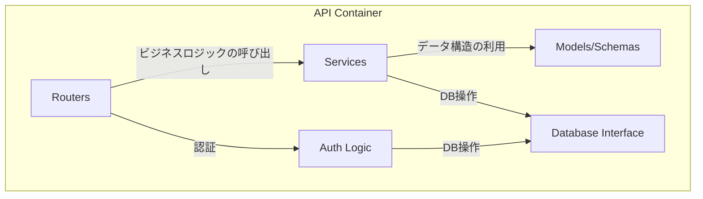
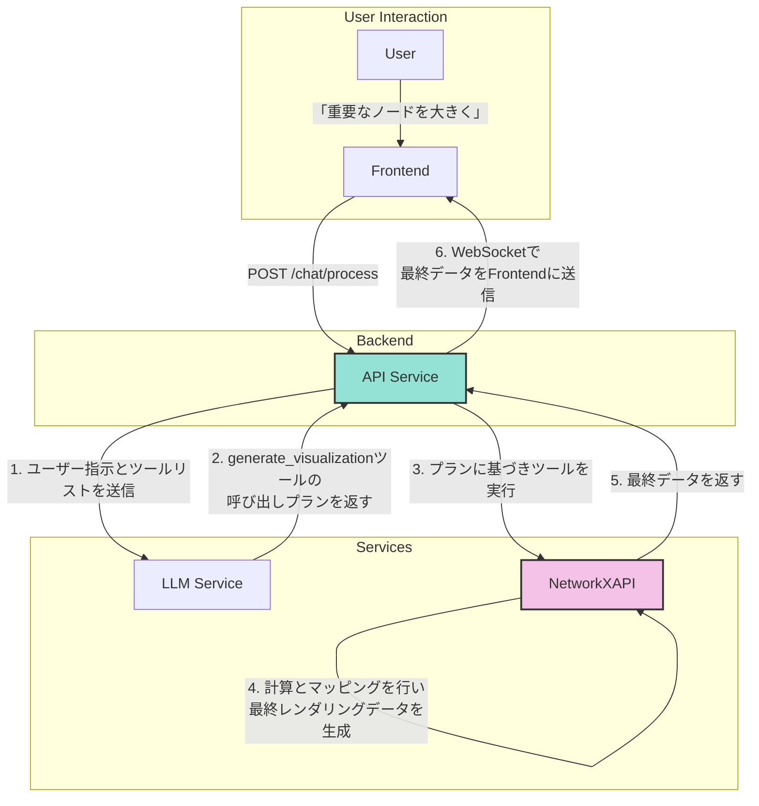

# 1. バックエンド仕様 (API)

**前提知識レベル:**

- FastAPI, Pydantic, SQLAlchemyに関する開発経験
- REST API, OAuth2, JWTに関する知識

FastAPIで構築されたバックエンドAPI。主な責務は、認証、ビジネスロジックの実行、外部サービス連携です。

## 1.1. コンポーネント図



| コンポーネント         | 説明                                                                      |
| :--------------------- | :------------------------------------------------------------------------ |
| **Routers**            | APIエンドポイントを定義し、リクエストを適切なサービスにルーティングする。 |
| **Services**           | ビジネスロジックを実装する。LLMサービス連携やNetworkXAPIの呼び出しなど。  |
| **Models/Schemas**     | Pydanticモデルとデータベーススキーマを定義する。                          |
| **Database Interface** | SQLAlchemyを使用してデータベースとのやり取りを抽象化する。                |
| **Auth Logic**         | OAuth2/JSON Web Tokenによるユーザー認証・認可のロジックを実装する。       |

## 1.2. APIエンドポイント一覧

### 1.2.1. 認証 (`/auth`)

| Method | Path        | 説明                                                            |
| :----- | :---------- | :-------------------------------------------------------------- |
| `POST` | `/register` | 新規ユーザーを登録する。                                        |
| `POST` | `/token`    | ユーザー名とパスワードで認証し、JWTアクセストークンを発行する。 |
| `GET`  | `/users/me` | 現在認証中のユーザー情報を取得する。                            |

### 1.2.2. 運用

| Method | Path      | 説明                             |
| :----- | :-------- | :------------------------------- |
| `GET`  | `/health` | サービスのヘルスチェックを行う。 |

### 1.2.3. チャット・LLM連携 (`/chat`)

| Method | Path                           | 説明                                                                                                                         |
| :----- | :----------------------------- | :--------------------------------------------------------------------------------------------------------------------------- |
| `POST` | `/conversations`               | 新しい会話を作成する。                                                                                                       |
| `GET`  | `/conversations`               | ユーザーの会話一覧を取得する。                                                                                               |
| `GET`  | `/conversations/{id}`          | 特定の会話の詳細を取得する。                                                                                                 |
| `GET`  | `/conversations/{id}/messages` | 特定の会話のメッセージ一覧を取得する。                                                                                       |
| `POST` | `/process`                     | チャットUIからのメッセージを処理し、LLMやツール呼び出しを実行して最終結果を返す。                                            |
| `POST` | `/recommend-layout`            | ネットワーク概要に基づき、LLMが最適なレイアウトを推薦する。                                                                  |
| `GET`  | `/conversations/{id}/stream`   | WebSocketの接続を確立するエンドポイント。ネットワークの更新通知、計算の進捗、LLMの思考プロセスなどをリアルタイムで送信する。 |

#### `/chat/process` の詳細

- **Request Body:**

```json
{
  "conversation_id": 12345,
  "message": {
    "role": "user",
    "content": "次数中心性を計算して、重要なノードを大きく表示してください。"
  }
}
```

- **Response Body (Success):**

```json
{
  "message": {
    "role": "assistant",
    "content": "次数中心性を計算し、ノードのサイズに反映しました。"
  }
}
```

このエンドポイントが呼び出された際の、Backend、LLM、NetworkXAPI間のより詳細な連携フローについては、以下のドキュメントを参照してください。

- **[6. 主要な処理フローとデータ生成](./6_Core_Workflows.md)**: 全体のやり取りをシーケンス図で解説しています。このシーケンス図が、フロントエンドとバックエンド間の非同期通信における唯一の信頼できる情報源（Single Source of Truth）となります。
- **[データフローと責務詳細 (LLM Function Calling)](./6_Core_Workflows.md#632-データフローと責務詳細-llm-function-calling)**: Function Callingにおけるデータの流れと責務を詳細に定義しています。

### 1.2.4. ネットワーク (`/network`)

| Method | Path                    | 説明                                                                                                                                                                                                                                                                                                                             |
| :----- | :---------------------- | :------------------------------------------------------------------------------------------------------------------------------------------------------------------------------------------------------------------------------------------------------------------------------------------------------------------------------- |
| `POST` | `/upload`               | GraphMLファイルをアップロードし、新しい会話とネットワークを作成する。 `multipart/form-data` を使用。この処理の中でNetworkXAPIを呼び出し、デフォルトのレイアウトを計算して属性として保存する。詳細は[新規会話開始（ネットワークアップロード）フロー](./6_Core_Workflows.md#62-新規会話開始ネットワークアップロードフロー)を参照。 |
| `GET`  | `/{network_id}/visdata` | **【用途: 初期表示専用】** ネットワークの基本的な構造と永続化された属性を基に、初期表示用のレンダリングデータを生成して返す。動的な更新はWebSocket経由で行われるため、このエンドポイントは対話中の更新には使用されない。 |
| `GET`  | `/{network_id}/export`  | ネットワークをGraphMLファイルとしてダウンロードする。                                                                                                                                                                                                                                                                            |

#### `/network/upload` の詳細

- **Response Body (Success):**

```json
{
  "conversation_id": "conv_67890",
  "network_id": "net_54321"
}
```

### 1.3. Backendの役割: LLMとツールのオーケストレーター

新アーキテクチャにおいて、Backendの役割はレンダリングデータを自ら組み立てることではなく、LLMと専門ツール（NetworkXAPI）間の指示を調整する**オーケストレーター（指揮者）**に特化します。これにより、ビジネスロジックと専門的な計算処理が明確に分離されます。

#### データ変換フロー図



プロセスは以下のステップで実行されます。

1.  **BackendがLLMに指示を送信**:
    - Frontendから受け取ったユーザーの自然言語指示（例：「次数中心性でノードを色分けして」）と、利用可能なツールリスト（`list_attributes`, `calculate_centrality`, `generate_visualization`など）をLLMに送信します。

2.  **LLMが実行プランを計画**:
    - LLMはユーザーの意図を解釈します。
    - ネットワークの現状を把握するために`list_attributes`を呼び出し、必要な属性（例：`degree_centrality`）が存在するか確認します。
    - 属性が存在しない場合は、`calculate_centrality`を呼び出して計算させます。
    - 最終的に、レイアウト、ノードサイズ、ノードカラーなどの割り当てをすべて定義した、`generate_visualization`ツールのパラメータを組み立て、Backendに返します。

3.  **BackendがNetworkXAPIを呼び出す**:
    - Backendは、LLMから受け取った`generate_visualization`の呼び出しプラン（リクエストボディ）をそのままNetworkXAPIの`/tools/generate_visualization`エンドポイントに送信します。

4.  **NetworkXAPIがレンダリングデータを生成**:
    - NetworkXAPIは、リクエストされたすべての視覚的割り当て（レイアウト、サイズ、色など）に基づき、データベースから必要な属性値を取得し、マッピング計算を行い、フロントエンドが直接描画できる最終的なJSONデータを生成します。

5.  **Backendが結果を中継**:
    - NetworkXAPIから返された最終的なレンダリングデータを、BackendはWebSocketを通じてFrontendに送信します。Frontendはこれを受け取り、画面を更新します。

この設計により、Backendは視覚化の具体的なロジックに関与せず、LLMの知能とNetworkXAPIの計算能力を最大限に引き出すことに集中できます。

#### 5. デフォルトの視覚スタイル

上記のプロセスにおいて、特定の視覚的特徴（例: `NODE_SIZE`）に適用されるマッピングルールが存在しない場合、システムは以下のデフォルト値を適用します。これにより、ユーザーがファイルをアップロードした直後でも、常に一定のスタイルでネットワークが描画されることを保証します。

- **初期レイアウト (`x`, `y`座標)**
  - **値**: ネットワークのアップロード時に`NetworkXAPI`が計算した**Spring Layout**の結果が、`x`および`y`という名前の属性として永続化されています。Backendはこれを読み込み、デフォルトのノード座標として使用します。

- **ノードサイズ (`size`)**
  - **デフォルト値**: `5`

- **ノードカラー (`color`)**
  - **デフォルト値**: `#82b3ff` (システムのテーマカラーに合わせた明るい青)

- **エッジ幅 (`width`)**
  - **デフォルト値**: `1`

- **エッジカラー (`color`)**
  - **デフォルト値**: `#cccccc` (他の要素を邪魔しない薄いグレー)

## 1.4. 主要なデータモデル (Pydantic Schemas)

APIで送受信される主要なデータ構造です。

- **User**

| フィールド名 | 型    | 説明                        |
| :----------- | :---- | :-------------------------- |
| `id`         | `int` | ユーザーID (Auto-increment) |
| `username`   | `str` | ユーザー名                  |

- **Token**

| フィールド名   | 型    | 説明                        |
| :------------- | :---- | :-------------------------- |
| `access_token` | `str` | JWTアクセストークン         |
| `token_type`   | `str` | トークン種別 (例: "bearer") |

- **Conversation**

| フィールド名 | 型         | 説明                           |
| :----------- | :--------- | :----------------------------- |
| `id`         | `int`      | 会話ID                         |
| `title`      | `str`      | 会話のタイトル                 |
| `user_id`    | `int`      | この会話を所有するユーザーのID |
| `created_at` | `datetime` | 作成日時                       |
| `updated_at` | `datetime` | 更新日時                       |

- **ChatMessage**

| フィールド名      | 型         | 説明                                 |
| :---------------- | :--------- | :----------------------------------- |
| `id`              | `int`      | メッセージID                         |
| `conversation_id` | `str`      | 所属する会話のID                     |
| `role`            | `str`      | 発言者の役割 (`user` or `assistant`) |
| `content`         | `str`      | メッセージの本文                     |
| `meta_data`       | `dict`     | 拡張用のメタデータ (JSON)            |
| `created_at`      | `datetime` | 作成日時                             |

- **Network** (DBモデル)

`networks`テーブルのスキーマ定義は、このドキュメント群における唯一の信頼できる情報源（Single Source of Truth）である **[4. データベーススキーマ仕様](./4_Database.md)** を参照してください。

`conversations`テーブルが`network_id`を保持し、`networks`テーブルへの1対1の参照を持ちます。

## 1.5. 外部サービス連携

- **NetworkXAPI**: グラフ計算が必要なリクエストを `http://networkx-api:8001` に転送（プロキシ）します。（このURLは、環境変数 `NETWORKX_API_URL` によって設定されます。デフォルト値は `http://networkx-api:8001` です。）
- **LLMサービス**: ユーザーの指示解釈、ツールコール変換、結果の要約のために外部LLM（OpenAI, Gemini等）のAPIを呼び出します。

## 1.6. エラーハンドリング

APIは、エラー発生時にHTTPステータスコードと、詳細情報を含むJSONオブジェクトを返却します。

- **エラーレスポンス形式:**

```json
{
  "detail": {
    "error_code": "RESOURCE_NOT_FOUND",
    "message": "指定された会話が見つかりません。",
    "context": {
      "conversation_id": "unknown_id"
    }
  }
}
```

| フィールド名 | 型     | 説明                                         |
| :----------- | :----- | :------------------------------------------- |
| `error_code` | `str`  | エラーの種類を一意に識別するコード。         |
| `message`    | `str`  | 開発者向けのエラー詳細メッセージ。           |
| `context`    | `dict` | エラーが発生した際の関連情報（デバッグ用）。 |

- **主要なHTTPステータスコード:**

| コード                      | 説明                                                                   | 主な用途 |
| :-------------------------- | :--------------------------------------------------------------------- | :------- |
| `400 Bad Request`           | リクエストの形式が不正（例: 必須パラメータの欠如、データ型の不一致）。 |
| `401 Unauthorized`          | 認証が必要なリソースに対し、認証なしでアクセスした場合。               |
| `403 Forbidden`             | 認証済みだが、リソースへのアクセス権限がない場合。                     |
| `404 Not Found`             | 指定されたリソースが存在しない場合。                                   |
| `500 Internal Server Error` | サーバー内部で予期せぬエラーが発生した場合。                           |
