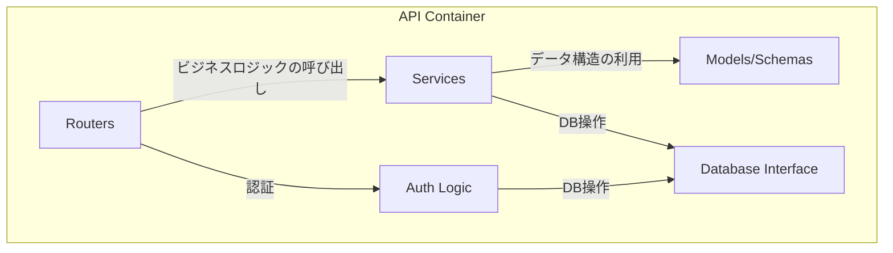

# 1. バックエンド仕様 (API)

**前提知識レベル:**

- FastAPI, Pydantic, SQLAlchemyに関する開発経験
- REST API, OAuth2, JWTに関する知識

FastAPIで構築されたバックエンドAPI。主な責務は、認証、ビジネスロジックの実行、外部サービス連携です。

## 1.1. コンポーネント図



| コンポーネント         | 説明                                                                      |
| :--------------------- | :------------------------------------------------------------------------ |
| **Routers**            | APIエンドポイントを定義し、リクエストを適切なサービスにルーティングする。 |
| **Services**           | ビジネスロジックを実装する。LLMサービス連携やNetworkXAPIの呼び出しなど。  |
| **Models/Schemas**     | Pydanticモデルとデータベーススキーマを定義する。                          |
| **Database Interface** | SQLAlchemyを使用してデータベースとのやり取りを抽象化する。                |
| **Auth Logic**         | OAuth2/JSON Web Tokenによるユーザー認証・認可のロジックを実装する。       |

## 1.2. APIエンドポイント一覧

### 1.2.1. 認証 (`/auth`)

| Method | Path        | 説明                                                            |
| :----- | :---------- | :-------------------------------------------------------------- |
| `POST` | `/register` | 新規ユーザーを登録する。                                        |
| `POST` | `/token`    | ユーザー名とパスワードで認証し、JWTアクセストークンを発行する。 |
| `GET`  | `/users/me` | 現在認証中のユーザー情報を取得する。                            |

### 1.2.2. 運用

| Method | Path      | 説明                             |
| :----- | :-------- | :------------------------------- |
| `GET`  | `/health` | サービスのヘルスチェックを行う。 |

### 1.2.3. チャット・ネットワーク機能 (`/chat`)

| Method | Path                           | 説明                                                                                                                         |
| :----- | :----------------------------- | :--------------------------------------------------------------------------------------------------------------------------- |
| `POST` | `/chat`               | 新しい空のチャットと、それに紐づくネットワークを作成する。レスポンスとして`chat_id`と`network_id`を返す。 |
| `POST` | `/chat/{id}/upload`   | 指定されたチャットに紐づくネットワークのGraphMLデータをアップロードする。処理は非同期で実行される。 |
| `GET`  | `/chat`               | ユーザーのチャット一覧を取得する。                                                                                               |
| `GET`  | `/chat/{id}`          | 特定のチャットの詳細（関連するネットワーク情報と**現在の可視化データ**を含む）を取得する。                                                              |
| `GET`  | `/chat/{id}/messages` | 特定のチャットのメッセージ一覧を取得する。                                                                                       |
| `POST` | `/chat/{id}/process`           | 特定のチャットのコンテキストでメッセージを処理し、LLMやツール呼び出しを実行する。                                          |
| `GET`  | `/chat/{id}/stream`   | Server-Sent Events (SSE) の接続を確立するエンドポイント。                                                                    |
| `GET`  | `/chat/{id}/export`   | チャットに対応するネットワークをGraphMLファイルとしてダウンロードする。                                                        |

#### `/chat/{id}/process` の詳細

- **Request Body:**

```json
{
  "message": {
    "content": "次数中心性を計算して、重要なノードを大きく表示してください。"
  }
}
```

- **Response:**
  - Status Code: `202 Accepted`

```json
{
  "status": "accepted"
}
```

※ 実際のLLMからの応答メッセージは、SSE (`/chat/{id}/stream`) の `message` イベントを通じて非同期に送信されます。

このエンドポイントが呼び出された際の、Backend、LLM、NetworkXAPI間のより詳細な連携フローについては、以下のドキュメントを参照してください。

- **[6. 主要な処理フローとデータ生成](./6_Core_Workflows.md)**: 全体のやり取りをシーケンス図で解説しています。このシーケンス図が、フロントエンドとバックエンド間の非同期通信における唯一の信頼できる情報源（Single Source of Truth）となります。

### 1.3. Backendの役割: LLMとツールのオーケストレーター

新アーキテクチャにおいて、Backendの役割はレンダリングデータを自ら組み立てることではなく、LLMと専門ツール（NetworkXAPI）間の指示を調整する**オーケストレーター（指揮者）**に特化します。これにより、ビジネスロジックと専門的な計算処理が明確に分離されます。

#### データ変換フロー図


プロセスは以下のステップで実行されます。

1.  **BackendがLLMに指示を送信**:
    - Frontendから受け取ったユーザーの自然言語指示（例：「次数中心性でノードを色分けして」）と、利用可能なツールリスト（`list_node_attributes`, `list_edge_attributes`, `calculate_centrality`, `calculate_layout`, `generate_visualization`など）をLLMに送信します。

2.  **LLMが実行プランを計画**:
    - LLMはユーザーの意図を解釈します。
    - **Tool Execution**:
     - `list_node_attributes()`: `network_service.list_node_attributes` を呼び出し、NetworkXAPIからノード属性一覧を取得。
     - `list_edge_attributes()`: `network_service.list_edge_attributes` を呼び出し、NetworkXAPIからエッジ属性一覧を取得。
     - `calculate_centrality(type)`: `network_service.calculate_centrality` を呼び出し、NetworkXAPIで計算を実行。
     - `calculate_layout(name)`: `network_service.calculate_layout` を呼び出し、NetworkXAPIで計算を実行。
     - `generate_visualization(config)`: `network_service.generate_visualization` を呼び出し、NetworkXAPIから可視化データを取得。
    - ネットワークの現状を把握するために`list_attributes`を呼び出し、必要な属性（例：`degree_centrality`）が存在するか確認します。
    - 属性の計算が必要な場合は`calculate_centrality`を呼び出し、その後`generate_visualization`を呼び出して可視化を更新するプランをBackendに返します。

3.  **BackendがNetworkXAPIを呼び出す**:
    - Backendは、LLMから受け取ったツール呼び出しプランに基づき、NetworkXAPIのエンドポイントを呼び出します。
    - 複合的なアクションの場合、Backendはまず`/tools/calculate_centrality`を呼び出して指標を計算し、次に`/tools/generate_visualization`を呼び出してその指標を用いた可視化データを生成するという、**複数のAPIコールを順次実行**します。

4.  **NetworkXAPIがレンダリングデータを生成**:
    - NetworkXAPIは、計算（必要な場合）とマッピングを行い、フロントエンドが直接描画できる最終的なJSONデータを生成します。

5.  **Backendが結果を中継**:
    - NetworkXAPIから返された最終的なレンダリングデータを、BackendはHTTP Streaming (SSE)を通じてFrontendに送信します。Frontendはこれを受け取り、画面を更新します。

この設計により、Backendは視覚化の具体的なロジックに関与せず、LLMの知能とNetworkXAPIの計算能力を最大限に引き出すことに集中できます。


## 1.4. 主要なデータモデル (Pydantic Schemas)

APIで送受信される主要なデータ構造です。

- **User**

| フィールド名 | 型    | 説明                        |
| :----------- | :---- | :-------------------------- |
| `id`         | `int` | ユーザーID (Auto-increment) |
| `username`   | `str` | ユーザー名                  |

- **Token**

| フィールド名   | 型    | 説明                        |
| :------------- | :---- | :-------------------------- |
| `access_token` | `str` | JWTアクセストークン         |
| `token_type`   | `str` | トークン種別 (例: "bearer") |

- **Chat**

| フィールド名 | 型         | 説明                           |
| :----------- | :--------- | :----------------------------- |
| `id`         | `int`      | 会話ID                         |
| `title`      | `str`      | 会話のタイトル                 |
| `user_id`    | `int`      | この会話を所有するユーザーのID |
| `created_at` | `datetime` | 作成日時                       |
| `updated_at` | `datetime` | 更新日時                       |

- **ChatMessage**

| フィールド名      | 型         | 説明                                 |
| :---------------- | :--------- | :----------------------------------- |
| `id`              | `int`      | メッセージID                         |
| `chat_id` | `int`      | 所属するチャットのID                     |
| `role`            | `str`      | 発言者の役割 (`user` or `assistant`) |
| `content`         | `str`      | メッセージの本文                     |
| `meta_data`       | `dict`     | 拡張用のメタデータ (JSON)            |
| `created_at`      | `datetime` | 作成日時                             |

- **Network** (DBモデル)

`networks`テーブルのスキーマ定義は、このドキュメント群における唯一の信頼できる情報源（Single Source of Truth）である **[4. データベーススキーマ仕様](./4_Database.md)** を参照してください。

`chats`テーブルが`network_id`を保持し、`networks`テーブルへの1対1の参照を持ちます。

## 1.5. 外部サービス連携

- **NetworkXAPI**: グラフ計算が必要なリクエストを `http://networkx-api:8001` に転送（プロキシ）します。（このURLは、環境変数 `NETWORKX_API_URL` によって設定されます。デフォルト値は `http://networkx-api:8001` です。）
- **LLMサービス**: ユーザーの指示解釈、ツールコール変換、結果の要約のために外部LLM（Google Gemini 2.5 Flash）のAPIを呼び出します。

## 1.6. エラーハンドリング

APIは、エラー発生時にHTTPステータスコードと、詳細情報を含むJSONオブジェクトを返却します。

- **エラーレスポンス形式:**

```json
{
  "detail": {
    "error_code": "RESOURCE_NOT_FOUND",
    "message": "指定されたチャットが見つかりません。",
    "context": {
      chat_id: "unknown_id"
    }
  }
}
```

| フィールド名 | 型     | 説明                                         |
| :----------- | :----- | :------------------------------------------- |
| `error_code` | `str`  | エラーの種類を一意に識別するコード。         |
| `message`    | `str`  | 開発者向けのエラー詳細メッセージ。           |
| `context`    | `dict` | エラーが発生した際の関連情報（デバッグ用）。 |

- **主要なHTTPステータスコード:**

| コード                      | 説明                                                                   | 主な用途 |
| :-------------------------- | :--------------------------------------------------------------------- | :------- |
| `400 Bad Request`           | リクエストの形式が不正（例: 必須パラメータの欠如、データ型の不一致）。 |
| `401 Unauthorized`          | 認証が必要なリソースに対し、認証なしでアクセスした場合。               |
| `403 Forbidden`             | 認証済みだが、リソースへのアクセス権限がない場合。                     |
| `404 Not Found`             | 指定されたリソースが存在しない場合。                                   |
| `500 Internal Server Error` | サーバー内部で予期せぬエラーが発生した場合。                           |
