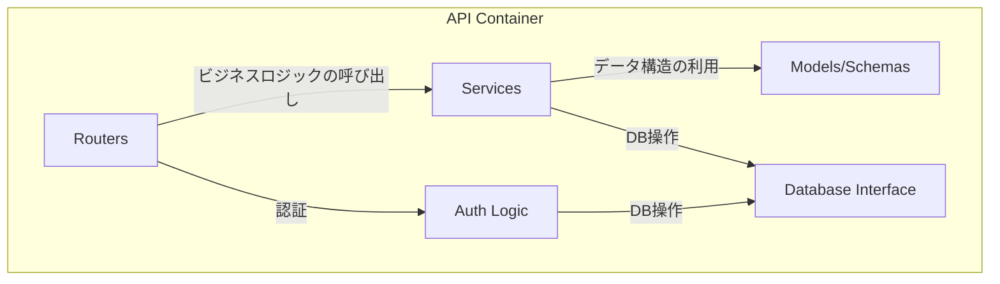
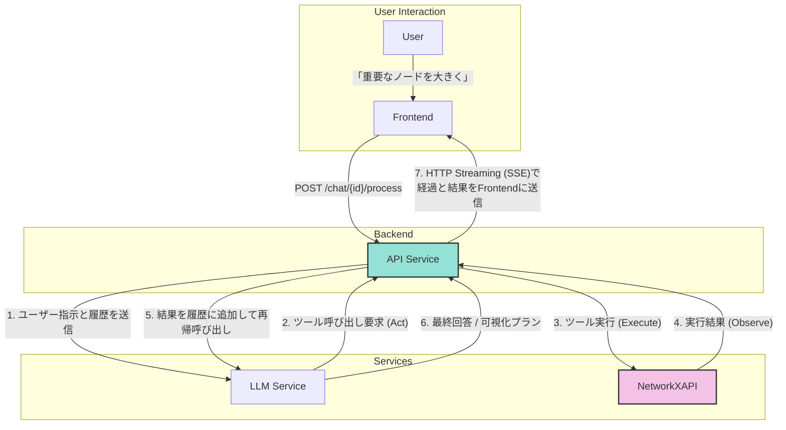

# 1. バックエンド仕様 (API)

**前提知識レベル:**

- FastAPI, Pydantic, SQLAlchemyに関する開発経験
- REST API, OAuth2, JWTに関する知識

FastAPIで構築されたバックエンドAPI。主な責務は、認証、ビジネスロジックの実行、外部サービス連携です。

## 1.1. コンポーネント図



| コンポーネント         | 説明                                                                      |
| :--------------------- | :------------------------------------------------------------------------ |
| **Routers**            | APIエンドポイントを定義し、リクエストを適切なサービスにルーティングする。 |
| **Services**           | ビジネスロジックを実装する。LLMサービス連携やNetworkXAPIの呼び出しなど。  |
| **Models/Schemas**     | Pydanticモデルとデータベーススキーマを定義する。                          |
| **Database Interface** | SQLAlchemyを使用してデータベースとのやり取りを抽象化する。                |
| **Auth Logic**         | OAuth2/JSON Web Tokenによるユーザー認証・認可のロジックを実装する。       |

## 1.2. APIエンドポイント一覧

### 1.2.1. 認証 (`/auth`)

| Method | Path        | 説明                                                            |
| :----- | :---------- | :-------------------------------------------------------------- |
| `POST` | `/register` | 新規ユーザーを登録する。                                        |
| `POST` | `/token`    | ユーザー名とパスワードで認証し、JWTアクセストークンを発行する。 |
| `GET`  | `/users/me` | 現在認証中のユーザー情報を取得する。                            |

### 1.2.2. 運用

| Method | Path      | 説明                             |
| :----- | :-------- | :------------------------------- |
| `GET`  | `/health` | サービスのヘルスチェックを行う。 |

### 1.2.3. チャット・ネットワーク機能 (`/chat`)

| Method | Path                           | 説明                                                                                                                         |
| :----- | :----------------------------- | :--------------------------------------------------------------------------------------------------------------------------- |
| `POST` | `/chat`               | 新しい空のチャットと、それに紐づくネットワークを作成する。レスポンスとして`chat_id`と`network_id`を返す。 |
| `POST` | `/chat/{id}/upload`   | 指定されたチャットに紐づくネットワークのGraphMLデータをアップロードする。処理は非同期で実行される。 |
| `GET`  | `/chat`               | ユーザーのチャット一覧を取得する。                                                                                               |
| `GET`  | `/chat/{id}`          | 特定のチャットの詳細（関連するネットワーク情報と**現在の可視化データ**を含む）を取得する。                                                              |
| `GET`  | `/chat/{id}/messages` | 特定のチャットのメッセージ一覧を取得する。                                                                                       |
| `POST` | `/chat/{id}/process`           | 特定のチャットのコンテキストでメッセージを処理し、LLMやツール呼び出しを実行する。                                          |
| `GET`  | `/chat/{id}/stream`   | Server-Sent Events (SSE) の接続を確立するエンドポイント。                                                                    |
| `GET`  | `/chat/{id}/stream`   | Server-Sent Events (SSE) の接続を確立するエンドポイント。                                                                    |
| `GET`  | `/chat/{id}/export`   | チャットに対応するネットワークをGraphMLファイルとしてダウンロードする。                                                        |

### 1.2.4. ネットワーク操作 (`/networks`)

チャットに紐づくネットワークに対して、サブグラフ作成や分析を行うエンドポイント群です。これらの操作を実行するには、そのネットワーク（またはその親）に紐づくチャットの所有権が必要です。

| Method | Path | 説明 |
| :----- | :--- | :--- |
| `GET` | `/networks/{network_id}/subgraphs` | 親ネットワークから作成されたサブグラフの一覧を取得する。 |
| `POST` | `/networks/{network_id}/subgraphs/ego` | 指定ノードを中心としたEgo Network（指定ホップ数以内のノード群）を作成する。 |
| `POST` | `/networks/{network_id}/subgraphs/from_nodes` | 指定されたノードIDのリストからサブグラフを作成する。 |
| `POST` | `/networks/{network_id}/subgraphs/path` | 指定された2ノード間の最短経路をサブグラフとして作成する。 |
| `POST` | `/networks/{network_id}/subgraphs/k_core` | K-Core（次数k以上のノード群）を抽出し、サブグラフを作成する。 |
| `POST` | `/networks/{network_id}/subgraphs/largest_component` | 最大連結成分を抽出し、サブグラフを作成する。 |
| `POST` | `/networks/{network_id}/subgraphs/component_containing_node` | 指定されたノードを含む連結成分を抽出し、サブグラフを作成する。 |
| `GET` | `/networks/{network_id}/nodes/top` | 指定された中心性指標（degree, betweenness等）に基づいて、上位k個のノードを取得する。 |

#### `/chat/{id}/process` の詳細

- **Request Body:**

```json
{
  "message": {
    "content": "次数中心性を計算して、重要なノードを大きく表示してください。"
  }
}
```

- **Response:**
  - Status Code: `202 Accepted`

```json
{
  "status": "accepted"
}
```

※ 実際のLLMからの応答メッセージは、SSE (`/chat/{id}/stream`) の `message` イベントを通じて非同期に送信されます。

このエンドポイントが呼び出された際の、Backend、LLM、NetworkXAPI間のより詳細な連携フローについては、以下のドキュメントを参照してください。

- **[6. 主要な処理フローとデータ生成](./6_Core_Workflows.md)**: 全体のやり取りをシーケンス図で解説しています。このシーケンス図が、フロントエンドとバックエンド間の非同期通信における唯一の信頼できる情報源（Single Source of Truth）となります。

### 1.3. Backendの役割: LLMとツールのオーケストレーター

新アーキテクチャにおいて、Backendの役割はレンダリングデータを自ら組み立てることではなく、LLMと専門ツール（NetworkXAPI）間の指示を調整する**オーケストレーター（指揮者）**に特化します。

Backendは、ユーザーの入力に対して「思考(Think) → 行動(Act) → 観察(Observe)」のサイクル（ReActループ）を実行します。これにより、LLMはツール実行結果を見て次のアクションを決定できるため、動的柔軟な対応が可能になります。

#### データ変換フロー図



プロセスは以下のステップで実行されます。詳細は **[6. 主要な処理フローとデータ生成](./6_Core_Workflows.md)** の「6.13. LLMツール実行ループとコンテキスト管理詳細」を参照してください。

1.  **Thinking & Planning**:
    - Backendはユーザーの入力をLLMに渡します。
    - LLMはシステムプロンプトに従い、まず「何をするべきか」を思考し、必要なツール（`list_node_attributes`など）を選択します。

2.  **Tool Execution Loop**:
    - BackendはLLMが要求したツール（MCPツールまたはローカルツール）を実行します。
    - **Context Awareness**: 実行時に現在の `network_id` を自動的に注入します。
    - **Verification First**: LLMは計算や可視化の前に、必ず `read_resource` や `list_attributes` を呼び出してデータの存在確認を行うよう指示されています。

3.  **Visualization & Response**:
    - LLMが `generate_visualization` を呼び出すと、NetworkXAPIがレンダリングデータを生成します。
    - Backendはこのデータを即座にSSEでクライアントにプッシュします。
    - 最後にLLMが生成したテキスト（考察や説明）をユーザーに送信します。

この設計により、Backendは視覚化の具体的なロジックに関与せず、LLMの知能とNetworkXAPIの計算能力を最大限に引き出すことに集中できます。


### 1.3.1. Context Injection Mechanism

LLMが「現在のネットワーク状態」を正確に把握し、効率的にツールを選択できるよう、Backendは独自の**コンテキスト注入メカニズム**を実装しています。

- **概要**: ユーザーの各メッセージの直前に、現在のネットワークのメタ情報（ID, ノード数, エッジ数, 利用可能な属性リスト）を自動的に挿入します。
- **目的**:
  1.  **Verification Firstの高速化**: 属性リストが既に提示されているため、単純な可視化指示であれば `read_resource` による確認ステップをスキップ可能にします。
  2.  **ハルシネーション防止**: 存在しない属性を使用しようとするLLMのミスを防ぎます。
  3.  **状態追従**: サブグラフへのコンテキスト切り替えが発生した場合でも、次のターンで最新のサブグラフ情報が注入されるため、LLMは常に正しい対象を分析できます。

**注入される情報の例:**

```text
[Current Network Context]
Network ID: 5
Stats: 150 Nodes, 300 Edges
Available Node Attributes:
- department (string)
- tenure (integer)
```

## 1.4. 主要なデータモデル (Pydantic Schemas)

APIで送受信される主要なデータ構造です。

- **User**

| フィールド名 | 型    | 説明                        |
| :----------- | :---- | :-------------------------- |
| `id`         | `int` | ユーザーID (Auto-increment) |
| `username`   | `str` | ユーザー名                  |

- **Token**

| フィールド名   | 型    | 説明                        |
| :------------- | :---- | :-------------------------- |
| `access_token` | `str` | JWTアクセストークン         |
| `token_type`   | `str` | トークン種別 (例: "bearer") |

- **Chat**

| フィールド名 | 型         | 説明                           |
| :----------- | :--------- | :----------------------------- |
| `id`         | `int`      | 会話ID                         |
| `name`       | `str`      | 会話のタイトル                 |
| `user_id`    | `int`      | この会話を所有するユーザーのID |
| `network_id` | `int`      | 関連するネットワークのID（**現在のアクティブなコンテキスト**）。サブグラフ分析中は、そのサブグラフのIDに更新されます。       |
| `created_at` | `datetime` | 作成日時                       |
| `updated_at` | `datetime` | 更新日時                       |

- **ChatMessage**

| フィールド名      | 型         | 説明                                 |
| :---------------- | :--------- | :----------------------------------- |
| `id`              | `int`      | メッセージID                         |
| `chat_id` | `int`      | 所属するチャットのID                     |
| `role`            | `str`      | 発言者の役割 (`user` or `assistant`) |
| `content`         | `str`      | メッセージの本文                     |
| `meta_data`       | `dict`     | 拡張用のメタデータ (JSON)            |
| `created_at`      | `datetime` | 作成日時                             |

- **Network** (DBモデル)

`networks`テーブルのスキーマ定義は、このドキュメント群における唯一の信頼できる情報源（Single Source of Truth）である **[4. データベーススキーマ仕様](./4_Database.md)** を参照してください。

`chats`テーブルが`network_id`を保持し、`networks`テーブルへの1対1の参照を持ちます。

## 1.5. 外部サービス連携

- **NetworkXAPI**: グラフ計算と可視化データ生成のために、MCP (Model Context Protocol) サーバーとして接続します。通信は `http://networkx-api:8000/mcp/sse` への SSE 接続を通じて行われます。`app/services/llm/mcp_client.py` がクライアントとして機能します。
- **LLMサービス**: ユーザーの指示解釈、ツールコール変換、結果の要約のために外部LLM（Google Gemini 2.5 Flash）のAPIを呼び出します。Google AI Studio (API Key) と Vertex AI の両方をサポートしています。`VERTEX_PROJECT_ID` 環境変数が設定されている場合、自動的に Vertex AI が使用されます。

## 1.6. エラーハンドリング

APIは、エラー発生時にHTTPステータスコードと、詳細情報を含むJSONオブジェクトを返却します。

- **エラーレスポンス形式:**

```json
{
  "detail": {
    "error_code": "RESOURCE_NOT_FOUND",
    "message": "指定されたチャットが見つかりません。",
    "context": {
      chat_id: "unknown_id"
    }
  }
}
```

| フィールド名 | 型     | 説明                                         |
| :----------- | :----- | :------------------------------------------- |
| `error_code` | `str`  | エラーの種類を一意に識別するコード。         |
| `message`    | `str`  | 開発者向けのエラー詳細メッセージ。           |
| `context`    | `dict` | エラーが発生した際の関連情報（デバッグ用）。 |

- **主要なHTTPステータスコード:**

| コード                      | 説明                                                                   | 主な用途 |
| :-------------------------- | :--------------------------------------------------------------------- | :------- |
| `400 Bad Request`           | リクエストの形式が不正（例: 必須パラメータの欠如、データ型の不一致）。 |
| `401 Unauthorized`          | 認証が必要なリソースに対し、認証なしでアクセスした場合。               |
| `403 Forbidden`             | 認証済みだが、リソースへのアクセス権限がない場合。                     |
| `404 Not Found`             | 指定されたリソースが存在しない場合。                                   |
| `500 Internal Server Error` | サーバー内部で予期せぬエラーが発生した場合。                           |
