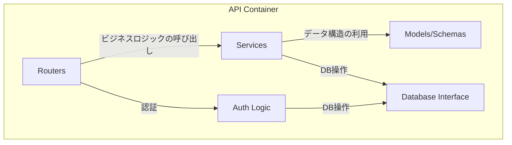

# 1. バックエンド仕様 (API)

**前提知識レベル:**
- FastAPI, Pydantic, SQLAlchemyに関する開発経験
- REST API, OAuth2, JWTに関する知識

FastAPIで構築されたバックエンドAPI。主な責務は、認証、ビジネスロジックの実行、外部サービス連携です。

## 1.1. コンポーネント図



| コンポーネント | 説明 |
|:---|:---|
| **Routers** | APIエンドポイントを定義し、リクエストを適切なサービスにルーティングする。 |
| **Services** | ビジネスロジックを実装する。LLMサービス連携やNetworkXMCPの呼び出しなど。 |
| **Models/Schemas** | Pydanticモデルとデータベーススキーマを定義する。 |
| **Database Interface** | SQLAlchemyを使用してデータベースとのやり取りを抽象化する。 |
| **Auth Logic** | OAuth2/JSON Web Tokenによるユーザー認証・認可のロジックを実装する。 |

## 1.2. APIエンドポイント一覧

### 1.2.1. 認証 (`/auth`)

| Method | Path | 説明 |
|:---|:---|:---|
| `POST` | `/register` | 新規ユーザーを登録する。 |
| `POST` | `/token` | ユーザー名とパスワードで認証し、JWTアクセストークンを発行する。 |
| `GET` | `/users/me` | 現在認証中のユーザー情報を取得する。 |

### 1.2.2. 運用

| Method | Path | 説明 |
|:---|:---|:---|
| `GET` | `/health` | サービスのヘルスチェックを行う。 |

### 1.2.3. チャット・LLM連携 (`/chat`)

| Method | Path | 説明 |
|:---|:---|:---|
| `POST` | `/conversations` | 新しい会話を作成する。 |
| `GET` | `/conversations` | ユーザーの会話一覧を取得する。 |
| `GET` | `/conversations/{id}` | 特定の会話の詳細を取得する。 |
| `GET` | `/conversations/{id}/messages` | 特定の会話のメッセージ一覧を取得する。 |
| `POST` | `/process` | チャットUIからのメッセージを処理し、LLMやツール呼び出しを実行して最終結果を返す。 |
| `POST` | `/recommend-layout` | ネットワーク概要に基づき、LLMが最適なレイアウトを推薦する。 |
| `GET` | `/stream/{conversation_id}` | WebSocketの接続を確立するエンドポイント。ネットワークの更新通知、計算の進捗、LLMの思考プロセスなどをリアルタイムで送信する。 |

#### `/chat/process` の詳細

- **Request Body:**

```json
{
  "conversation_id": 12345,
  "message": {
    "role": "user",
    "content": "次数中心性を計算して、重要なノードを大きく表示してください。"
  }
}
```

- **Response Body (Success):**

```json
{
  "message": {
    "role": "assistant",
    "content": "次数中心性を計算し、ノードのサイズに反映しました。"
  },
  "graph_updated": true,
  "new_vis_data": { ... } // 永続化された属性と視覚ルールに基づき、動的に生成された最終レンダリングデータ
}
```

このエンドポイントが呼び出された際の、Backend、LLM、NetworkXMCP間のより詳細な連携フローについては、以下のドキュメントを参照してください。
- **[6. 主要な処理フローとデータ生成](./6_Core_Workflows.md)**: 全体のやり取りをシーケンス図で解説しています。
- **[データフローと責務詳細 (LLM Function Calling)](./6_Core_Workflows.md#632-データフローと責務詳細-llm-function-calling)**: Function Callingにおけるデータの流れと責務を詳細に定義しています。

### 1.2.4. ネットワーク (`/network`)

| Method | Path | 説明 |
|:---|:---|:---|
| `POST` | `/upload` | GraphMLファイルをアップロードし、新しい会話とネットワークを作成する。 `multipart/form-data` を使用。この処理の中でNetworkXMCPを呼び出し、デフォルトのレイアウトを計算して属性として保存する。詳細は[新規会話開始（ネットワークアップロード）フロー](./6_Core_Workflows.md#62-新規会話開始ネットワークアップロードフロー)を参照。 |
| `GET` | `/{network_id}/visdata` | ネットワークの元データ、永続化された全属性、視覚マッピングルールをDBから読み出し、最終的なレンダリングデータ（`nodes_data`と`edges_data`）を動的に組み立てて返す。 |
| `GET` | `/{network_id}/export` | ネットワークをGraphMLファイルとしてダウンロードする。 |

#### `/network/upload` の詳細

- **Response Body (Success):**

```json
{
  "conversation_id": "conv_67890",
  "network_id": "net_54321"
}
```

### 1.3. Backendによる動的なレンダリングデータ生成プロセス

`GET /network/{network_id}/visdata` が呼び出された際に、Backendが実行する動的なレンダリングデータ生成プロセスは、本システムの柔軟性を支えるコア機能です。このプロセスは、最終的な視覚スタイルを永続化せず、リクエストの都度、永続化された「データ」と「ルール」から組み立てることで、状態の不整合を防ぎます。

プロセスは以下のステップで実行されます。

1.  **基礎データ（ネットワーク構造）の取得**
    - `networks` テーブルから、リクエストされた `network_id` に紐づくGraphMLデータを読み込み、基本的なノードとエッジのリストを構築します。

2.  **全属性データの取得**
    - `attributes` および `attribute_values` テーブルから、当該ネットワークに属するすべての属性（元データ由来、計算結果を含む）を読み込みます。
    - 効率的にアクセスできるよう、データを `{ element_id: { attribute_name: value, ... } }` のようなMap形式に整理します。

3.  **視覚マッピングルールの取得**
    - `visual_mapping_rules` テーブルから、現在適用されているすべての視覚ルール（例：「'次数中心性'を'NODE_SIZE'に線形スケールでマッピングする」）を取得します。

4.  **レンダリングデータの組み立て（ルール適用）**
    - Step 1で取得したノードとエッジのリストをループ処理します。
    - 個々のノード（またはエッジ）に対して、以下の処理を行います。
        - Step 2で取得した属性Mapから、その要素の属性値を取得します。
        - Step 3で取得した視覚ルールを一つずつ評価します。
        - **ルール適用**:
            - 例えば、「`NODE_SIZE`」に関するルールが存在し、それが「`degree_centrality`」属性に紐づいている場合、そのノードの `degree_centrality` の値をルールの定義（スケール種別、出力範囲など）に従って具体的なサイズ（例: `10.5`）に変換します。
            - 「`NODE_COLOR`」に関するルールも同様に、属性値を具体的な色コード（例: `#ffcc00`）に変換します。
        - **デフォルト値**: 適用されるルールがない視覚的特徴（例: ノードの形状）については、システムで定義されたデフォルト値を適用します。
    - すべてのノードとエッジの視覚スタイルが決定されたら、Frontendのライブラリ（`react-force-graph-2d`）が要求する最終的なJSONフォーマット（`{ "nodes": [...], "links": [...] }`）に組み立てます。

5.  **レスポンス返却**
    - 組み立てられたJSONデータを、APIのレスポンスとしてFrontendに返却します。

## 1.4. 主要なデータモデル (Pydantic Schemas)

APIで送受信される主要なデータ構造です。

- **User**

| フィールド名 | 型 | 説明 |
|:---|:---|:---|
| `id` | `int` | ユーザーID (Auto-increment) |
| `username` | `str` | ユーザー名 |

- **Token**

| フィールド名 | 型 | 説明 |
|:---|:---|:---|
| `access_token` | `str` | JWTアクセストークン |
| `token_type` | `str` | トークン種別 (例: "bearer") |

- **Conversation**

| フィールド名 | 型 | 説明 |
|:---|:---|:---|
| `id` | `int` | 会話ID |
| `title` | `str` | 会話のタイトル |
| `user_id` | `int` | この会話を所有するユーザーのID |
| `created_at` | `datetime` | 作成日時 |
| `updated_at` | `datetime` | 更新日時 |

- **ChatMessage**

| フィールド名 | 型 | 説明 |
|:---|:---|:---|
| `id` | `int` | メッセージID |
| `conversation_id` | `str` | 所属する会話のID |
| `role` | `str` | 発言者の役割 (`user` or `assistant`) |
| `content` | `str` | メッセージの本文 |
| `meta_data` | `dict` | 拡張用のメタデータ (JSON) |
| `created_at` | `datetime` | 作成日時 |

- **Network** (DBモデル)

`networks`テーブルのスキーマ定義は、このドキュメント群における唯一の信頼できる情報源（Single Source of Truth）である **[4. データベーススキーマ仕様](./4_Database.md)** を参照してください。

`conversations`テーブルが`network_id`を保持し、`networks`テーブルへの1対1の参照を持ちます。

## 1.5. 外部サービス連携

- **NetworkXMCP**: グラフ計算が必要なリクエストを `http://networkx-mcp:8001` に転送（プロキシ）します。（このURLは環境変数で設定可能であるべきです。）
- **LLMサービス**: ユーザーの指示解釈、ツールコール変換、結果の要約のために外部LLM（OpenAI, Gemini等）のAPIを呼び出します。