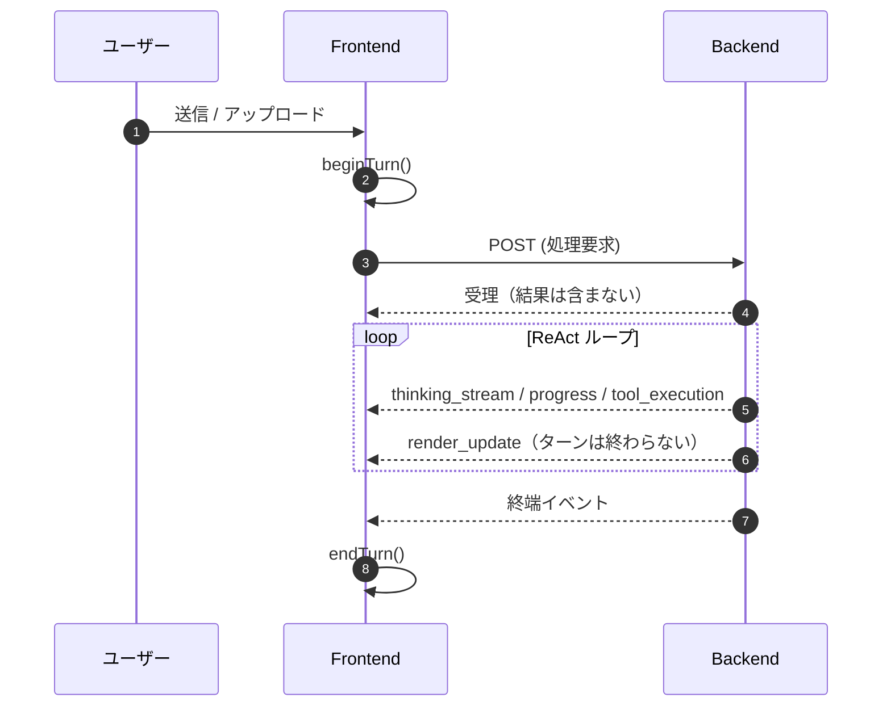

# 2. フロントエンド仕様

**前提知識レベル:**

- React, Zustand に関する開発経験
- シングルページアプリケーション (SPA) の状態管理に関する知識
- Server-Sent Events (SSE) の基本的な理解

## 2.0. この文書の範囲

コンポーネント構成・ストアのフィールド・API クライアントの関数は `frontend/src/` が唯一の情報源である。ここでは **バックエンドとの間で守らなければならない契約** と、その契約がなぜその形なのかを定義する。契約は片方向（バックエンドが書き、フロントエンドが読む）であり、**両側を同時に変更しなければならない**。

## 2.1. 最上位の制約: フロントエンドは計算しない

可視化に関する計算はすべてバックエンドで実行される。フロントエンドは受け取ったレンダリングデータを描画するのみで、レイアウト計算・中心性計算・スケーリングのいずれも行わない。

**根拠**: 同じネットワークに対する同じ操作が、閲覧環境によって異なる結果を返してはならない。研究用途では図の再現性が要件であり、またエージェントが「今ユーザーに何が見えているか」を把握できることが `visualization_get_state` を含むユーザー主体性の原則（[0_Architecture.md](./0_Architecture.md) 0.5.3）の前提になる。クライアント側で計算を行うと、この状態はサーバーから観測できなくなる。

**唯一の例外**: ノード半径の算出。バックエンドは面積としての `size` を送り、フロントエンドが `r = sqrt(size * 10 / π)` で半径に変換する。この変換式は 3 箇所（フロントエンドの描画、ツールの説明文、可視化ビルダー）に複製されており、**変更する場合は 3 箇所同時**である。根拠は [3_NetworkXAPI.md](./3_NetworkXAPI.md) を参照。

## 2.2. 画面構成

| 画面 | パス | 認証 | 役割 |
| :--- | :--- | :---: | :--- |
| HomePage | `/` | 不要 | ログイン・新規登録への導線 |
| LoginPage | `/login` | 不要 | ログインフォーム |
| RegisterPage | `/register` | 不要 | 新規ユーザー登録フォーム |
| NetworkChatPage | `/chat/{id}` | **必要** | ネットワーク可視化とチャット UI を統合したメイン画面 |

認証トークンは `HttpOnly` Cookie としてバックエンドが発行し、ブラウザが自動的にリクエストへ含める。クライアントの JavaScript がトークンに触れる経路は存在しない（根拠は [0_Architecture.md](./0_Architecture.md) 0.2）。トークン失効は `401` 応答として観測し、ログイン画面へ遷移する。

## 2.3. ターンのライフサイクル契約

**ターン**とは、バックエンドが受理のみを返す 1 回の POST と、それに続く SSE イベント列を指す。

### 2.3.1. ターンを終わらせるのは終端イベントだけである

ターンの終了、すなわち進行中状態のクリアは、**終端イベント（`message` / `message_complete` / `error`）を受け取ったときにのみ**行う。

**`render_update` は終端ではない。** 可視化ツールはターンの途中で描画し、エージェントはその後も作業を続ける。以前 `render_update` を終端として扱っていたため、進行インジケータが消えて再点灯する挙動が発生した。同様に、ツール完了（`tool_execution` の完了状態）もターンの終了ではない。

**「ターンの間だけ真である状態」は 1 箇所でまとめて設定・クリアする。** 個々のイベントハンドラが進行状態を部分的に解除できる構造にすると、ターンが「半分終わった」状態が生まれる。ライフサイクルの開始と終了を一対の操作に閉じ込めることが、この契約の実装上の要件である。

### 2.3.2. ユーザーの発言はターンをまたいで直列化する

ターンの実行中にユーザーが次の発言を送った場合、それは即座に送信せず、現在のターンの終了時に送出する。同時に 2 つのターンを走らせない制約はバックエンド側の制約であり、フロントエンドがキューイングによってこれを保証する。

## 2.4. SSE イベント契約

イベントは `backend/app/services/llm/emitters.py` が送出し、`frontend/src/hooks/useChatConnection.js` が受ける。**イベント名と正確なペイロードはこの 2 ファイルが唯一の情報源である。** ここでは、名前からは読み取れない意味論上の区別を定義する。

### 2.4.1. 思考と進捗は別のイベントである

| 区別 | イベント | 内容 |
| :--- | :--- | :--- |
| **モデルの推論** | `thinking_stream` | LLM が生成した思考。UI の「Thinking」見出しの下に描画される |
| **こちらの処理段階** | `progress` | 「GraphML をインポート中」のような、我々が定義した固定のパイプラインラベル |

**この区別は厳格である。** パイプラインの段階表示やステータス行を `thinking_stream` で送ってはならない。UI がそれを「Thinking」として提示するため、モデルが考えていないことを考えたように見せることになる。かつて実際にこの混同が起き、思考ではないものが Thinking の下に現れていた。

### 2.4.2. 描画は終端ではない

`render_update` はネットワークの可視化を更新するが、ターンを終わらせない（2.3.1）。

### 2.4.3. 消費量の通知は累積値である

トークン消費の通知は ReAct ループのイテレーションごとに複数回発火しうる。各回が運ぶのは差分ではなく、**そのターンのここまでの累計**である。したがって受信側は加算せず置換する。生涯累計への繰り入れは、ターンが完全に終了した時点で一度だけ行う。

## 2.5. インバンド・マークアップ契約

保存されるチャットメッセージは 1 本の Markdown 文字列である。散文でないものは、その文字列の中にタグとして埋め込まれる。`backend/app/services/llm/markup.py` が生成し、`frontend/src/utils/parseMessageContent.js` が解釈する。**この 2 ファイルは 1 つの契約であり、同時に変更する。**

SSE イベントとの役割分担は次の通り。

- **SSE イベント**は、ターンの進行中にだけ意味を持つ。ターンが終われば消える。
- **インバンド・マークアップ**は、保存されたメッセージの中に残る。履歴を再読み込みしても再現される。

したがって「後から見返したときにも見えるべきもの」（実行された手順のログ、折りたたまれた長文、ツールが実行された位置）はマークアップで表現し、「実行中にだけ見えるべきもの」（現在実行中のツール、進捗ラベル）はイベントで表現する。

### 2.5.1. `<thought>` は特別である

`<thought>` はエンジンがモデルの推論の周囲にのみ書き込む。**他のいかなるコードもこのタグを出力してはならない。** 「Thinking」という見出しで提示してよい唯一のブロックがこれであり、2.4.1 と同じ原則をメッセージ本文側で表現したものである。

## 2.6. 状態管理の方針

状態管理には Zustand を用い、責務ごとにストアを分ける。

| ストア | 責務 |
| :--- | :--- |
| 認証ストア | ログイン状態 |
| ネットワークストア | 表示中のレンダリングデータ（ノード、エッジ、現在のネットワーク ID） |
| チャットストア | メッセージ履歴とターンのライフサイクル |

**ネットワークストアは上書きのみを行う。** `render_update` を受け取ったとき、既存のノード・エッジとのマージは行わず完全に置き換える。差分適用を行うと、フロントエンドが「前の状態」の解釈を持つことになり、2.1 の制約が崩れるためである。

**ネットワーク ID の同期**: `render_update` がネットワーク ID を含む場合、ストアはそれに追従する。エージェントがサブグラフへ表示を切り替えたとき、フロントエンドは自分から切替を知る手段を持たないためである。
