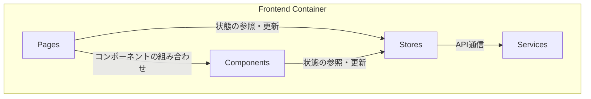

# 2. フロントエンド仕様

**前提知識レベル:**

- React, Zustand, axiosに関する開発経験
- シングルページアプリケーション (SPA) の状態管理に関する知識

React (Vite) で構築されたシングルページアプリケーション (SPA)。ユーザーインターフェースの提供とバックエンドAPIとの通信を担います。**可視化に関する計算処理はすべてバックエンドで実行され、フロントエンドはバックエンドから受け取った最終的なレンダリングデータを表示するのみで、一切の計算を行いません。**

## 2.1. コンポーネント図

| コンポーネント | 説明                                                          |
| :------------- | :------------------------------------------------------------ |
| **Pages**      | 各画面（ページ）を構成するコンポーネント。                    |
| **Components** | ボタンやナビゲーションバーなど、再利用可能なUI部品。          |
| **Stores**     | Zustandを使用してアプリケーション全体の状態を管理するストア。 |
| **Services**   | APIクライアントなど、外部との通信処理を責務とするモジュール。 |

## 2.2. 画面一覧

| 画面                | パス        |   認証   | 説明                                                         |
| :------------------ | :---------- | :------: | :----------------------------------------------------------- |
| **HomePage**        | `/`         |   不要   | アプリケーションのトップページ。ログインや新規登録への導線。 |
| **LoginPage**       | `/login`    |   不要   | ログインフォーム画面。                                       |
| **RegisterPage**    | `/register` |   不要   | 新規ユーザー登録フォーム画面。                               |
| **NetworkChatPage** | `/chat/{id}`     | **必要** | ネットワーク可視化とチャットUIを統合したメイン画面。         |

## 2.3. 状態管理とAPI連携 (Zustand & Axios)

状態管理にはZustandを使用し、機能ごとにストアを分割します。API通信にはaxiosをベースとしたクライアント (`services/api.js`) を用い、各ストアのアクション内から呼び出します。認証トークンは`HttpOnly`属性付きCookieとしてバックエンドから発行され、ブラウザが自動的にリクエストに含めるため、クライアントサイドのJavaScriptが直接トークンを操作することはありません。トークン失効時は、バックエンドからの`401 Unauthorized`応答を受けてログインページへリダイレクトします。

### `authStore`

ユーザーの認証状態とアクセストークンを管理します。

- **状態:** `isAuthenticated`, `user`
- **主要なアクションと連携API:**
  - `login(username, password)`: `POST /auth/token` を呼び出し、成功時に`HttpOnly` Cookieが設定される。
  - `register(username, password)`: `POST /auth/register` を呼び出す。
  - `logout()`: `HttpOnly` Cookieを削除するAPIを呼び出し、状態をリセットする。

### `networkStore`

表示中のネットワークデータ（ノード、エッジ）の状態を管理します。このストアは、バックエンドから受け取った最新のレンダリングデータを保持し、可視化コンポーネントに提供する責務を持ちます。

- **状態 (State):**
  - `networkId`: 現在のネットワークID。
  - `nodes`: ノードの配列。座標、サイズ、色など、描画に必要なすべての情報を含む。
  - `edges`: エッジの配列。幅、色などのスタイル情報を含む。

- **アクション (Actions) とデータの流れ:**
  - `setNetworkData(visData)`:
    - **トリガー:** SSEの `render_update` イベント経由で呼び出される。
    - **データ:** `visData` は、NetworkXAPIが生成した最終的なレンダリングデータ (`{ nodes: [...], links: [...] }`)。
    - **処理:** 受け取ったデータで `nodes` と `edges` の状態を完全に上書きする。これにより、画面のネットワークが再描画される。

### `chatStore`

チャットセッション全体の状態（メッセージ履歴、サーバーの処理状況など）を管理します。ネットワークの初期化と対話的操作は、すべてこのストアのアクションが起点となります。

- **状態 (State):**
  - `chatId`: 現在のチャットID。
  - `messages`: チャットのメッセージ履歴の配列 (`{ role: 'user' | 'assistant', content: '...' }`)。
  - `isLoading`: バックエンドでツールが実行中であるかを示す真偽値。
  - `thinkingMessage`: LLMの思考プロセスなど、リアルタイムの状況を示すテキスト。

- **アクション (Actions) とデータの流れ:**
  - `createChat(name)`:
    - **フロー:**
      1. Backendの `POST /chat` へリクエストを送信する。
      2. レスポンスで返された `chat_id` を `chatId` 状態に保存し、対応するチャットページへ遷移する。
  - `uploadNetwork(chatId, file)`:
    - **フロー:**
      1. Backendの `POST /chat/{chatId}/upload` へGraphMLファイルを送信する。
      2. Backendから即座に `202 Accepted` を受け取る。このアクションは状態を直接変更せず、UIをローディング状態に移行させ、後続のSSEイベントを待つ。
  - `fetchHistory(chatId)`:
    - **フロー:**
      1. Backendの `GET /chat/{id}/messages` を呼び出す。
      2. レスポンスで返されたメッセージ配列で `messages` 状態を更新する。
  - `sendMessage(messageContent)`:
    - **フロー:**
      1. ユーザーのメッセージを `messages` 状態に即時追加し、UIに反映させる（楽観的更新）。
      2. Backendの `POST /chat/{id}/process` へメッセージを送信し、即座に `202 Accepted` を受け取る。後続の更新はすべてSSE経由で行われる。

### リアルタイム更新 (Server-Sent Events)

`chatId` が確定すると、フロントエンドは `/api/chat/{chatId}/stream` へのSSE接続を確立します。サーバーからのすべての非同期通知は、この接続を通じてイベントとして受信され、対応するストアのアクションを呼び出します。

- **`render_update` イベント:**
  - **データ:** 最終的なレンダリングデータ (`{ nodes, links }`)。
  - **処理:** `networkStore.setNetworkData` を呼び出し、ネットワークの可視化を更新する。
- **`message` イベント:**
  - **データ:** LLMからの最終応答メッセージ (`{ role, content }`)。
  - **処理:** `chatStore.addMessage` を呼び出し、チャット履歴を更新する。
- **`tool_execution` イベント:**
  - **データ:** ツールの実行状態 (`{ tool, status }`)。
  - **処理:** `chatStore.setIsLoading` を呼び出し、UIのローディングインジケーターを制御する。
- **`thinking_stream` イベント:**
  - **データ:** LLMの思考プロセスを示すテキスト。
  - **処理:** `chatStore.setThinkingMessage` を呼び出し、リアルタイムの処理状況をUIに表示する。
