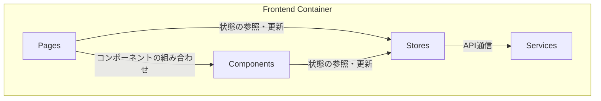

# 2. フロントエンド仕様

**前提知識レベル:**
- React, Zustand, axiosに関する開発経験
- シングルページアプリケーション (SPA) の状態管理に関する知識

React (Vite) で構築されたシングルページアプリケーション (SPA)。ユーザーインターフェースの提供とバックエンドAPIとの通信を担います。

## 2.1. コンポーネント図



| コンポーネント | 説明 |
|:---|:---|
| **Pages** | 各画面（ページ）を構成するコンポーネント。 |
| **Components** | ボタンやナビゲーションバーなど、再利用可能なUI部品。 |
| **Stores** | Zustandを使用してアプリケーション全体の状態を管理するストア。 |
| **Services** | APIクライアントなど、外部との通信処理を責務とするモジュール。 |

## 2.2. 画面一覧

| 画面 | パス | 認証 | 説明 |
|:---|:---|:---:|:---|
| **HomePage** | `/` | 不要 | アプリケーションのトップページ。ログインや新規登録への導線。 |
| **LoginPage** | `/login` | 不要 | ログインフォーム画面。 |
| **RegisterPage** | `/register` | 不要 | 新規ユーザー登録フォーム画面。 |
| **NetworkChatPage** | `/chat` | **必要** | ネットワーク可視化とチャットUIを統合したメイン画面。 |

## 2.3. 状態管理とAPI連携 (Zustand & Axios)

状態管理にはZustandを使用し、機能ごとにストアを分割します。API通信にはaxiosをベースとしたクライアント (`services/api.js`) を用い、各ストアのアクション内から呼び出します。APIクライアントは全てのリクエストに認証トークンを付与し、トークン失効時はログインページへリダイレクトします。

### `authStore`

ユーザーの認証状態とアクセストークンを管理します。

- **状態:** `isAuthenticated`, `user`, `token`
- **主要なアクションと連携API:**
    - `login(username, password)`: `POST /auth/token` を呼び出し、成功時にトークンを状態と`localStorage`に保存する。
    - `register(username, password)`: `POST /auth/register` を呼び出す。
    - `logout()`: トークンを削除し、状態をリセットする。

### `networkStore`

表示中のネットワークデータ（ノード、エッジ、レイアウト情報）の状態を管理します。このストアは、バックエンドから受け取った最新のネットワークデータを保持し、可視化コンポーネントに提供する責務を持ちます。

- **状態:** `networkId`, `nodes`, `edges` (ノードの座標、スタイル、エッジのスタイルなど、すべてのレンダリングデータを含む)
- **主要なアクションと連携API:**
    - `fetchNetwork(networkId)`: `GET /network/{networkId}/visdata` を呼び出し、最終レンダリングデータを取得する。
    - `uploadNetwork(file)`: `POST /network/upload` を呼び出し、新規ネットワークをアップロードする。
    - `setNetworkData(visData)`: `chatStore`のアクション経由で取得した、更新後の最終レンダリングデータで状態を上書きする。

### `chatStore`

会話の履歴やメッセージ一覧を管理します。**ネットワークに対する操作は、すべてこのストアの`sendMessage`アクションが起点となります。**

- **状態:** `conversationId`, `messages`, `isLoading`
- **主要なアクションと連携API:**
    - `fetchHistory(conversationId)`: `GET /conversations/{id}/messages` を呼び出し、`messages` 状態を更新する。
    - `sendMessage(messageContent)`: ユーザーの自然言語による指示（計算、可視化、レイアウト変更など）をバックエンドの `POST /chat/process` へ送信する。バックエンドでの処理の結果、ネットワークが更新された場合は、`networkStore` の状態も更新されます。

#### コード例: `sendMessage` アクションの実装イメージ

```javascript
// chatStore.js (Zustand)
import { create } from 'zustand';
import { api } from '../services/api'; // axios instance
import { useNetworkStore } from './networkStore';

export const useChatStore = create((set, get) => ({
  messages: [],
  isLoading: false,
  sendMessage: async (messageContent) => {
    const conversationId = get().conversationId;
    set({ isLoading: true });

    try {
      // ユーザーのメッセージをUIに即時反映
      const userMessage = { role: 'user', content: messageContent };
      set((state) => ({ messages: [...state.messages, userMessage] }));

      // バックエンドに処理をリクエスト
      const response = await api.post('/chat/process', {
        conversation_id: conversationId,
        message: userMessage,
      });

      // アシスタントの返信をUIに反映
      const assistantMessage = response.data.message;
      set((state) => ({ messages: [...state.messages, assistantMessage] }));

      // ネットワークが更新された場合、networkStoreのアクションを呼び出す (new_vis_dataは最終レンダリングデータ)
      if (response.data.graph_updated) {
        useNetworkStore.getState().setNetworkData(response.data.new_vis_data);
      }
    } catch (error) {
      console.error("Failed to send message:", error);
      // エラー処理: ユーザーへの通知、ログ記録、必要に応じたリトライなどを実装
    } finally {
      set({ isLoading: false });
    }
  },
}));
```