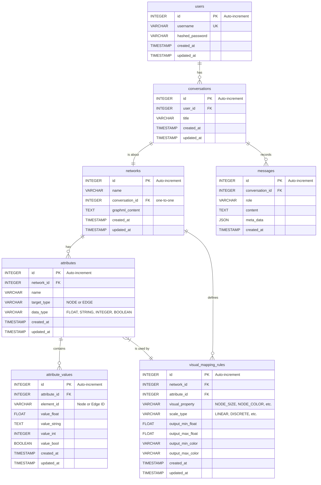

# 4. データベーススキーマ仕様

**前提知識レベル:**
- リレーショナルデータベースおよびSQLに関する基本的な知識
- ER図の読解能力

このドキュメントでは、GraphVisAgentアプリケーションで使用される主要なデータベーススキーマを定義します。

## 4.1. 設計方針

本データベースは、以下の設計方針に基づき、データの永続化を行います。

1.  **会話とネットワークの1対1関係**:
    ユーザーからのフィードバックに基づき、データモデルを単純化します。従来の「プロジェクト」という概念を廃止し、「**1つの会話が1つのネットワークを扱う**」という、より直感的な1対1の関係を基本構造とします。

2.  **属性の永続化**:
    ネットワークの属性（次数中心性などの計算結果や、元データに含まれる属性）は、一時的な「キャッシュ」ではなく、ネットワークが恒久的に持つ**永続的なデータ（列）**として扱います。これにより、Gephiのデータテーブルのように、一度計算・追加された属性はいつでも再利用可能になります。

3.  **視覚スタイルの非永続化**:
    ノードの色やサイズといった最終的な視覚スタイルそのものは永続化しません。代わりに、「どの属性を、どのように視覚的特徴に変換するか」という**マッピングルールのみを永続化**します。最終的なレンダリングデータは、このルールと属性値に基づき、リクエストの都度、動的に組み立てられます。これにより、状態の不整合を防ぎ、柔軟な視覚表現の変更を可能にします。

4.  **拡張性と柔軟性**:
    将来的な機能拡張に柔軟に対応するため、`messages`テーブルに`meta_data`フィールド（JSONB型）を設けます。これにより、構造化された追加情報をスキーマ変更なしに格納できます。

## 4.2. ER図



### テーブル定義

| テーブル名 | 説明 |
|:---|:---|
| `users` | アプリケーションのユーザー情報を格納します。 |
| `conversations` | ユーザーが行う個々の分析セッション（会話）を管理します。各会話は必ず1つのネットワークに紐付きます。 |
| `networks` | ユーザーがアップロードしたGraphML形式の元データ、またはNetworkXMCPによって正規化されたGraphMLデータ。 |
| `messages` | `conversations` に含まれる個々のメッセージ（ユーザーの発言、アシスタントの応答）を時系列で記録します。 |
| `attributes` | ネットワークの属性（列）のメタデータを定義します。元データ由来か、計算によって追加されたものかを問いません（例: '次数中心性', 'NODE', 'FLOAT'）。Gephiのデータテーブルの列定義に相当します。 |
| `attribute_values` | `attributes`で定義された各属性の、個々のノード/エッジにおける実際の値を格納します。 |
| `visual_mapping_rules` | どの属性をどの視覚的特徴（ノードサイズ、色など）にマッピングするかのルールを定義します。このテーブルは常に**最新の**マッピングルールセットを保持し、チャットでの対話を通じてルールは追加・更新されます。最終的な視覚スタイルは、このルールに基づいて動的に生成されます。 |

## 4.3. 属性データ (Attributes & Attribute Values)

ネットワークの属性（Gephiにおけるデータテーブルの列に相当）とその値を格納します。属性のメタデータ（列名やデータ型）と、実際の値（各ノード/エッジの持つ値）を分離して管理することで、正規化を実現します。

### 4.3.1. `attributes` テーブル

属性のメタデータを定義します。

```sql
CREATE TABLE attributes (
    id INTEGER PRIMARY KEY AUTOINCREMENT,
    network_id INTEGER NOT NULL,          -- 外部キーとしてnetworksテーブルに関連付け
    name VARCHAR(255) NOT NULL,     -- 属性名（'degree_centrality', 'component_id'など）
    target_type VARCHAR(50) NOT NULL, -- 'NODE' または 'EDGE'
    data_type VARCHAR(50) NOT NULL,   -- 'FLOAT', 'STRING', 'INTEGER', 'BOOLEAN'
    created_at TIMESTAMPTZ DEFAULT NOW(),
    updated_at TIMESTAMPTZ DEFAULT NOW(),
    FOREIGN KEY (network_id) REFERENCES networks(id),
    UNIQUE(network_id, name)
);
```

### 4.3.2. `attribute_values` テーブル

個々のノード/エッジが持つ属性値を格納します。`data_type`に応じて、対応する`value_*`カラムのいずれか一つに値が格納されます。

```sql
CREATE TABLE attribute_values (
    id INTEGER PRIMARY KEY AUTOINCREMENT,
    attribute_id INTEGER NOT NULL,      -- 外部キーとしてattributesテーブルに関連付け
    element_id VARCHAR(255) NOT NULL, -- 対象となるノードIDまたはエッジID
    value_float FLOAT,
    value_string TEXT,
    value_int INTEGER,
    value_bool BOOLEAN,
    created_at TIMESTAMPTZ DEFAULT NOW(),
    updated_at TIMESTAMPTZ DEFAULT NOW(),
    FOREIGN KEY (attribute_id) REFERENCES attributes(id),
    UNIQUE(attribute_id, element_id)
);
```

## 4.4. 視覚マッピングルール (`visual_mapping_rules`)

「どの属性」を「どの視覚的特徴」に「どのようにマッピングするか」というルールを永続化します。このテーブルの定義に基づき、レンダリングデータは動的に生成されます。

```sql
CREATE TABLE visual_mapping_rules (
    id INTEGER PRIMARY KEY AUTOINCREMENT,
    network_id INTEGER NOT NULL,          -- 外部キーとしてnetworksテーブルに関連付け
    attribute_id INTEGER NOT NULL,        -- 外部キーとしてattributesテーブルに関連付け
    visual_property VARCHAR(100) NOT NULL, -- 'NODE_SIZE', 'NODE_COLOR', 'EDGE_WIDTH'など
    scale_type VARCHAR(50) NOT NULL,      -- 'LINEAR'（線形）, 'DISCRETE'（離散）, 'PASSTHROUGH'（値の直接利用）など
    
    -- 線形マッピング用の設定
    output_min_float FLOAT,               -- 例: NODE_SIZEの最小値
    output_max_float FLOAT,               -- 例: NODE_SIZEの最大値
    output_min_color VARCHAR(7),          -- 例: NODE_COLORのグラデーション開始色（#RRGGBB）
    output_max_color VARCHAR(7),          -- 例: NODE_COLORのグラデーション終了色（#RRGGBB）

    created_at TIMESTAMPTZ DEFAULT NOW(),
    updated_at TIMESTAMPTZ DEFAULT NOW(),
    FOREIGN KEY (network_id) REFERENCES networks(id),
    FOREIGN KEY (attribute_id) REFERENCES attributes(id),
    UNIQUE(network_id, visual_property)
);
```

**補足:** `UNIQUE(network_id, visual_property)` 制約により、「あるネットワーク(`network_id`)に対して、特定の視覚的特徴（例: `NODE_SIZE`）のルールは常に1つだけである」ことがデータベースレベルで保証されます。ユーザーが対話の中でマッピング対象の属性を変更した場合（例: 「サイズを次数中心性ではなく媒介中心性で表現して」）、この制約によって既存のルールが新しいルールで**上書き（UPDATE）**されるため、ルールセットは常に最新の状態に保たれます。


**補足:** `DISCRETE`（離散値）マッピング（例: 特定のカテゴリ文字列を特定の色に割り当てる）を厳密に実装する場合、さらに別のテーブル（`discrete_mapping_pairs`など）が必要になりますが、本仕様ではまず連続値マッピングを主眼に置き、スキーマを単純化しています。

