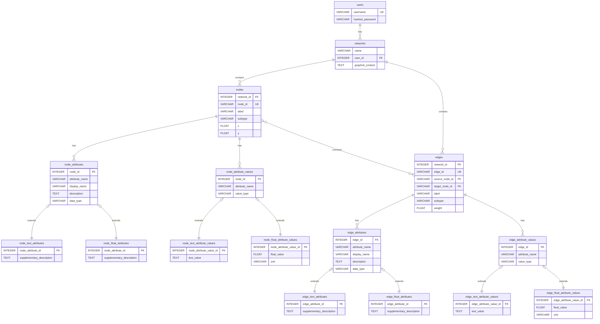

# 4. データベーススキーマ仕様

**前提知識レベル:**
- リレーショナルデータベースおよびSQLに関する基本的な知識
- ER図の読解能力

このドキュメントでは、GraphVisAgentアプリケーションで使用される主要なデータベーススキーマを定義します。

## 4.1. 設計方針

本データベースは、以下の設計方針に基づき、データの永続化を行います。

1.  **ユーザーとネットワークの関係**:
    ユーザーは複数のネットワークを所有できます。各ネットワークは1人のユーザーに属します。

2.  **ノードとエッジの明示的な管理**:
    ネットワークを構成するノードとエッジを明示的に管理します。これにより、ノードやエッジに対する操作（追加、削除、更新）が容易になります。また、サブタイプ情報を持たせることで、より詳細な分類が可能になります。

3.  **属性の永続化と型別分離**:
    ネットワークの属性（次数中心性などの計算結果や、元データに含まれる属性）は、一時的な「キャッシュ」ではなく、ネットワークが恒久的に持つ**永続的なデータ**として扱います。さらに、**データ型別・要素別に分離したテーブル構造**を採用し、型安全性とクエリパフォーマンスを向上させます。

4.  **属性メタデータの充実化**:
    属性には詳細な説明や使用方法に関するメタデータを付与し、名前だけでは不十分な情報を補完します。これにより、LLMの属性選択精度が向上し、より適切な視覚マッピングが可能になります。

5.  **サブタイプによる型の階層化**:
    属性や属性値のテーブルをサブタイプとして階層化することで、共通の特性を持ちながらも型ごとに特化した情報を格納できるようにします。これにより、データモデルの柔軟性と拡張性が向上します。

6.  **拡張性と柔軟性**:
    将来的な機能拡張に柔軟に対応するため、構造化された追加情報をスキーマ変更なしに格納できる仕組みを提供します。

## 4.2. ER図



### テーブル定義

| テーブル名 | 説明 |
|:---|:---|
| `users` | アプリケーションのユーザー情報を格納します。 |
| `networks` | ユーザーがアップロードしたGraphML形式の元データ、またはNetworkXMCPによって正規化されたGraphMLデータ。ネットワーク全体の情報を管理します。 |
| `nodes` | ネットワーク内の各ノード（頂点）の基本情報を管理します。ノードID、ラベル、サブタイプ、座標情報などを格納します。 |
| `edges` | ネットワーク内の各エッジ（辺）の基本情報を管理します。エッジID、ソースノード、ターゲットノード、ラベル、サブタイプ、重みなどを格納します。 |
| `node_attributes` | ノードの属性に関する基本情報を管理します。これは抽象的な基底テーブルで、具体的な属性に関するメタデータは子テーブル（サブタイプ）に格納されます。 |
| `node_text_attributes` | `node_attributes`のサブタイプ。テキスト型の属性に関する追加の自然言語説明を格納します。 |
| `node_float_attributes` | `node_attributes`のサブタイプ。浮動小数点型の属性に関する追加の自然言語説明を格納します。 |
| `edge_attributes` | エッジの属性に関する基本情報を管理します。これは抽象的な基底テーブルで、具体的な属性に関するメタデータは子テーブル（サブタイプ）に格納されます。 |
| `edge_text_attributes` | `edge_attributes`のサブタイプ。テキスト型の属性に関する追加の自然言語説明を格納します。 |
| `edge_float_attributes` | `edge_attributes`のサブタイプ。浮動小数点型の属性に関する追加の自然言語説明を格納します。 |
| `node_attribute_values` | ノードの属性値に関する基本情報を管理します。これは抽象的な基底テーブルで、具体的な属性値は子テーブル（サブタイプ）に格納されます。 |
| `node_text_attribute_values` | `node_attribute_values`のサブタイプ。ノードのテキスト型属性値を格納します。 |
| `node_float_attribute_values` | `node_attribute_values`のサブタイプ。ノードの浮動小数点型属性値を格納します。 |
| `edge_attribute_values` | エッジの属性値に関する基本情報を管理します。これは抽象的な基底テーブルで、具体的な属性値は子テーブル（サブタイプ）に格納されます。 |
| `edge_text_attribute_values` | `edge_attribute_values`のサブタイプ。エッジのテキスト型属性値を格納します。 |
| `edge_float_attribute_values` | `edge_attribute_values`のサブタイプ。エッジの浮動小数点型属性値を格納します。 |

## 4.3. 基本テーブル

### 4.3.1. `users` テーブル

ユーザー情報を格納します。

```sql
CREATE TABLE users (
    id INTEGER PRIMARY KEY AUTOINCREMENT,
    username VARCHAR(255) NOT NULL UNIQUE,
    hashed_password VARCHAR(255) NOT NULL,
    created_at TIMESTAMPTZ DEFAULT NOW(),
    updated_at TIMESTAMPTZ DEFAULT NOW()
);
```

### 4.3.2. `networks` テーブル

ネットワーク情報を格納します。

```sql
CREATE TABLE networks (
    id INTEGER PRIMARY KEY AUTOINCREMENT,
    name VARCHAR(255) NOT NULL,
    user_id INTEGER NOT NULL,
    graphml_content TEXT,
    created_at TIMESTAMPTZ DEFAULT NOW(),
    updated_at TIMESTAMPTZ DEFAULT NOW(),
    FOREIGN KEY (user_id) REFERENCES users(id)
);
```

### 4.3.3. `nodes` テーブル

ネットワーク内のノード情報を格納します。

```sql
CREATE TABLE nodes (
    id INTEGER PRIMARY KEY AUTOINCREMENT,
    network_id INTEGER NOT NULL,
    node_id VARCHAR(255) NOT NULL,
    label VARCHAR(255),
    subtype VARCHAR(100),
    x FLOAT,
    y FLOAT,
    created_at TIMESTAMPTZ DEFAULT NOW(),
    updated_at TIMESTAMPTZ DEFAULT NOW(),
    FOREIGN KEY (network_id) REFERENCES networks(id),
    UNIQUE(network_id, node_id)
);
```

### 4.3.4. `edges` テーブル

ネットワーク内のエッジ情報を格納します。

```sql
CREATE TABLE edges (
    id INTEGER PRIMARY KEY AUTOINCREMENT,
    network_id INTEGER NOT NULL,
    edge_id VARCHAR(255) NOT NULL,
    source_node_id VARCHAR(255) NOT NULL,
    target_node_id VARCHAR(255) NOT NULL,
    label VARCHAR(255),
    subtype VARCHAR(100),
    weight FLOAT DEFAULT 1.0,
    created_at TIMESTAMPTZ DEFAULT NOW(),
    updated_at TIMESTAMPTZ DEFAULT NOW(),
    FOREIGN KEY (network_id) REFERENCES networks(id),
    FOREIGN KEY (network_id, source_node_id) REFERENCES nodes(network_id, node_id),
    FOREIGN KEY (network_id, target_node_id) REFERENCES nodes(network_id, node_id),
    UNIQUE(network_id, edge_id)
);
```

## 4.4. ノード属性テーブル（サブタイプ階層）

### 4.4.1. `node_attributes` テーブル（基底テーブル）

ノードの属性に関する基本情報を管理します。

```sql
CREATE TABLE node_attributes (
    id INTEGER PRIMARY KEY AUTOINCREMENT,
    node_id INTEGER NOT NULL,
    attribute_name VARCHAR(255) NOT NULL,
    display_name VARCHAR(255),
    description TEXT,
    data_type VARCHAR(50) NOT NULL,
    created_at TIMESTAMPTZ DEFAULT NOW(),
    updated_at TIMESTAMPTZ DEFAULT NOW(),
    FOREIGN KEY (node_id) REFERENCES nodes(id),
    UNIQUE(node_id, attribute_name)
);
```

### 4.4.2. `node_text_attributes` テーブル（サブタイプ）

テキスト型の属性に関する追加の自然言語説明を格納します。

```sql
CREATE TABLE node_text_attributes (
    id INTEGER PRIMARY KEY AUTOINCREMENT,
    node_attribute_id INTEGER NOT NULL,
    supplementary_description TEXT,
    created_at TIMESTAMPTZ DEFAULT NOW(),
    updated_at TIMESTAMPTZ DEFAULT NOW(),
    FOREIGN KEY (node_attribute_id) REFERENCES node_attributes(id)
);
```

### 4.4.3. `node_float_attributes` テーブル（サブタイプ）

浮動小数点型の属性に関する追加の自然言語説明を格納します。

```sql
CREATE TABLE node_float_attributes (
    id INTEGER PRIMARY KEY AUTOINCREMENT,
    node_attribute_id INTEGER NOT NULL,
    supplementary_description TEXT,
    created_at TIMESTAMPTZ DEFAULT NOW(),
    updated_at TIMESTAMPTZ DEFAULT NOW(),
    FOREIGN KEY (node_attribute_id) REFERENCES node_attributes(id)
);
```

## 4.5. エッジ属性テーブル（サブタイプ階層）

### 4.5.1. `edge_attributes` テーブル（基底テーブル）

エッジの属性に関する基本情報を管理します。

```sql
CREATE TABLE edge_attributes (
    id INTEGER PRIMARY KEY AUTOINCREMENT,
    edge_id INTEGER NOT NULL,
    attribute_name VARCHAR(255) NOT NULL,
    display_name VARCHAR(255),
    description TEXT,
    data_type VARCHAR(50) NOT NULL,
    created_at TIMESTAMPTZ DEFAULT NOW(),
    updated_at TIMESTAMPTZ DEFAULT NOW(),
    FOREIGN KEY (edge_id) REFERENCES edges(id),
    UNIQUE(edge_id, attribute_name)
);
```

### 4.5.2. `edge_text_attributes` テーブル（サブタイプ）

テキスト型の属性に関する追加の自然言語説明を格納します。

```sql
CREATE TABLE edge_text_attributes (
    id INTEGER PRIMARY KEY AUTOINCREMENT,
    edge_attribute_id INTEGER NOT NULL,
    supplementary_description TEXT,
    created_at TIMESTAMPTZ DEFAULT NOW(),
    updated_at TIMESTAMPTZ DEFAULT NOW(),
    FOREIGN KEY (edge_attribute_id) REFERENCES edge_attributes(id)
);
```

### 4.5.3. `edge_float_attributes` テーブル（サブタイプ）

浮動小数点型の属性に関する追加の自然言語説明を格納します。

```sql
CREATE TABLE edge_float_attributes (
    id INTEGER PRIMARY KEY AUTOINCREMENT,
    edge_attribute_id INTEGER NOT NULL,
    supplementary_description TEXT,
    created_at TIMESTAMPTZ DEFAULT NOW(),
    updated_at TIMESTAMPTZ DEFAULT NOW(),
    FOREIGN KEY (edge_attribute_id) REFERENCES edge_attributes(id)
);
```

## 4.6. ノード属性値テーブル（サブタイプ階層）

### 4.6.1. `node_attribute_values` テーブル（基底テーブル）

ノードの属性値に関する基本情報を管理します。

```sql
CREATE TABLE node_attribute_values (
    id INTEGER PRIMARY KEY AUTOINCREMENT,
    node_id INTEGER NOT NULL,
    attribute_name VARCHAR(255) NOT NULL,
    value_type VARCHAR(50) NOT NULL,
    created_at TIMESTAMPTZ DEFAULT NOW(),
    updated_at TIMESTAMPTZ DEFAULT NOW(),
    FOREIGN KEY (node_id) REFERENCES nodes(id),
    UNIQUE(node_id, attribute_name)
);
```

### 4.6.2. `node_text_attribute_values` テーブル（サブタイプ）

ノードの属性値のうち、テキスト型の値を格納します。

```sql
CREATE TABLE node_text_attribute_values (
    id INTEGER PRIMARY KEY AUTOINCREMENT,
    node_attribute_value_id INTEGER NOT NULL,
    text_value TEXT,
    created_at TIMESTAMPTZ DEFAULT NOW(),
    updated_at TIMESTAMPTZ DEFAULT NOW(),
    FOREIGN KEY (node_attribute_value_id) REFERENCES node_attribute_values(id)
);
```

### 4.6.3. `node_float_attribute_values` テーブル（サブタイプ）

ノードの属性値のうち、浮動小数点型の値を格納します。

```sql
CREATE TABLE node_float_attribute_values (
    id INTEGER PRIMARY KEY AUTOINCREMENT,
    node_attribute_value_id INTEGER NOT NULL,
    float_value FLOAT,
    unit VARCHAR(50),
    created_at TIMESTAMPTZ DEFAULT NOW(),
    updated_at TIMESTAMPTZ DEFAULT NOW(),
    FOREIGN KEY (node_attribute_value_id) REFERENCES node_attribute_values(id)
);
```

## 4.7. エッジ属性値テーブル（サブタイプ階層）

### 4.7.1. `edge_attribute_values` テーブル（基底テーブル）

エッジの属性値に関する基本情報を管理します。

```sql
CREATE TABLE edge_attribute_values (
    id INTEGER PRIMARY KEY AUTOINCREMENT,
    edge_id INTEGER NOT NULL,
    attribute_name VARCHAR(255) NOT NULL,
    value_type VARCHAR(50) NOT NULL,
    created_at TIMESTAMPTZ DEFAULT NOW(),
    updated_at TIMESTAMPTZ DEFAULT NOW(),
    FOREIGN KEY (edge_id) REFERENCES edges(id),
    UNIQUE(edge_id, attribute_name)
);
```

### 4.7.2. `edge_text_attribute_values` テーブル（サブタイプ）

エッジの属性値のうち、テキスト型の値を格納します。

```sql
CREATE TABLE edge_text_attribute_values (
    id INTEGER PRIMARY KEY AUTOINCREMENT,
    edge_attribute_value_id INTEGER NOT NULL,
    text_value TEXT,
    created_at TIMESTAMPTZ DEFAULT NOW(),
    updated_at TIMESTAMPTZ DEFAULT NOW(),
    FOREIGN KEY (edge_attribute_value_id) REFERENCES edge_attribute_values(id)
);
```

### 4.7.3. `edge_float_attribute_values` テーブル（サブタイプ）

エッジの属性値のうち、浮動小数点型の値を格納します。

```sql
CREATE TABLE edge_float_attribute_values (
    id INTEGER PRIMARY KEY AUTOINCREMENT,
    edge_attribute_value_id INTEGER NOT NULL,
    float_value FLOAT,
    unit VARCHAR(50),
    created_at TIMESTAMPTZ DEFAULT NOW(),
    updated_at TIMESTAMPTZ DEFAULT NOW(),
    FOREIGN KEY (edge_attribute_value_id) REFERENCES edge_attribute_values(id)
);
```

## 4.8. データ型判定ロジック

属性値を解析して適切なデータ型を判定するロジックを実装します。

```python
def determine_attribute_type(attribute_name, value):
    """
    属性値を解析して適切なデータ型を判定する
    
    Parameters:
    - attribute_name: 属性名
    - value: 属性値
    
    Returns:
    - data_type: 判定されたデータ型 ('TEXT', 'FLOAT')
    - processed_value: 処理された値
    """
    # None値の場合はTEXTとして扱う
    if value is None:
        return "TEXT", ""
    
    # 数値への変換を試みる
    try:
        float_value = float(value)
        return "FLOAT", float_value
    except (ValueError, TypeError):
        # 数値に変換できない場合はテキスト型として扱う
        return "TEXT", str(value)
```

## 4.9. 属性値の保存ロジック

属性値を適切なサブタイプテーブルに保存するロジックを実装します。

```python
def save_node_attribute(node_id, attribute_name, value):
    """
    ノードの属性値を保存する
    
    Parameters:
    - node_id: ノードID
    - attribute_name: 属性名
    - value: 属性値
    """
    # データ型を判定
    data_type, processed_value = determine_attribute_type(attribute_name, value)
    
    # 基底テーブルに属性情報を保存
    node_attribute_id = save_node_attribute_base(node_id, attribute_name, data_type)
    
    # データ型に応じて適切なサブタイプテーブルに値を保存
    if data_type == "TEXT":
        save_node_text_attribute(node_attribute_id, processed_value)
    elif data_type == "FLOAT":
        save_node_float_attribute(node_attribute_id, processed_value)
```

## 4.10. サブタイプの利点

サブタイプを使用したテーブル構造には、以下のような利点があります：

1. **型安全性の確保**:
   - 各サブタイプが特定のデータ型に特化しているため、型の整合性が保たれる
   - 型変換の必要性が減少

2. **拡張性の向上**:
   - 新しいデータ型のサブタイプを追加することで、容易に拡張可能
   - 既存のコードに影響を与えずに新機能を追加できる

3. **クエリの最適化**:
   - 特定のデータ型に対するクエリが最適化される
   - インデックスの効率的な利用が可能

4. **データの整合性**:
   - 各サブタイプが親テーブルに依存するため、データの整合性が保たれる
   - 外部キー制約により、関連データの一貫性が確保される

5. **コードの再利用**:
   - 共通の処理は親テーブルで実装し、特殊な処理はサブタイプで実装することで、コードの再利用性が向上
   - 保守性と可読性の向上
