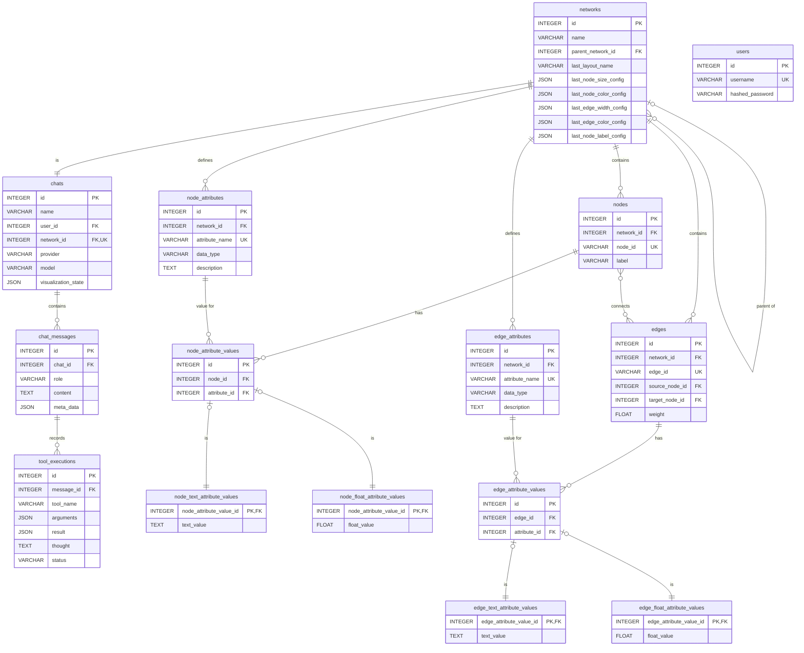

# 4. データベーススキーマ仕様

**前提知識レベル:**
- リレーショナルデータベースおよびSQLに関する基本的な知識
- ER図の読解能力

このドキュメントでは、GraphVisAgentアプリケーションで使用される主要なデータベーススキーマを定義します。

## 4.1. 設計方針

本データベースは、以下の設計方針に基づき、データの永続化を行います。

1.  **ユーザーとチャット、ネットワークの関係**:
    ユーザーは複数のチャットを持つことができます。各チャットセッションは、単一のネットワークに1対1で対応します。

2.  **ノードとエッジの明示的な管理**:
    ネットワークを構成するノードとエッジを明示的に管理します。

3.  **属性の永続化と型別分離**:
    ネットワークの属性（計算結果や元データ由来）は永続的なデータとして扱います。データ型別・要素別に分離したテーブル構造（サブタイプモデル）を採用し、型安全性を確保します。

4.  **属性メタデータの充実化**:
    属性には詳細な説明を付与し、LLMの属性選択精度を向上させます。属性が計算による派生であるかどうか、およびその計算条件も属性定義側に保持します（4.5）。

5.  **エージェントの実行履歴の保存**:
    ツールの呼び出しと結果は、メッセージ本文とは独立したレコードとして保存します（4.8）。会話に用いた LLM のプロバイダとモデルもチャットに保持します。

6.  **複数データベースのサポート**:
    SQLAlchemy ORMを使用することで、PostgreSQLとMySQLの両方に対応可能なデータベース設計とします。具体的なDDLは、SQLAlchemyのマイグレーションツール（例: Alembic）によって各データベースに最適化された形で生成されます。

7.  **柔軟なデータ検証と型安全性**:
    属性定義（`NodeAttribute` / `EdgeAttribute`）に「期待されるデータ型（`data_type`）」を保持します。一方で、実際の値は型別のテーブル（`NodeFloatAttributeValue` / `NodeTextAttributeValue`）に格納します。
    これにより、以下のメリットを享受します：
    - **柔軟性**: インポート時に型不一致があってもエラーとせず、テキストとして保存することでデータの消失を防ぎます（例: 数値属性に "N/A" が混入した場合）。
    - **検証可能性**: `data_type` と実際の格納テーブルを比較することで、後から型不一致データを特定・検証できます。

## 4.2. ER図

## 4.3. テーブル定義について

**列定義は `common/models.py` が唯一の情報源である。** SQLAlchemy ORM が両サービスから共有されており、そこに書かれた型・制約・関連がそのまま実体である。この文書に DDL を転記していた時期は、実装との乖離が最も早く進んだ箇所であった。

以下では、モデル定義を読んだだけでは意図が分からない設計判断を述べる。

## 4.4. 属性のサブタイプ階層

属性は「定義」と「値」を分け、値はさらに型別のテーブルに分離する。

### 4.4.1. なぜ定義と値を分けるのか

属性の定義（名前・データ型・説明・由来）はネットワークに 1 つだが、値はノードの数だけ存在する。分離することで、**エージェントは値を一切読まずに「どんな属性が使えるか」を把握できる。** 属性一覧のリソースが軽量であることは、システムプロンプトの文脈に含められるかどうかを左右する。

### 4.4.2. なぜ値を型別のテーブルに分けるのか

宣言された型と実際の格納先を分離することで、**インポート時の型不一致をエラーにせずに済む**。数値属性のはずの列に "N/A" が混入していても、その値はテキストとして保存され、データは失われない。

同時に、宣言された型と実際の格納テーブルを突き合わせれば、後から型不一致のデータを特定できる。**寛容にインポートし、厳密に検証する**という方針を、スキーマの形で表現したものである。

厳密な型を強制する設計を採らなかったのは、対象が研究者の手元にある実データだからである。取り込めないファイルがあることは、多少の型の揺れよりも重い問題になる。

## 4.5. 派生属性のキャッシュ

計算によって生成された属性（中心性、コミュニティ、レイアウト座標）は、元データ由来の属性と**同じテーブルに**格納する。ただし、派生であること・何から計算されたか・どのパラメータで計算されたか・計算時点のグラフ構造は、属性定義側に記録する。

### 4.5.1. 同じテーブルに置く理由

エージェントから見れば、「元データにあった `department`」と「計算した媒介中心性」は同じ *ノードの属性* であり、色やサイズに割り当てられる同じ種類のものである。格納場所を分けると、可視化ツールは両方を照会しなければならなくなり、その分岐が全ツールに波及する。

### 4.5.2. グラフ構造のハッシュを持つ理由

派生属性は入力となるグラフ構造に依存する。**サブグラフを作れば、同じ名前の中心性でも値は変わる。** 計算時のグラフ構造をハッシュとして保持することで、キャッシュが現在の構造に対して有効かどうかを判定できる。

パラメータも同様に記録するため、**異なるパラメータでの再計算は自動的にキャッシュミスになる**。明示的な再計算フラグは、利用者が「同じ条件でもう一度計算せよ」と求めた場合のためだけに存在する。

## 4.6. ネットワークの親子関係

ネットワークは自分自身への親参照を持ち、サブグラフは親を指す。**サブグラフは独立したネットワークとして格納され、親のノード・エッジを参照するのではなく複製する。**

**根拠**: サブグラフに対して計算された派生属性は、そのサブグラフの構造に対する値であり、親の同名属性とは別物である（4.5.2）。参照で表現すると、どちらの構造に対する値なのかを属性側で区別しなければならなくなる。複製のコストを払う代わりに、「1 つのネットワーク = 1 つの構造 = 1 組の属性」という単純な関係を保っている。

親をたどれる構造は、認可（[1_Backend.md](./1_Backend.md) 1.2.1）と、表示を親に戻す操作の双方で使われる。

## 4.7. チャットとネットワークの対応

チャットはネットワークと 1 対 1 で対応するが、この参照は**会話の中で移動する**。サブグラフを作れば参照はサブグラフを指し、親に戻れば巻き戻る。設計上の含意は [1_Backend.md](./1_Backend.md) 1.4.1 を参照。

## 4.8. ツール実行の記録

エージェントによるツール呼び出しは、メッセージとは独立したレコードとして保存する。呼び出し名・引数・結果・思考・状態・開始と終了の時刻を持つ。

**根拠**: これはエージェントの振る舞いを評価するための一次データである。メッセージ本文の表示形式が変わっても、この記録の形は変わってはならない。メッセージの拡張用メタデータに埋め込む設計を採らなかったのはこのためである。

## 4.9. 複数データベースへの対応

SQLAlchemy ORM を介することで、特定の RDBMS の方言に依存しない。DDL はマイグレーションツールが各データベース向けに生成する。この文書に手書きの `CREATE TABLE` を置かないのは、それが特定方言の写しにしかならないためでもある。
