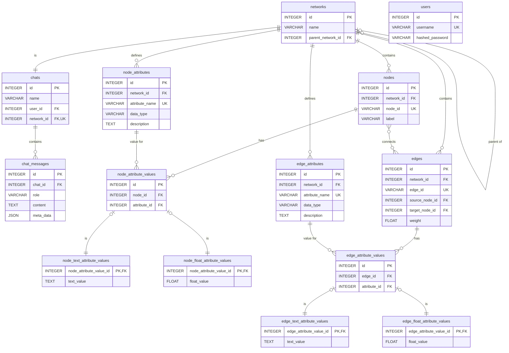

# 4. データベーススキーマ仕様

**前提知識レベル:**
- リレーショナルデータベースおよびSQLに関する基本的な知識
- ER図の読解能力

このドキュメントでは、GraphVisAgentアプリケーションで使用される主要なデータベーススキーマを定義します。

## 4.1. 設計方針

本データベースは、以下の設計方針に基づき、データの永続化を行います。

1.  **ユーザーとチャット、ネットワークの関係**:
    ユーザーは複数のチャットを持つことができます。各チャットセッションは、単一のネットワークに1対1で対応します。

2.  **ノードとエッジの明示的な管理**:
    ネットワークを構成するノードとエッジを明示的に管理します。

3.  **属性の永続化と型別分離**:
    ネットワークの属性（計算結果や元データ由来）は永続的なデータとして扱います。データ型別・要素別に分離したテーブル構造（サブタイプモデル）を採用し、型安全性を確保します。

4.  **属性メタデータの充実化**:
    属性には詳細な説明を付与し、LLMの属性選択精度を向上させます。

5.  **複数データベースのサポート**:
    SQLAlchemy ORMを使用することで、PostgreSQLとMySQLの両方に対応可能なデータベース設計とします。具体的なDDLは、SQLAlchemyのマイグレーションツール（例: Alembic）によって各データベースに最適化された形で生成されます。

6.  **柔軟なデータ検証と型安全性**:
    属性定義（`NodeAttribute` / `EdgeAttribute`）に「期待されるデータ型（`data_type`）」を保持します。一方で、実際の値は型別のテーブル（`NodeFloatAttributeValue` / `NodeTextAttributeValue`）に格納します。
    これにより、以下のメリットを享受します：
    - **柔軟性**: インポート時に型不一致があってもエラーとせず、テキストとして保存することでデータの消失を防ぎます（例: 数値属性に "N/A" が混入した場合）。
    - **検証可能性**: `data_type` と実際の格納テーブルを比較することで、後から型不一致データを特定・検証できます。

## 4.2. ER図



### テーブル定義
(テーブル定義のリストはER図とSQLから自明なため省略)

## 4.3. 基本テーブル

**補足:** 以下のテーブル定義は概念的なものであり、SQLAlchemy ORMを通じて定義されます。`id`カラムの自動採番（`AUTOINCREMENT`相当）は、SQLAlchemyが各データベースの適切な機能（PostgreSQLの`SERIAL`や`IDENTITY`、MySQLの`AUTO_INCREMENT`など）を利用して管理します。

### 4.3.1. `users`
```sql
CREATE TABLE users (
    id INTEGER PRIMARY KEY,
    username VARCHAR(255) NOT NULL UNIQUE,
    hashed_password VARCHAR(255) NOT NULL,
    created_at TIMESTAMPTZ DEFAULT NOW(),
    updated_at TIMESTAMPTZ DEFAULT NOW()
);
```

### 4.3.2. `networks`
```sql
CREATE TABLE networks (
    id INTEGER PRIMARY KEY,
    name VARCHAR(255) NOT NULL,
    description TEXT,
    parent_network_id INTEGER,

    created_at TIMESTAMPTZ DEFAULT NOW(),
    updated_at TIMESTAMPTZ DEFAULT NOW(),
    FOREIGN KEY (parent_network_id) REFERENCES networks(id)
);
```

### 4.3.3. networks (ネットワーク)

| カラム名 | データ型 | 制約 | 説明 |
| :--- | :--- | :--- | :--- |
| `id` | `INTEGER` | `PRIMARY KEY` | ネットワークの一意識別子 |
| `name` | `VARCHAR` | `NOT NULL` | ネットワーク名 |
| `description` | `TEXT` | `NULLABLE` | ネットワークの説明・メタデータ |
| `parent_network_id` | `INTEGER` | `FOREIGN KEY` | 親ネットワークのID（サブグラフの場合） |


- **説明**: グラフデータ全体を管理するテーブルです。
- **リレーション**:
    - `chats` テーブルと1対1の関係を持ちます。
    - `nodes`, `edges`, `node_attributes`, `edge_attributes` と1対多の関係を持ちます。
    - 自分自身 (`networks`) と1対多の関係を持ちます（サブグラフの階層構造）。

### 4.3.4. `chats`
```sql
CREATE TABLE chats (
    id INTEGER PRIMARY KEY,
    name VARCHAR(255) NOT NULL,
    user_id INTEGER NOT NULL,
    network_id INTEGER NOT NULL UNIQUE,
    created_at TIMESTAMPTZ DEFAULT NOW(),
    updated_at TIMESTAMPTZ DEFAULT NOW(),
    FOREIGN KEY (user_id) REFERENCES users(id),
    FOREIGN KEY (network_id) REFERENCES networks(id)
);
```

### 4.3.4. `chat_messages`
```sql
CREATE TABLE chat_messages (
    id INTEGER PRIMARY KEY,
    chat_id INTEGER NOT NULL,
    role VARCHAR(50) NOT NULL,
    content TEXT NOT NULL,
    meta_data JSON,
    created_at TIMESTAMPTZ DEFAULT NOW(),
    FOREIGN KEY (chat_id) REFERENCES chats(id)
);
```

### 4.3.5. `nodes`
```sql
CREATE TABLE nodes (
    id INTEGER PRIMARY KEY,
    network_id INTEGER NOT NULL,
    node_id VARCHAR(255) NOT NULL,
    label VARCHAR(255),
    created_at TIMESTAMPTZ DEFAULT NOW(),
    updated_at TIMESTAMPTZ DEFAULT NOW(),
    FOREIGN KEY (network_id) REFERENCES networks(id),
    UNIQUE(network_id, node_id)
);
```

### 4.3.6. `edges`
```sql
CREATE TABLE edges (
    id INTEGER PRIMARY KEY,
    network_id INTEGER NOT NULL,
    edge_id VARCHAR(255) NOT NULL,
    source_node_id INTEGER NOT NULL,
    target_node_id INTEGER NOT NULL,
    weight FLOAT DEFAULT 1.0,
    created_at TIMESTAMPTZ DEFAULT NOW(),
    updated_at TIMESTAMPTZ DEFAULT NOW(),
    FOREIGN KEY (network_id) REFERENCES networks(id),
    FOREIGN KEY (source_node_id) REFERENCES nodes(id),
    FOREIGN KEY (target_node_id) REFERENCES nodes(id),
    UNIQUE(network_id, edge_id)
);
```

## 4.4. 属性テーブル（サブタイプ階層）

### `node_attributes` (基底)
```sql
CREATE TABLE node_attributes (
    id INTEGER PRIMARY KEY,
    network_id INTEGER NOT NULL,
    attribute_name VARCHAR(255) NOT NULL,
    data_type VARCHAR(50), -- Expected type: "float", "string", etc.
    description TEXT,
    created_at TIMESTAMPTZ DEFAULT NOW(),
    updated_at TIMESTAMPTZ DEFAULT NOW(),
    FOREIGN KEY (network_id) REFERENCES networks(id),
    UNIQUE(network_id, attribute_name)
);
```
(Note: `node_text_attributes` and `node_float_attributes` definition tables are removed. Values are stored in `node_attribute_values` subtypes.)
### `edge_attributes` (基底)
```sql
CREATE TABLE edge_attributes (
    id INTEGER PRIMARY KEY,
    network_id INTEGER NOT NULL,
    attribute_name VARCHAR(255) NOT NULL,
    data_type VARCHAR(50), -- Expected type: "float", "string", etc.
    description TEXT,
    created_at TIMESTAMPTZ DEFAULT NOW(),
    updated_at TIMESTAMPTZ DEFAULT NOW(),
    FOREIGN KEY (network_id) REFERENCES networks(id),
    UNIQUE(network_id, attribute_name)
);
```
(Note: `edge_text_attributes` and `edge_float_attributes` definition tables are removed.)
## 4.5. 属性値テーブル（サブタイプ階層）

### `node_attribute_values` (基底)
```sql
CREATE TABLE node_attribute_values (
    id INTEGER PRIMARY KEY,
    node_id INTEGER NOT NULL,
    attribute_id INTEGER NOT NULL,
    created_at TIMESTAMPTZ DEFAULT NOW(),
    updated_at TIMESTAMPTZ DEFAULT NOW(),
    FOREIGN KEY (node_id) REFERENCES nodes(id),
    FOREIGN KEY (attribute_id) REFERENCES node_attributes(id),
    UNIQUE(node_id, attribute_id)
);
```
```sql
CREATE TABLE node_text_attribute_values (
    node_attribute_value_id INTEGER PRIMARY KEY,
    text_value TEXT,
    FOREIGN KEY (node_attribute_value_id) REFERENCES node_attribute_values(id)
);
```
```sql
CREATE TABLE node_float_attribute_values (
    node_attribute_value_id INTEGER PRIMARY KEY,
    float_value FLOAT,
    FOREIGN KEY (node_attribute_value_id) REFERENCES node_attribute_values(id)
);
```

### `edge_attribute_values` (基底)
```sql
CREATE TABLE edge_attribute_values (
    id INTEGER PRIMARY KEY,
    edge_id INTEGER NOT NULL,
    attribute_id INTEGER NOT NULL,
    created_at TIMESTAMPTZ DEFAULT NOW(),
    updated_at TIMESTAMPTZ DEFAULT NOW(),
    FOREIGN KEY (edge_id) REFERENCES edges(id),
    FOREIGN KEY (attribute_id) REFERENCES edge_attributes(id),
    UNIQUE(edge_id, attribute_id)
);
```
```sql
CREATE TABLE edge_text_attribute_values (
    edge_attribute_value_id INTEGER PRIMARY KEY,
    text_value TEXT,
    FOREIGN KEY (edge_attribute_value_id) REFERENCES edge_attribute_values(id)
);
```
```sql
CREATE TABLE edge_float_attribute_values (
    edge_attribute_value_id INTEGER PRIMARY KEY,
    float_value FLOAT,
    FOREIGN KEY (edge_attribute_value_id) REFERENCES edge_attribute_values(id)
);
```
