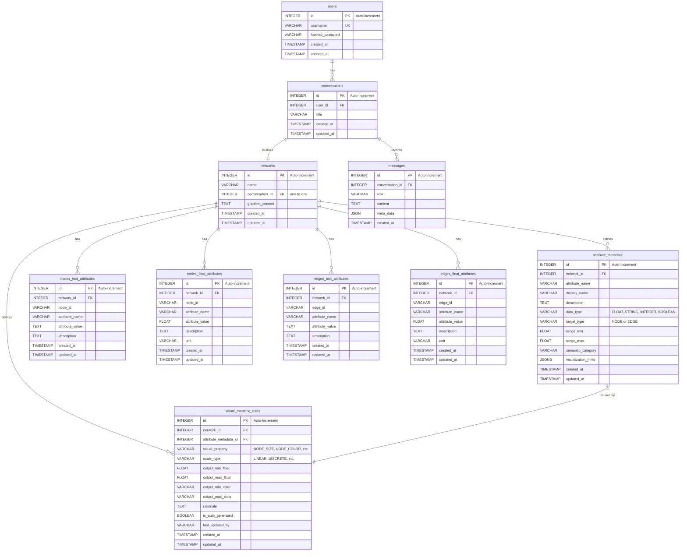

# 4. データベーススキーマ仕様

**前提知識レベル:**
- リレーショナルデータベースおよびSQLに関する基本的な知識
- ER図の読解能力

このドキュメントでは、GraphVisAgentアプリケーションで使用される主要なデータベーススキーマを定義します。

## 4.1. 設計方針

本データベースは、以下の設計方針に基づき、データの永続化を行います。

1.  **会話とネットワークの1対1関係**:
    ユーザーからのフィードバックに基づき、データモデルを単純化します。従来の「プロジェクト」という概念を廃止し、「**1つの会話が1つのネットワークを扱う**」という、より直感的な1対1の関係を基本構造とします。

2.  **属性の永続化と型別分離**:
    ネットワークの属性（次数中心性などの計算結果や、元データに含まれる属性）は、一時的な「キャッシュ」ではなく、ネットワークが恒久的に持つ**永続的なデータ**として扱います。さらに、**データ型別・要素別に分離したテーブル構造**を採用し、型安全性とクエリパフォーマンスを向上させます。

3.  **属性メタデータの充実化**:
    属性には詳細な説明や使用方法に関するメタデータを付与し、名前だけでは不十分な情報を補完します。これにより、LLMの属性選択精度が向上し、より適切な視覚マッピングが可能になります。

4.  **視覚マッピングの必須化**:
    視覚マッピングルールは、オプショナルなツールではなく、必須の処理フローとして位置づけます。「どの属性を、どのように視覚的特徴に変換するか」という**マッピングルールを永続化**し、最終的なレンダリングデータは、このルールと属性値に基づき、リクエストの都度、動的に組み立てられます。

5.  **拡張性と柔軟性**:
    将来的な機能拡張に柔軟に対応するため、構造化された追加情報をスキーマ変更なしに格納できる仕組みを提供します。

## 4.2. ER図



### テーブル定義

| テーブル名 | 説明 |
|:---|:---|
| `users` | アプリケーションのユーザー情報を格納します。 |
| `conversations` | ユーザーが行う個々の分析セッション（会話）を管理します。各会話は必ず1つのネットワークに紐付きます。 |
| `networks` | ユーザーがアップロードしたGraphML形式の元データ、またはNetworkXMCPによって正規化されたGraphMLデータ。 |
| `messages` | `conversations` に含まれる個々のメッセージ（ユーザーの発言、アシスタントの応答）を時系列で記録します。 |
| `attribute_metadata` | 属性のメタデータ（名前、説明、データ型、対象タイプ、意味的カテゴリなど）を定義します。 |
| `nodes_text_attributes` | ノードのテキスト型属性値を格納します。 |
| `nodes_float_attributes` | ノードの数値型属性値を格納します。 |
| `edges_text_attributes` | エッジのテキスト型属性値を格納します。 |
| `edges_float_attributes` | エッジの数値型属性値を格納します。 |
| `visual_mapping_rules` | どの属性をどの視覚的特徴（ノードサイズ、色など）にマッピングするかのルールを定義します。このテーブルは常に**最新の**マッピングルールセットを保持し、チャットでの対話を通じてルールは追加・更新されます。最終的な視覚スタイルは、このルールに基づいて動的に生成されます。 |

## 4.3. 属性データ (型別テーブル構造)

ネットワークの属性（Gephiにおけるデータテーブルの列に相当）とその値を格納します。従来の統一テーブルから、データ型別・要素別に分離したテーブル構造に変更することで、型安全性とクエリパフォーマンスを向上させます。

### 4.3.1. `attribute_metadata` テーブル

属性に関する詳細なメタデータを定義します。

```sql
CREATE TABLE attribute_metadata (
    id INTEGER PRIMARY KEY AUTOINCREMENT,
    network_id INTEGER NOT NULL,
    attribute_name VARCHAR(255) NOT NULL,
    display_name VARCHAR(255),
    description TEXT,
    data_type VARCHAR(50) NOT NULL,
    target_type VARCHAR(50) NOT NULL,
    range_min FLOAT,
    range_max FLOAT,
    semantic_category VARCHAR(100),
    visualization_hints JSONB,
    created_at TIMESTAMPTZ DEFAULT NOW(),
    updated_at TIMESTAMPTZ DEFAULT NOW(),
    FOREIGN KEY (network_id) REFERENCES networks(id),
    UNIQUE(network_id, attribute_name)
);
```

`visualization_hints`フィールドには、以下のような情報を格納します：

```json
{
  "suitable_for": ["node_size", "node_color"],
  "default_scale": "linear",
  "recommended_palette": "viridis",
  "interpretation": {
    "high_values": "重要なノード",
    "low_values": "周辺的なノード"
  }
}
```

### 4.3.2. ノード属性テーブル

ノードの属性値を、データ型に応じて2つのテーブルに分離して格納します。

#### `nodes_text_attributes` テーブル

```sql
CREATE TABLE nodes_text_attributes (
    id INTEGER PRIMARY KEY AUTOINCREMENT,
    network_id INTEGER NOT NULL,
    node_id VARCHAR(255) NOT NULL,
    attribute_name VARCHAR(255) NOT NULL,
    attribute_value TEXT,
    description TEXT,
    created_at TIMESTAMPTZ DEFAULT NOW(),
    updated_at TIMESTAMPTZ DEFAULT NOW(),
    FOREIGN KEY (network_id) REFERENCES networks(id),
    UNIQUE(network_id, node_id, attribute_name)
);
```

#### `nodes_float_attributes` テーブル

```sql
CREATE TABLE nodes_float_attributes (
    id INTEGER PRIMARY KEY AUTOINCREMENT,
    network_id INTEGER NOT NULL,
    node_id VARCHAR(255) NOT NULL,
    attribute_name VARCHAR(255) NOT NULL,
    attribute_value FLOAT,
    description TEXT,
    unit VARCHAR(50),
    created_at TIMESTAMPTZ DEFAULT NOW(),
    updated_at TIMESTAMPTZ DEFAULT NOW(),
    FOREIGN KEY (network_id) REFERENCES networks(id),
    UNIQUE(network_id, node_id, attribute_name)
);
```

### 4.3.3. エッジ属性テーブル

エッジの属性値も、データ型に応じて2つのテーブルに分離して格納します。

#### `edges_text_attributes` テーブル

```sql
CREATE TABLE edges_text_attributes (
    id INTEGER PRIMARY KEY AUTOINCREMENT,
    network_id INTEGER NOT NULL,
    edge_id VARCHAR(255) NOT NULL,
    attribute_name VARCHAR(255) NOT NULL,
    attribute_value TEXT,
    description TEXT,
    created_at TIMESTAMPTZ DEFAULT NOW(),
    updated_at TIMESTAMPTZ DEFAULT NOW(),
    FOREIGN KEY (network_id) REFERENCES networks(id),
    UNIQUE(network_id, edge_id, attribute_name)
);
```

#### `edges_float_attributes` テーブル

```sql
CREATE TABLE edges_float_attributes (
    id INTEGER PRIMARY KEY AUTOINCREMENT,
    network_id INTEGER NOT NULL,
    edge_id VARCHAR(255) NOT NULL,
    attribute_name VARCHAR(255) NOT NULL,
    attribute_value FLOAT,
    description TEXT,
    unit VARCHAR(50),
    created_at TIMESTAMPTZ DEFAULT NOW(),
    updated_at TIMESTAMPTZ DEFAULT NOW(),
    FOREIGN KEY (network_id) REFERENCES networks(id),
    UNIQUE(network_id, edge_id, attribute_name)
);
```

## 4.4. 視覚マッピングルール (`visual_mapping_rules`)

「どの属性」を「どの視覚的特徴」に「どのようにマッピングするか」というルールを永続化します。このテーブルの定義に基づき、レンダリングデータは動的に生成されます。

```sql
CREATE TABLE visual_mapping_rules (
    id INTEGER PRIMARY KEY AUTOINCREMENT,
    network_id INTEGER NOT NULL,
    attribute_metadata_id INTEGER NOT NULL,
    visual_property VARCHAR(100) NOT NULL,
    scale_type VARCHAR(50) NOT NULL,
    
    -- 線形マッピング用の設定
    output_min_float FLOAT,
    output_max_float FLOAT,
    output_min_color VARCHAR(7),
    output_max_color VARCHAR(7),
    
    -- 新しいフィールド
    rationale TEXT,
    is_auto_generated BOOLEAN DEFAULT FALSE,
    last_updated_by VARCHAR(50),
    
    created_at TIMESTAMPTZ DEFAULT NOW(),
    updated_at TIMESTAMPTZ DEFAULT NOW(),
    FOREIGN KEY (network_id) REFERENCES networks(id),
    FOREIGN KEY (attribute_metadata_id) REFERENCES attribute_metadata(id),
    UNIQUE(network_id, visual_property)
);
```

**補足:** `UNIQUE(network_id, visual_property)` 制約により、「あるネットワーク(`network_id`)に対して、特定の視覚的特徴（例: `NODE_SIZE`）のルールは常に1つだけである」ことがデータベースレベルで保証されます。ユーザーが対話の中でマッピング対象の属性を変更した場合（例: 「サイズを次数中心性ではなく媒介中心性で表現して」）、この制約によって既存のルールが新しいルールで**上書き（UPDATE）**されるため、ルールセットは常に最新の状態に保たれます。

**補足:** 新しいフィールドとして、`rationale`（マッピングの理由）、`is_auto_generated`（自動生成されたルールかどうか）、`last_updated_by`（最後に更新したエージェント）を追加しています。これにより、マッピングルールの説明可能性と追跡可能性が向上します。

## 4.5. データ型判定ロジック

属性値を解析してテーブルを自動選択する処理を実装します。これにより、適切なテーブルに属性値が格納されます。

```python
def determine_attribute_table(attribute_name, value, target_type):
    """
    属性値を解析して適切なテーブルを選択する
    
    Parameters:
    - attribute_name: 属性名
    - value: 属性値
    - target_type: 'NODE' または 'EDGE'
    
    Returns:
    - table_name: 適切なテーブル名
    - processed_value: 処理された値
    """
    try:
        # 数値に変換可能か試みる
        float_value = float(value)
        
        # 整数かどうかを確認
        if float_value.is_integer():
            float_value = int(float_value)
        
        if target_type == "NODE":
            return "nodes_float_attributes", float_value
        else:
            return "edges_float_attributes", float_value
    except (ValueError, TypeError):
        # 数値に変換できない場合はテキスト型として扱う
        if target_type == "NODE":
            return "nodes_text_attributes", str(value)
        else:
            return "edges_text_attributes", str(value)
```

## 4.6. 属性メタデータの自動生成

新しい属性が計算または追加されるときに、自動的にメタデータを生成する機能を実装します。

```python
def generate_attribute_metadata(attribute_name, data_type, target_type):
    """
    属性名に基づいて、メタデータを自動生成する
    
    Parameters:
    - attribute_name: 属性名
    - data_type: データ型
    - target_type: 対象タイプ
    
    Returns:
    - metadata: 生成されたメタデータ
    """
    metadata = {
        "attribute_name": attribute_name,
        "display_name": format_display_name(attribute_name),
        "description": "",
        "data_type": data_type,
        "target_type": target_type,
        "semantic_category": determine_semantic_category(attribute_name),
        "visualization_hints": {}
    }
    
    # 属性名に基づいて、メタデータを充実させる
    if "degree" in attribute_name:
        metadata["description"] = "ノードが持つエッジの数。ネットワーク内での接続度を示します。"
        metadata["semantic_category"] = "centrality_metric"
        metadata["visualization_hints"] = {
            "suitable_for": ["node_size", "node_color"],
            "default_scale": "sqrt",
            "interpretation": {
                "high_values": "多くの接続を持つ中心的なノード",
                "low_values": "少ない接続しか持たない周辺的なノード"
            }
        }
    # 他の属性タイプも同様に処理
    
    return metadata
```

## 4.7. 型別テーブル構造の利点

データ型別・要素別に分離したテーブル構造には、以下のような利点があります：

1. **クエリパフォーマンスの向上**:
   - データ型が明確なため、インデックス最適化が可能
   - 不要なカラムを含まないため、テーブルサイズが小さくなる

2. **型安全性の確保**:
   - 数値演算時のエラーを防止
   - 型変換の必要性が減少

3. **可視化マッピングの簡素化**:
   - Float属性に対して直接視覚変数をマッピング可能
   - 型に応じた適切な処理が容易

4. **拡張性の向上**:
   - 新しい属性タイプの追加が容易
   - メタデータの充実化が可能