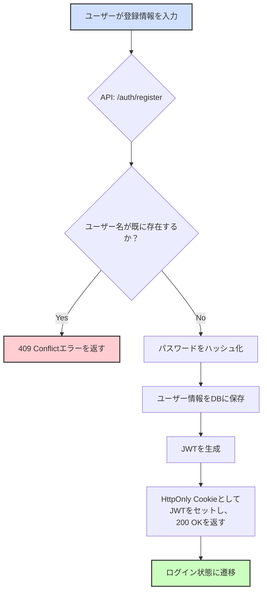
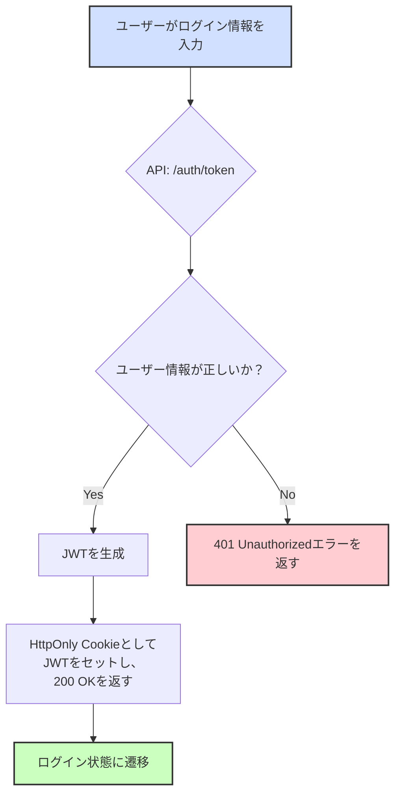

# 5. 認証フロー

**前提知識レベル:**
- OAuth2, JWTに関する基本的な知識
- シーケンス図の読解能力

**目的:** ユーザーが安全にシステムを利用するための、ユーザー登録およびログインのフローです。

認証後のデータ永続化やグラフ操作については、[6. 主要な処理フローとデータ生成](./6_Core_Workflows.md)を参照してください。

## 5.1. フローチャート

### 新規登録フロー

### ログインフロー

