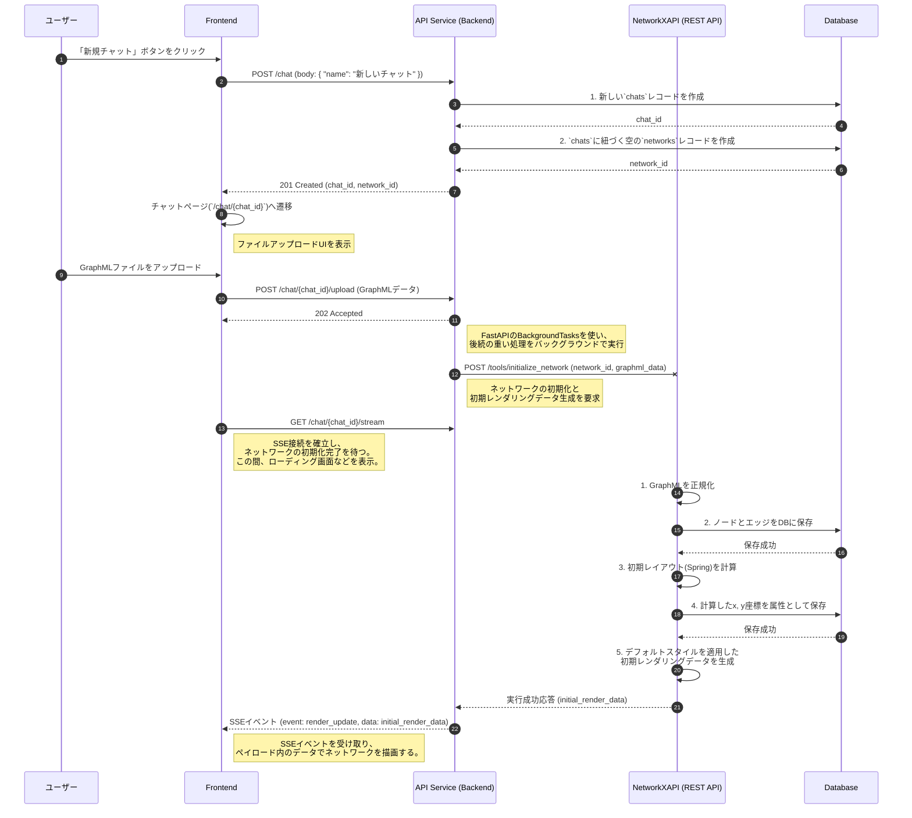
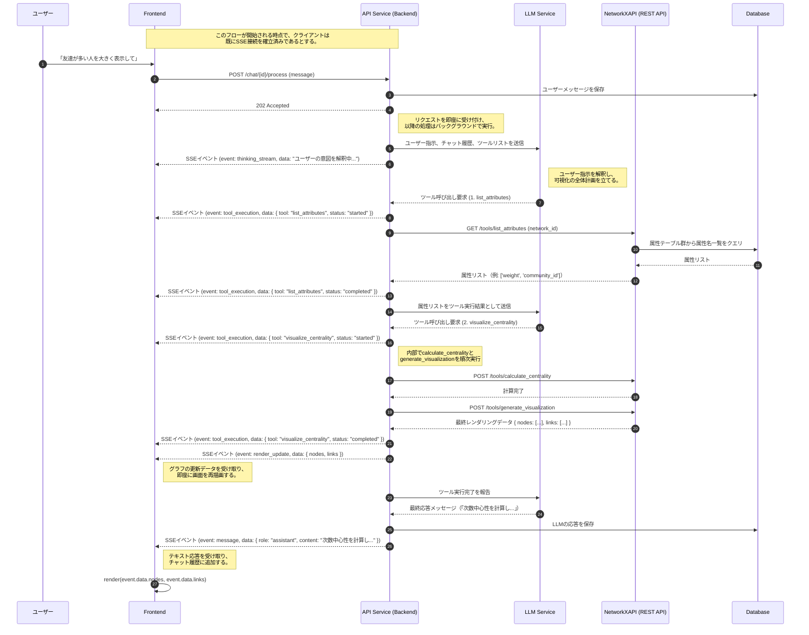
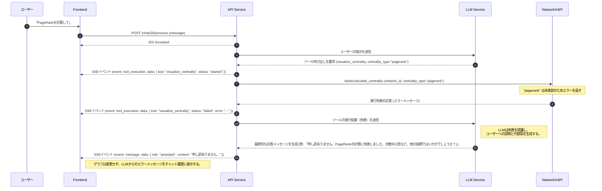

# 6. 主要な処理フローとデータ生成

**前提知識レベル:**
- シーケンス図の読解能力
- REST APIおよびSSEに関する知識
- LLMのFunction Calling（ツール呼び出し）に関する基本的な理解

## 6.1. 概要

このドキュメントでは、主要なユースケースにおけるコンポーネント間の動的なやり取りと、その過程で実行されるデータ生成のフローを定義します。

本システムのコア機能は、ユーザーの自然言語指示をLLMが解釈し、複数のツールを段階的に呼び出すことで、最終的なネットワークの可視化を実現する点にあります。

---

## 6.2. 新規チャット作成とネットワークの初期化フロー

**目的:** ユーザーが新しい分析サイクルを開始するフローを、**チャット作成**と**ネットワークデータ初期化**の2段階に分離して定義します。これにより、責務が明確になり、よりRESTfulな設計を実現します。

**方針:** ネットワークデータの処理は時間がかかる可能性があるため、**非同期処理**を維持します。Backendはアップロードリクエストを即座に受け付け、バックグラウンドでNetworkXAPIを呼び出します。NetworkXAPIは、データのパース、DBへの保存、初期レイアウト計算、デフォルトスタイル適用済みのレンダリングデータ生成までを一貫して行い、完了後にBackend経由でSSEを通じてクライアントに通知します。

---

## 6.3. チャットによるネットワーク操作（統一非同期フロー）

**目的:** ユーザーの自然言語指示に対し、Backendがリクエストを即座に受け付け、その後の全ての処理（LLMの思考、ツールの実行、最終的な応答）をSSEを通じてリアルタイムにクライアントへ通知する、統一された非同期フローを定義します。これが、本システムにおける唯一の信頼できるチャット操作フローです。

### 6.3.1. シーケンス図（統一非同期アーキテクチャ）

このフローでは、ブロッキングなHTTP応答は存在せず、全ての情報がSSEストリームを通じて伝達されるため、高い応答性とリアルタイム性を実現します。

### 6.3.2. データフローと責務詳細

この統一フローにおいて、フロントエンドは`POST /chat/{id}/process`を呼び出した後、HTTPレスポンスを待つことなく、即座に操作可能な状態を維持します。ローディング状態の管理は、SSEから送られてくる`tool_execution`イベントの`status`（`started`/`completed`）に基づいて行います。

1.  **リクエストの即時受付**:
    - Backendは`POST /chat/{id}/process`のリクエストを受け取ると、メッセージをDBに保存し、即座に`202 Accepted`を返す。これにより、フロントエンドはブロックされない。

2.  **LLMによるプランニングとツールの実行**:
    - BackendはバックグラウンドでLLMとの対話を開始する。
    - LLMの思考プロセスや、`list_attributes`、`visualize_centrality`といったツールの実行状況は、`thinking_stream`や`tool_execution`といった専用のSSEイベントを通じて逐一フロントエンドに通知される。

3.  **最終的な結果の通知**:
    - `visualize_centrality`が完了すると、Backendは2つの重要な情報をSSEで送信する。
        1.  `render_update`イベント: NetworkXAPIが生成した最終的なレンダリングデータ（`{nodes, links}`）を送信する。フロントエンドはこれを受けてグラフを再描画する。
        2.  `message`イベント: LLMが生成した最終的なテキスト応答（例：「次数中心性を計算し、ノードのサイズに反映しました。」）を送信する。フロントエンドはこれを受けてチャット履歴を更新する。

この設計により、フロントエンドとバックエンドは完全に疎結合となり、ユーザーは処理の途中経過をリアルタイムに把握しながら、待たされることなくアプリケーションの操作を続けることができます。

---

## 6.4. ツール呼び出し失敗時のエラーハンドリングフロー

**目的:** システムが予期せぬ状況（例: 未実装の計算）に陥った場合でも、LLMが状況を理解し、ユーザーに代替案を提示することで、チャットを継続できるようにします。このフローも同様に非同期で実行されます。

