# 6. 主要な処理フローとデータ生成

**前提知識レベル:**
- シーケンス図の読解能力
- REST APIおよびSSEに関する知識
- LLMのFunction Calling（ツール呼び出し）に関する基本的な理解

## 6.1. 概要

このドキュメントでは、主要なユースケースにおけるコンポーネント間の動的なやり取りと、その過程で実行されるデータ生成のフローを定義します。

本システムのコア機能は、ユーザーの自然言語指示をLLMが解釈し、複数のツールを段階的に呼び出すことで、最終的なネットワークの可視化を実現する点にあります。

---

## 6.2. 新規チャット作成とネットワークの初期化フロー

**目的:** ユーザーが新しい分析サイクルを開始するフローを、**チャット作成**と**ネットワークデータ初期化**の2段階に分離して定義します。これにより、責務が明確になり、よりRESTfulな設計を実現します。

**方針:** ネットワークデータの処理は時間がかかる可能性があるため、**非同期処理**を維持します。入力はユーザーのGraphMLファイルと同梱サンプルの二つを認めますが、どちらもBackendでGraphML文字列へ解決した後は同じ処理へ合流させます。これにより、入力方法によって属性型推論、初期レイアウト、概要表示が変わることを防ぎます。Backendはリクエストを即座に受け付け、バックグラウンドでNetworkXAPIを呼び出します。完了後はSSEを通じてクライアントに通知します。

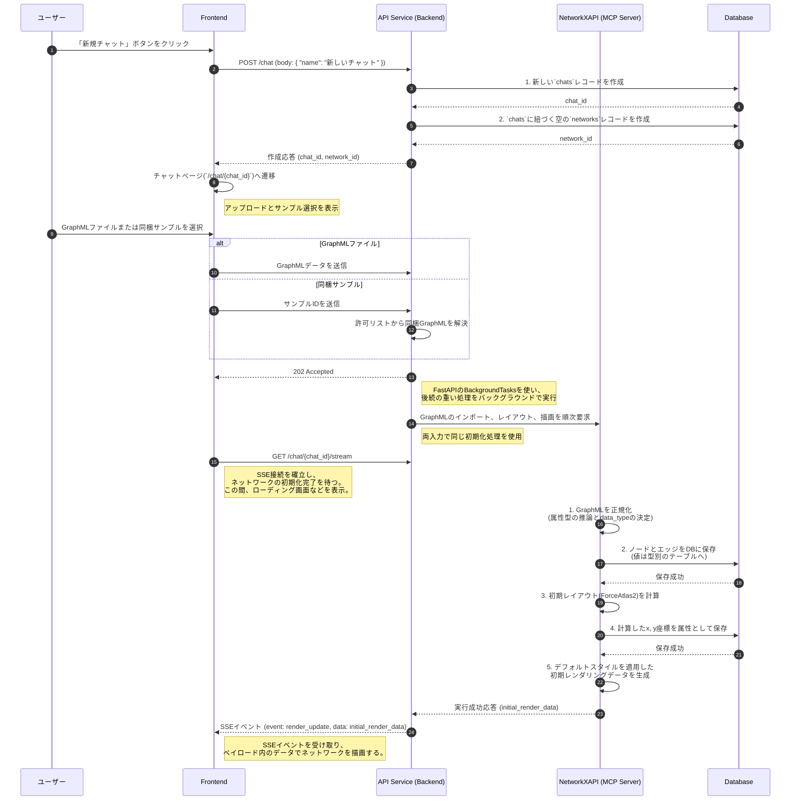

---

## 6.3. チャットによるネットワーク操作（統一非同期フロー）

**目的:** ユーザーの自然言語指示に対し、Backendがリクエストを即座に受け付け、その後の全ての処理（LLMの思考、ツールの実行、最終的な応答）をSSEを通じてリアルタイムにクライアントへ通知する、統一された非同期フローを定義します。これが、本システムにおける唯一の信頼できるチャット操作フローです。

### 6.3.1. シーケンス図（統一非同期アーキテクチャ）

このフローでは、ブロッキングなHTTP応答は存在せず、全ての情報がSSEストリームを通じて伝達されるため、高い応答性とリアルタイム性を実現します。

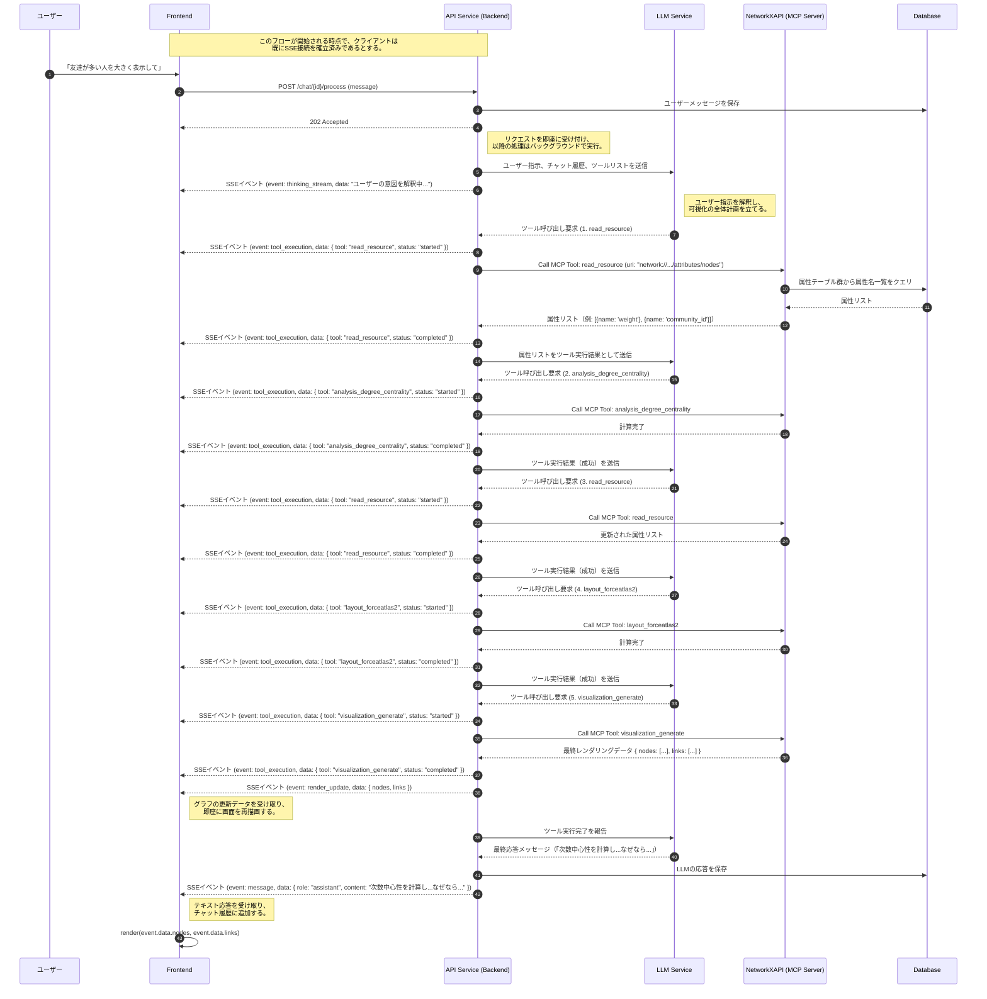

### 6.3.2. データフローと責務詳細

この統一フローにおいて、フロントエンドは`POST /chat/{id}/process`を呼び出した後、HTTPレスポンスを待つことなく、即座に操作可能な状態を維持します。ローディング状態の管理は、SSEから送られてくる`tool_execution`イベントの`status`（`started`/`completed`）に基づいて行います。

1.  **リクエストの即時受付**:
    - Backendは`POST /chat/{id}/process`のリクエストを受け取ると、メッセージをDBに保存し、即座に`202 Accepted`を返す。これにより、フロントエンドはブロックされない。

2.  **LLMによるプランニングとツールの実行**:
    - LLMの思考プロセスや、`read_resource`、`analysis_degree_centrality`、`layout_forceatlas2`、`visualization_generate`といったツールの実行状況は、`thinking_stream`や`tool_execution`といった専用のSSEイベントを通じて逐一フロントエンドに通知される。
    - **重要**: LLMは計算を実行した後、必ず再度`read_resource`を呼び出して、新しい属性が利用可能になったことを確認してから`visualization_generate`を呼び出す。また、**「name」や「label」などの属性が存在する場合、それを識別可能なラベルとして自動的に選択する。**

3.  **最終的な結果の通知**:
    - `visualization_generate`が完了すると、Backendは2つの重要な情報をSSEで送信する。
        1.  `render_update`イベント: NetworkXAPIが生成した最終的なレンダリングデータ（`{nodes, links}`）を送信する。フロントエンドはこれを受けてグラフを再描画する。
        2.  `message`イベント: LLMが生成した最終的なテキスト応答（例：「次数中心性を計算し、ノードのサイズに反映しました。これにより、ネットワーク内で最も影響力のあるノードが視覚的に強調されます。」）を送信する。ここには、**なぜその計算を行ったのか、なぜその可視化設定を選んだのかという理由**が含まれるべきである。また、**ユーザーが入力した言語と同じ言語で応答する**ことが必須である。フロントエンドはこれを受けてチャット履歴を更新する。

この設計により、フロントエンドとバックエンドは完全に疎結合となり、ユーザーは処理の途中経過をリアルタイムに把握しながら、待たされることなくアプリケーションの操作を続けることができます。

---

## 6.4. ツール呼び出し失敗時のエラーハンドリングフロー

**目的:** システムが予期せぬ状況（例: 未実装の計算）に陥った場合でも、LLMが状況を理解し、ユーザーに代替案を提示することで、チャットを継続できるようにします。このフローも同様に非同期で実行されます。

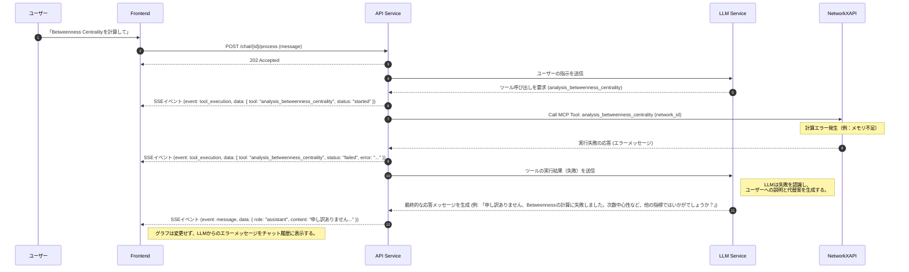

---

## 6.5. ノード認識に基づくサブグラフ作成フロー

**目的:** ユーザーの「最も重要なノードのEgo Networkを作って」といった抽象的な指示に対し、LLMが自律的に重要ノードを特定し、その結果を用いてサブグラフを作成するフローを定義します。

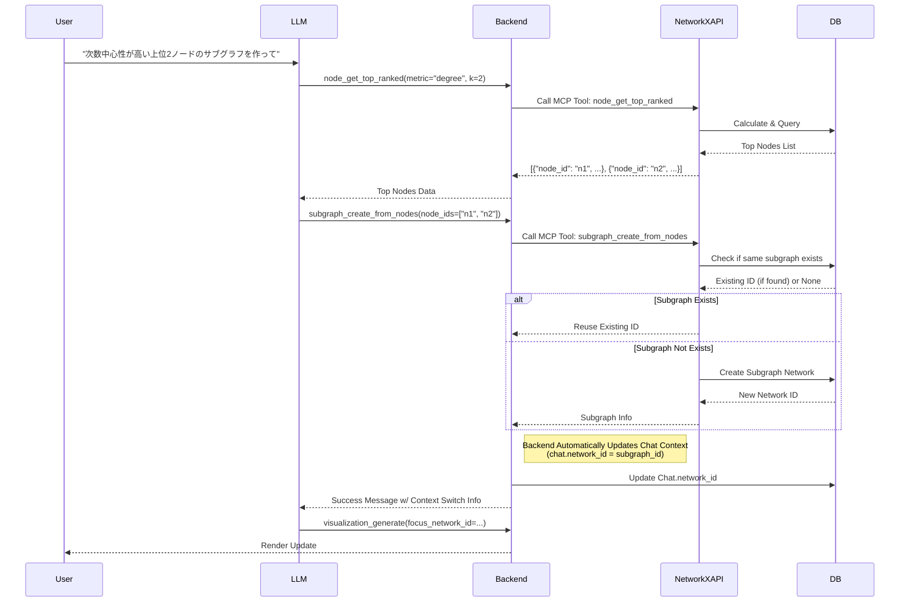

## 6.6. パスサブグラフ作成フロー

**目的:** 「Node A と Node B の最短経路のサブグラフを作って」という指示を、2 つのツールの組み合わせで実現するフローを定義します。

**設計判断: 経路サブグラフの専用 MCP ツールは用意しない。** 最短経路の算出と、ノード列からのサブグラフ作成は、それぞれ独立して有用な操作である。両者を束ねた専用ツールを作ると、「経路は見たいがサブグラフは要らない」場合に使えるものがなくなる。エージェントは 2 ステップを組み立てられるので、ツールの側で束ねる必要がない。

なお、フロントエンドからの直接操作のために REST 側には経路サブグラフの生成が存在する。エージェント経由と直接操作で入口が異なる例である（[3_NetworkXAPI.md](./3_NetworkXAPI.md) 3.6）。

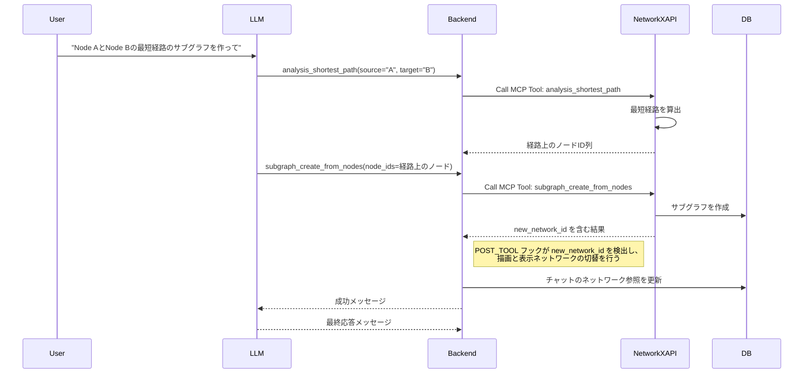

## 6.7. ランキングに基づく可視化フロー

**目的:** 「次数が高い上位3ノードを赤くして」といった指示に対し、LLMがランキングルールを構築し、NetworkXAPIがそれを解釈して動的に色を割り当てるフローです。

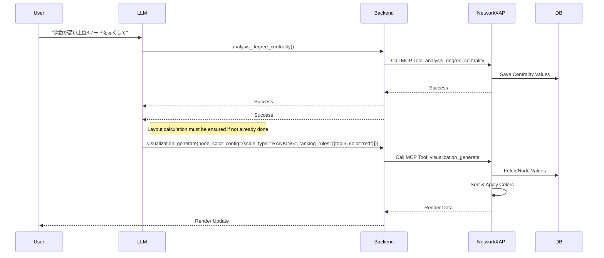

## 6.8. 複合的な可視化フロー (サイズ + オーバーレイ + 個別色指定)

**目的:** 「次数中心性でサイズを決め、上位1人を青、その周辺（サブグラフ）を水色、それ以外をグレーにして」といった複雑な指示を実現するフローです。

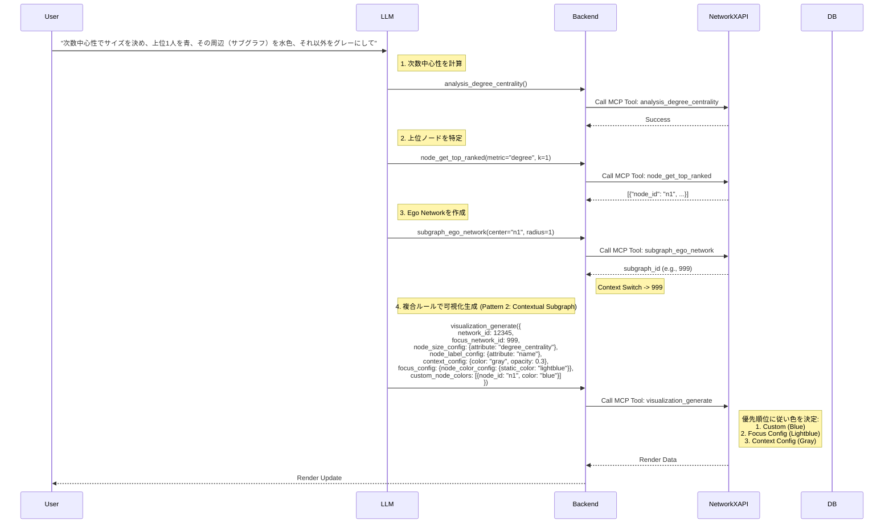

## 6.9. 独立したサブグラフ表示フロー

**目的:** 「サブグラフだけを見せて」といった指示に対し、メインの表示対象を親ネットワークからサブグラフ自体（Pattern 3）に切り替えるフローです。

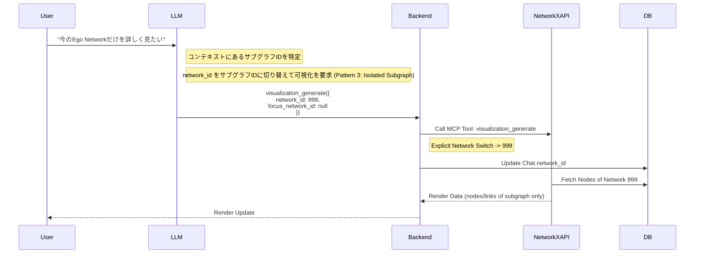

## 6.10. ネットワーク階層ナビゲーションフロー

**目的:** 「全体に戻って」や「親ネットワークに戻って」という指示に対し、コンテキストを上位のネットワークに戻すフローです。

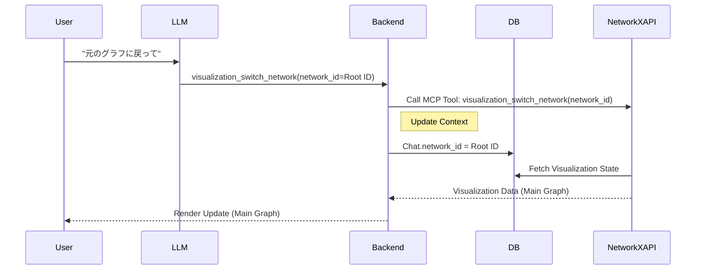

### 6.10.1. 親ネットワークへの切り替え

**目的:** 現在のサブグラフから、一つ上の階層（親ネットワーク）に戻るフローです。

**設計判断: 相対的な移動はバックエンド内のローカルツールが担う。** 「一つ上に戻る」「最初のグラフに戻る」は、移動先の ID をモデルが知っている必要がない操作である。ID を要求すると、モデルは親を調べるための呼び出しを 1 回余分に行うことになり、しかも取り違える余地が生まれる。そのためこれらは NetworkXAPI のツールではなく、バックエンドのプロセス内ツール（`switch_to_parent_network` / `switch_to_main_network`）として提供する。移動先の解決はチャットの状態を持つバックエンドが行う。

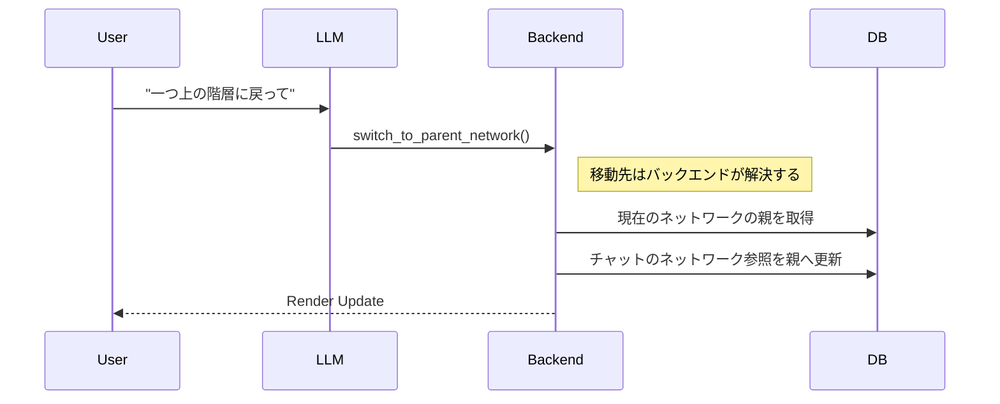

## 6.11. 属性条件によるサブグラフ作成フロー

**目的:** 「20代の女性のサブグラフを作って」といった指示に対し、属性条件を解釈してフィルタリングを実行するフローです。

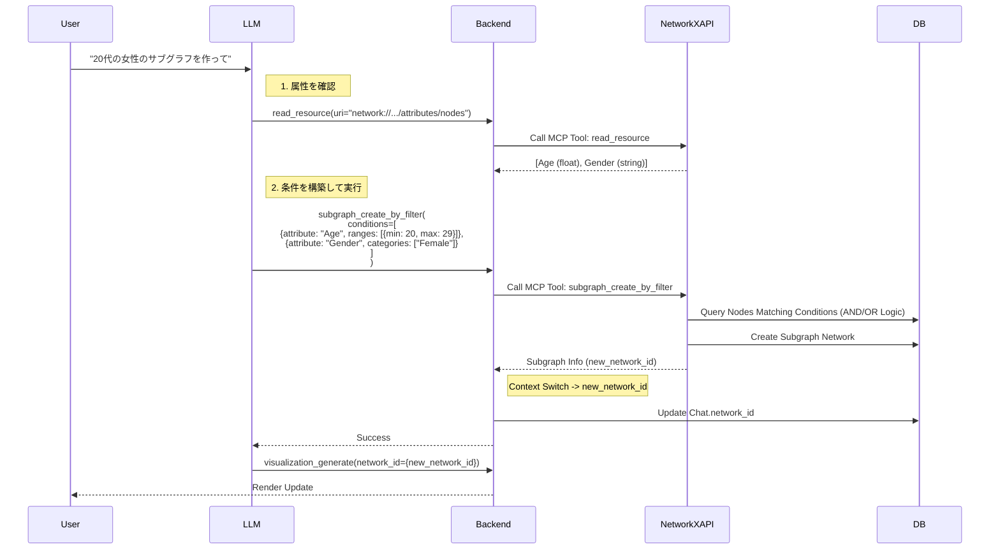

## 6.12. Verification First Workflow (安全な可視化フロー)

**目的:** LLMが「存在しない属性」を使用してエラーやハルシネーション（幻覚）を起こすのを防ぐため、計算や可視化の前に必ずデータの存在確認を行うフローです。LLMはシステムプロンプトにより、この手順を遵守するよう強制されています。

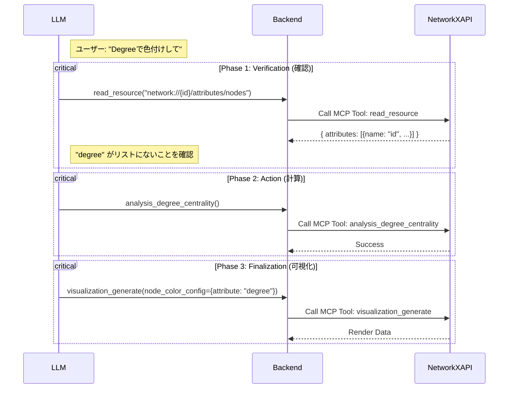

## 6.13. ツール実行ループとコンテキスト切り替え

**目的:** ReAct ループの内部、特に **表示ネットワークの自動切り替え** の仕組みを定義します。

### 6.13.1. 実行ループの構造

ループは 1 イテレーションあたり「生成 → ツール実行 → 結果を履歴へ追加」を行い、最終応答が得られるか上限回数に達するまで繰り返す。

**ループ本体は分岐を持たない。** ツールごとの前処理・後処理・制約は、すべてフックとして登録される（[1_Backend.md](./1_Backend.md) 1.3.3、1.7.1）。以下はいずれもフックであり、エンジンに直書きされているものではない。

| 挙動 | 担当するフックの帯 |
| :--- | :--- |
| 引数に現在のネットワーク ID を補完する | PRE / 正規化 |
| 高コストな計算や存在しない属性を拒否する | PRE / ガード |
| 新しいネットワークが生まれたら表示を切り替えて描画する | POST |
| 可視化データを含む結果を描画する | POST |
| ツールを呼ばずに終わろうとしたターンを継続させる | NO_TOOL_CALLS |

**新しい挙動を追加するときは、フックとして登録する。** ループ本体に条件を書き足してはならない。この制約の根拠は [1_Backend.md](./1_Backend.md) 1.7.1 を参照。

### 6.13.2. サブグラフ作成時の自動コンテキスト切り替え

サブグラフを作成するツールは、描画も表示切替も行わない。**結果に新しいネットワーク ID を含めるだけである。** それを検出して副作用を起こすのは POST フックの役割である。

この分離により、サブグラフを作るツールが何種類あっても、切り替えと描画の実装は 1 箇所で済む。

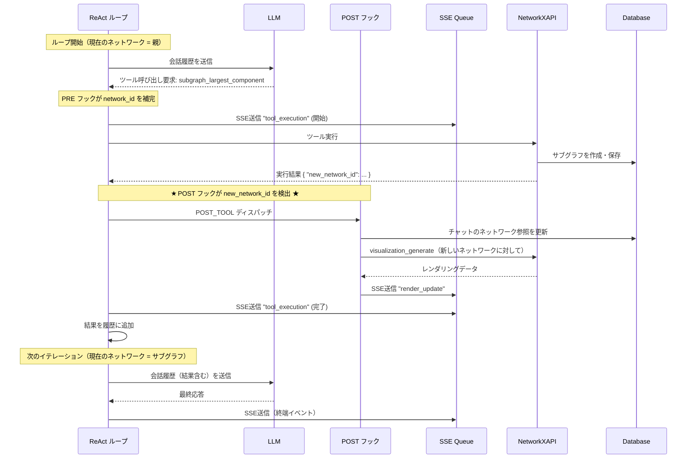

**この図が示す最も重要な点**: サブグラフ作成の直後、ユーザーの後続の指示（「それを赤く塗って」）は、明示的な指定なしに新しいサブグラフへ適用される。表示中のネットワークが会話の状態として保持されているためである（[1_Backend.md](./1_Backend.md) 1.4.1）。
