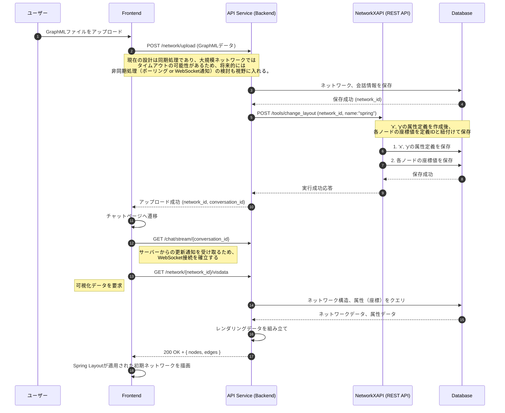
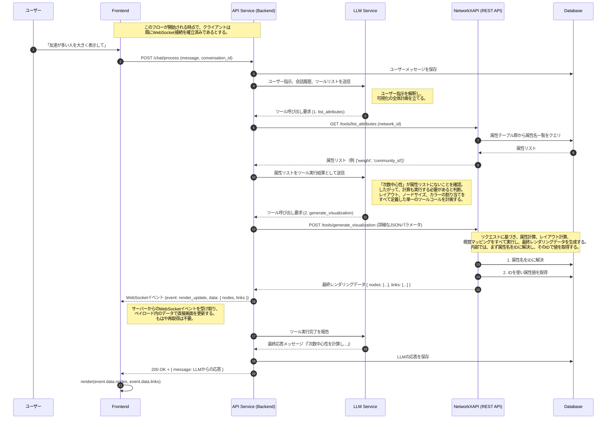
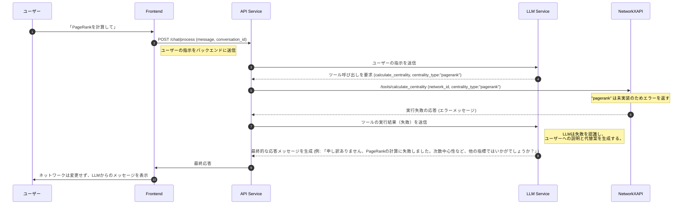
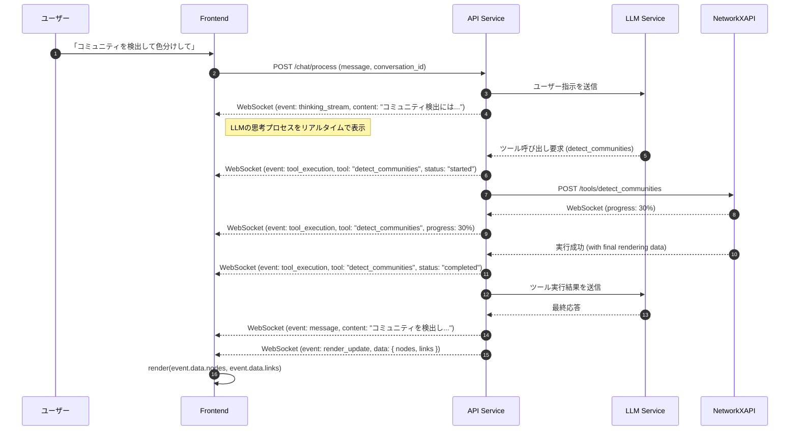
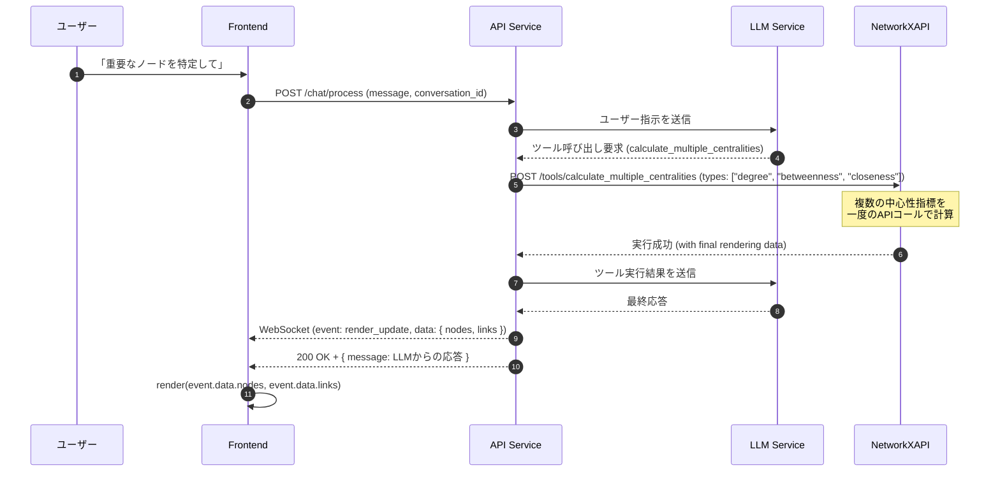
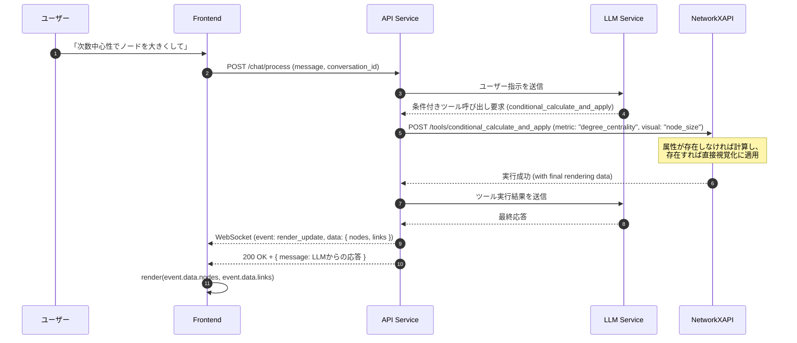

# 6. 主要な処理フローとデータ生成（最適化版）

**前提知識レベル:**
- シーケンス図の読解能力
- REST APIおよびWebSocketに関する知識
- LLMのFunction Calling（ツール呼び出し）に関する基本的な理解

## 6.1. 概要

このドキュメントでは、主要なユースケースにおけるコンポーネント間の動的なやり取りと、その過程で実行されるデータ生成のフローを定義します。

本システムのコア機能は、ユーザーの自然言語指示をLLMが解釈し、複数のツールを段階的に呼び出すことで、最終的なネットワークの可視化を実現する点にあります。

---

## 6.2. 新規会話開始（ネットワークアップロード）フロー

**目的:** ユーザーが新しい分析サイクルを開始するために、GraphMLファイルをアップロードして新規会話を作成する処理を定義します。

**方針:** アップロード処理の一環として、非同期または同期的にデフォルトのレイアウト（Spring Layout）を計算し、その結果を初期表示に利用します。

---

## 6.3. 対話によるネットワーク操作フロー

**目的:** ユーザーの曖昧な自然言語指示（例:「重要なノードを大きくして」）から、LLMが単一の強力なツール呼び出しを計画し、最終的な可視化を一度に実現する、新しいアーキテクチャの中心的なフローです。

### 6.3.1. シーケンス図（新アーキテクチャ）

このフローでは、LLMが視覚化の全体像を一度に計画し、`NetworkXAPI`がそれを実行します。状態（視覚ルール）は永続化されず、毎回動的に生成されます。

### 6.3.2. データフローと責務詳細 (LLM Function Calling)

ユーザーが「次数が多いノードを大きくして」のような曖昧な指示を出すと、システムは以下の手順でレンダリングデータを更新します。

#### 1. LLMによるワンショットでのツールプランニング

BackendとLLMは、より少ないやり取りで、より包括的なタスクを実行します。

- **1回目のLLM呼び出し**:
    - **Backend → LLM**: ユーザー指示 `「友達が多い人を大きく表示して」` + ツールリスト
    - **LLM → Backend**: `list_attributes()` の呼び出しを要求（現状把握のため）

- **2回目のLLM呼び出し**:
    - **Backend → LLM**: `list_attributes` の実行結果 `['weight']`
    - **LLM → Backend**: `generate_visualization` の呼び出しを要求。この際、リクエストボディには以下のような**完全な計画**が含まれる。
      - `layout_config`: 使用するレイアウト（例: "spring"）
      - `node_size_config`: `degree_centrality`（存在しないため計算が必要と判断）を`LINEAR`スケールでノードサイズに割り当てる設定
      - `node_color_config`: デフォルトの単色設定

#### 2. NetworkXAPIによるレンダリングデータ生成

Backendは、LLMの計画に従ってNetworkXAPIの`POST /tools/generate_visualization`を一度だけ呼び出します。NetworkXAPIは、このリクエストを受け取ると、内部で以下の処理をすべて実行します。

1.  **属性の確認と計算**:
    - リクエストされた属性（例: `degree_centrality`）がデータベースに存在するか確認します。
    - 存在しない場合は、`NetworkX`ライブラリを用いてその場で計算し、結果をデータベースに永続化します。

2.  **レイアウト計算**:
    - リクエストされたレイアウト（例: `spring`）を計算します。

3.  **マッピングとスタイル計算**:
    - すべてのノードとエッジをループ処理し、リクエストされたルール（サイズ、色など）に基づいて各要素の最終的な視覚スタイル（具体的なピクセルサイズや色コード）を決定します。

4.  **最終データ生成**:
    - フロントエンドが直接描画できる形式（`{ "nodes": [...], "links": [...] }`）のJSONを組み立てて、Backendに返します。

#### 3. Backendによる結果の中継

Backendは、NetworkXAPIから受け取った最終レンダリングデータを、そのままWebSocketを通じてフロントエンドに送信します。フロントエンドは、このデータを使って即座に可視化を更新します。このフローでは、フロントエンドがデータを再取得するための追加のAPI呼び出しは不要です。

---

## 6.4. ツール呼び出し失敗時のエラーハンドリングフロー

**目的:** システムが予期せぬ状況（例: 未実装の計算）に陥った場合でも、LLMが状況を理解し、ユーザーに代替案を提示することで、対話を継続できるようにします。

## 6.5. ファンクションコーリングの最適化に関する注意点

### 6.5.1. 最適化のメリット

1. **レイテンシの削減**:
   - LLMとBackendの間のやり取りが減少するため、全体的な処理時間が短縮される
   - ユーザーの待ち時間が減少し、体験が向上する

2. **コスト削減**:
   - LLMへのAPI呼び出し回数が減少するため、APIコストが削減される
   - とくに大量のユーザーがいる場合、コスト削減効果は大きい

3. **システムの効率化**:
   - 関連する操作（計算と視覚マッピング）をまとめることで、処理の論理的なグループ化が可能になる

### 6.5.2. 実装上の考慮点

1. **複数ツール呼び出しのパース**:
   - LLMからの応答で複数のツール呼び出しが含まれている場合、それらを適切にパースするロジックが必要

2. **エラーハンドリング**:
   - 複数のツール呼び出しの中で一部が失敗した場合の適切なエラーハンドリングが必要
   - 部分的な成功と失敗の状態をLLMに正確に伝える仕組みが重要

3. **依存関係の考慮**:
   - ツール呼び出し間に依存関係がある場合（前のツールの出力が次のツールの入力になる場合など）、その順序を保証する必要がある

## 6.6. その他の最適化可能な箇所

ファンクションコーリングのまとめ以外にも、以下のような最適化ポイントが考えられます：

### 6.6.1. WebSocketを活用したストリーミング最適化

### 6.6.2. バッチ処理による複数属性の一括計算

### 6.6.3. 条件付きファンクションコーリング

これらの追加の最適化ポイントを実装することで、システム全体のパフォーマンスとユーザー体験をさらに向上させることができます。