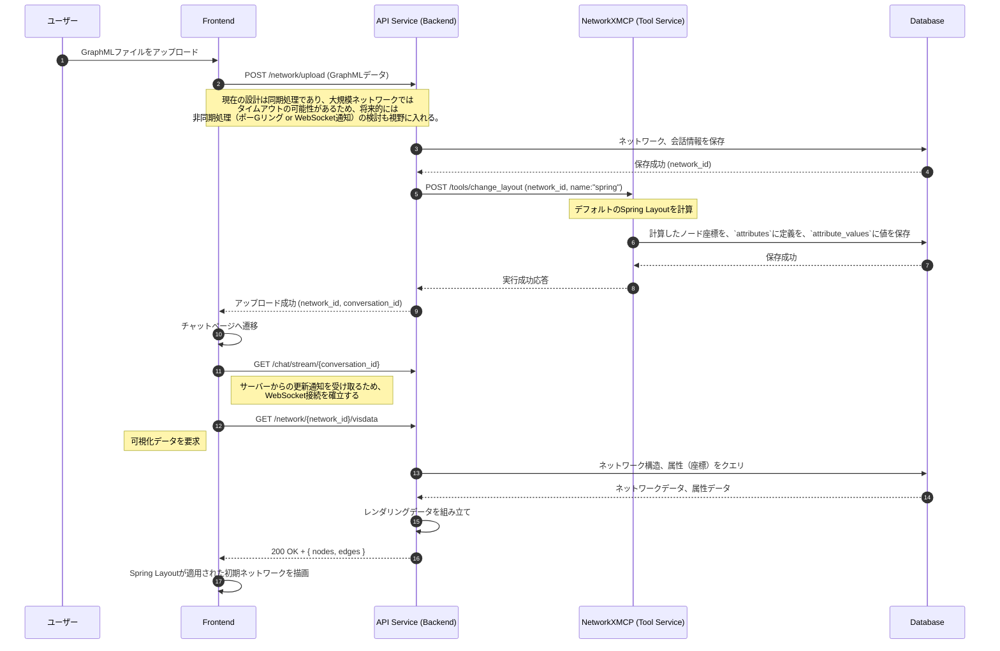
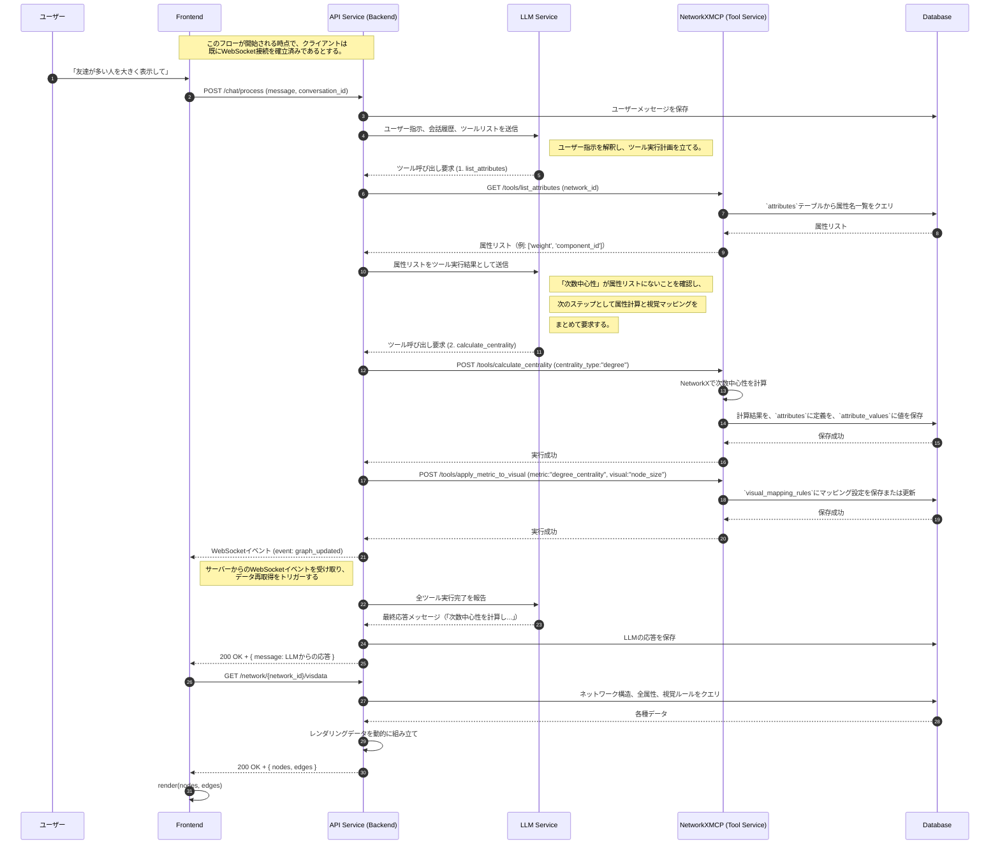
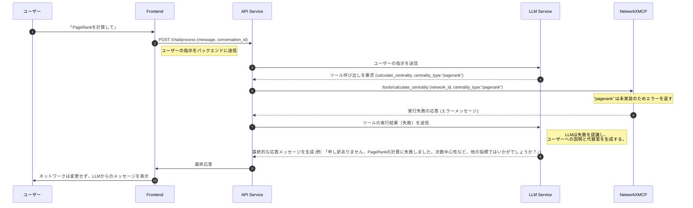
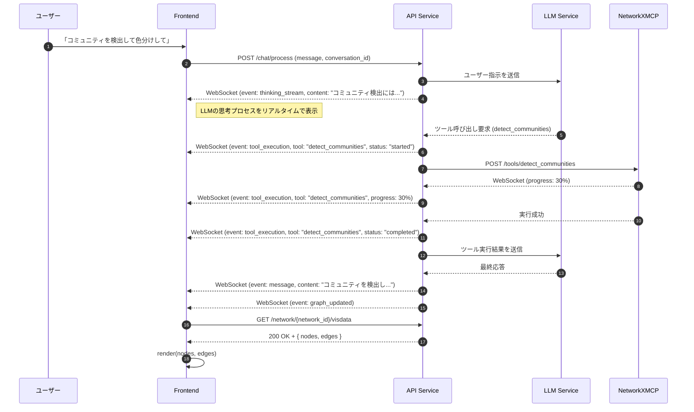
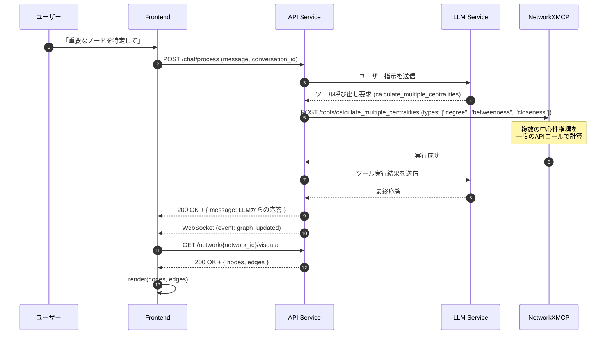
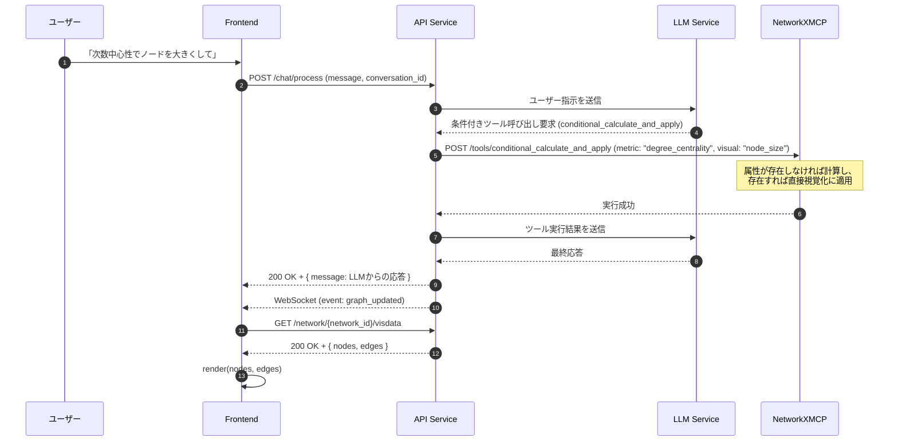

# 6. 主要な処理フローとデータ生成（最適化版）

**前提知識レベル:**
- シーケンス図の読解能力
- REST APIおよびWebSocketに関する知識
- LLMのFunction Calling（ツール呼び出し）に関する基本的な理解

## 6.1. 概要

このドキュメントでは、主要なユースケースにおけるコンポーネント間の動的なやり取りと、その過程で実行されるデータ生成のフローを定義します。

本システムのコア機能は、ユーザーの自然言語指示をLLMが解釈し、複数のツールを段階的に呼び出すことで、最終的なネットワークの可視化を実現する点にあります。

---

## 6.2. 新規会話開始（ネットワークアップロード）フロー

**目的:** ユーザーが新しい分析サイクルを開始するために、GraphMLファイルをアップロードして新規会話を作成する処理を定義します。

**方針:** アップロード処理の一環として、非同期または同期的にデフォルトのレイアウト（Spring Layout）を計算し、その結果を初期表示に利用します。

---

## 6.3. 対話によるネットワーク操作フロー

**目的:** ユーザーの曖昧な自然言語指示（例:「重要なノードを大きくして」）から、LLMが具体的な「計算」と「可視化」のツール呼び出しを推論し、実行する、本システムのもっとも中心的なフローです。

### 6.3.1. シーケンス図

このフローでは、計算結果をネットワークの属性として保存しておくことで、同じ計算を何度も繰り返すムダを省く仕組みも示されています。また、関連するファンクションコーリングをまとめて実行することで、LLMとBackendの間のやり取りを最小限に抑え、レイテンシとコストを削減しています。

### 6.3.2. データフローと責務詳細 (LLM Function Calling)

ユーザーが「次数が多いノードを大きくして」のような曖昧な指示を出すと、システムは以下の手順でレンダリングデータを更新します。

#### 1. LLMによる複数ステップのツールプランニング

BackendとLLMは、以下のような複数回のやり取りを通じて、段階的にタスクを実行します。

- **1回目のLLM呼び出し**:
    - **Backend → LLM**: ユーザー指示 `「友達が多い人を大きく表示して」` + ツールリスト
    - **LLM → Backend**: `list_attributes()` の呼び出しを要求

- **2回目のLLM呼び出し**:
    - **Backend → LLM**: `list_attributes` の実行結果 `['weight']`
    - **LLM → Backend**: ツール呼び出しを要求:
      1. `calculate_centrality(type: "degree")`
    - **Backend**: `calculate_centrality` の実行結果を受けて、自動的に `apply_metric_to_visual(metric: "degree_centrality", visual: "node_size", mapping: {scale: 'linear', ...})` を実行

#### 2. Backendによるツール実行と永続化

Backendは、LLMの要求にしたがってNetworkXMCPのAPIを呼び出し、結果を正規化されたテーブルに永続化します。複数のツール呼び出しが要求された場合は、それらを順番に実行します。

- `GET /tools/list_attributes`: `attributes`テーブルから属性名の一覧を取得します。
- `POST /tools/calculate_centrality`: 計算結果の**値**を`attribute_values`系のテーブルに、その**定義**を`attributes`系のテーブルに書き込みます。
- `POST /tools/apply_metric_to_visual`: マッピングルールを`visual_mapping_rules`テーブルに書き込みます。

#### 3. Backendによる動的なレンダリングデータ生成

Frontendが `/network/{network_id}/visdata` を呼び出すと、Backendはリクエストの都度、以下の情報をDBから読み込み、最終的なレンダリングデータを動的に組み立てて返します。

1.  `networks`テーブルから元のネットワーク構造
2.  `attributes`と`attribute_values`テーブルからすべての属性データ（座標を含む）
3.  `visual_mapping_rules`テーブルから適用すべき視覚ルール

Backendは、これらの情報を統合し、各ノード・エッジのスタイルを決定して最終的なJSONを生成します。

---

## 6.4. ツール呼び出し失敗時のエラーハンドリングフロー

**目的:** システムが予期せぬ状況（例: 未実装の計算）に陥った場合でも、LLMが状況を理解し、ユーザーに代替案を提示することで、対話を継続できるようにします。

## 6.5. ファンクションコーリングの最適化に関する注意点

### 6.5.1. 最適化のメリット

1. **レイテンシの削減**:
   - LLMとBackendの間のやり取りが減少するため、全体的な処理時間が短縮される
   - ユーザーの待ち時間が減少し、体験が向上する

2. **コスト削減**:
   - LLMへのAPI呼び出し回数が減少するため、APIコストが削減される
   - とくに大量のユーザーがいる場合、コスト削減効果は大きい

3. **システムの効率化**:
   - 関連する操作（計算と視覚マッピング）をまとめることで、処理の論理的なグループ化が可能になる

### 6.5.2. 実装上の考慮点

1. **複数ツール呼び出しのパース**:
   - LLMからの応答で複数のツール呼び出しが含まれている場合、それらを適切にパースするロジックが必要

2. **エラーハンドリング**:
   - 複数のツール呼び出しの中で一部が失敗した場合の適切なエラーハンドリングが必要
   - 部分的な成功と失敗の状態をLLMに正確に伝える仕組みが重要

3. **依存関係の考慮**:
   - ツール呼び出し間に依存関係がある場合（前のツールの出力が次のツールの入力になる場合など）、その順序を保証する必要がある

## 6.6. その他の最適化可能な箇所

ファンクションコーリングのまとめ以外にも、以下のような最適化ポイントが考えられます：

### 6.6.1. WebSocketを活用したストリーミング最適化

### 6.6.2. バッチ処理による複数属性の一括計算

### 6.6.3. 条件付きファンクションコーリング

これらの追加の最適化ポイントを実装することで、システム全体のパフォーマンスとユーザー体験をさらに向上させることができます。