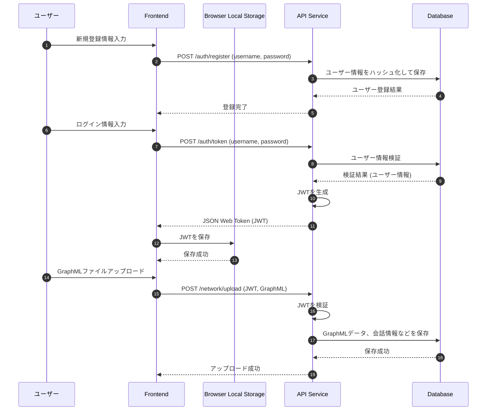
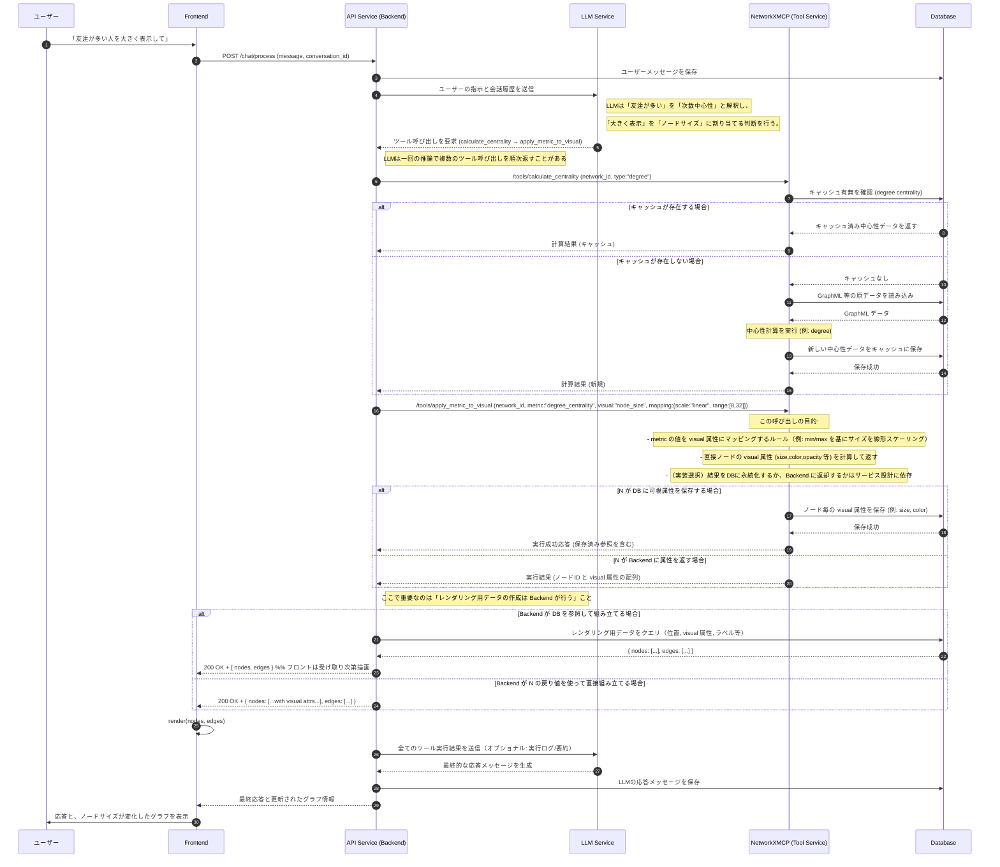
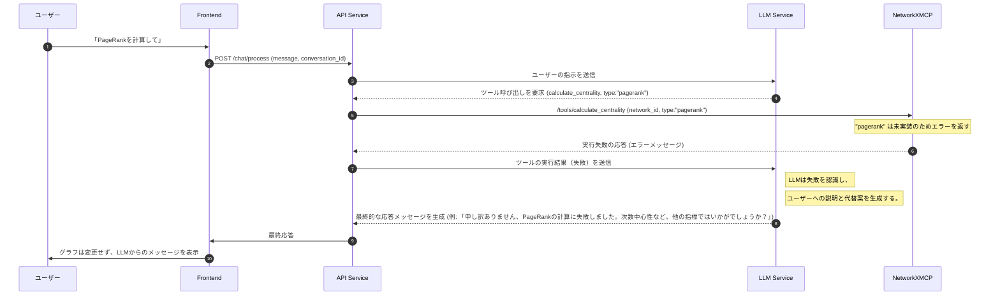

# 3. 主要な処理フロー

このドキュメントでは、主要なユースケースにおけるコンポーネント間の動的なやり取りをシーケンス図で示します。

## 3.1. 認証とデータ永続化フロー

ユーザー登録、ログイン時のJWT保存、ファイルアップロード時のデータ保存の流れです。



## 3.2. LLMによる複数ツール呼び出しとキャッシュ利用フロー

ユーザーの自然言語指示に対し、LLMが一度の推論で複数のツール呼び出しを生成し、連続して処理を実行するフローです。このフローでは、ツール実行時にキャッシュの利用も考慮されます。



### データベーススキーマ（モデル A: N が visual 属性を DB に書き込む）

このリファレンスはModel Aを採用する場合の例です。重要な設計方針は「可視化用の属性は計算結果とは別テーブルに保存する」ことです。

例: PostgreSQLでのテーブル定義（参考）

```sql
-- 計算結果のキャッシュ（中心性などの数値）
CREATE TABLE metric_cache (
    id SERIAL PRIMARY KEY,
    network_id UUID NOT NULL,
    node_id TEXT NOT NULL,
    metric_name TEXT NOT NULL,       -- 例: 'degree_centrality'
    value DOUBLE PRECISION NOT NULL,
    computed_at TIMESTAMP WITH TIME ZONE NOT NULL DEFAULT now(),
    computed_by TEXT,                -- 例: 'NetworkXMCP_v1'
    ttl_seconds INTEGER DEFAULT 3600
);

-- レンダリング用の visual 属性を格納するテーブル（計算結果とは別）
CREATE TABLE visual_attributes (
    id SERIAL PRIMARY KEY,
    network_id UUID NOT NULL,
    node_id TEXT NOT NULL,
    visual_attrs JSONB NOT NULL,     -- 例: {"size": 18, "color": "#4A90E2"}
    source TEXT,                     -- 例: 'NetworkXMCP' または 'backend'
    updated_at TIMESTAMP WITH TIME ZONE NOT NULL DEFAULT now(),
    version INTEGER DEFAULT 1
);
```

運用上の注意:

- `metric_cache`は計算結果（数値）を保持し、再計算を避けるために利用します。
- `visual_attributes`には描画に必要な属性（size, color, opacity, labelOverride 等）をJSONBとして格納します。
- Backendはレンダリング用データを組み立てる際に`visual_attributes`を参照して`nodes`の`style`/`position`を合成します。
- `visual_attributes`はNetworkXMCPが書き込む（今回のModel A）。NetworkXMCPは計算後に、ノードごとのvisual属性を`visual_attributes`テーブルにupsertします。

サンプル保存データ（`visual_attrs` の例）:

```json
{
  "size": 24,
  "color": "#F5A623",
  "borderColor": "#8A5A00",
  "borderWidth": 1,
  "note": "mapped from degree_centrality"
}
```

## 3.3. ツール呼び出し失敗時のエラーハンドリングフロー

LLMが要求したツールが何らかの理由（例: サポートされていない計算、不正なパラメーター）で失敗した場合のフローです。システムは失敗の事実をLLMに伝え、LLMがユーザーに対して状況を説明し、代替案を提示する機会を与えます。


