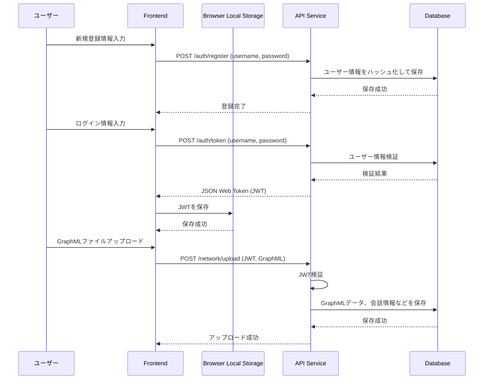
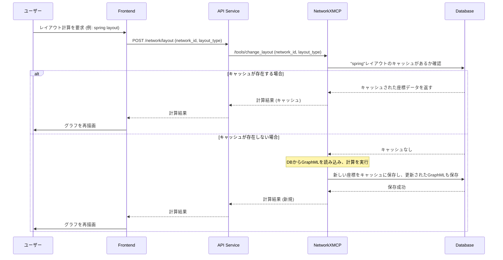
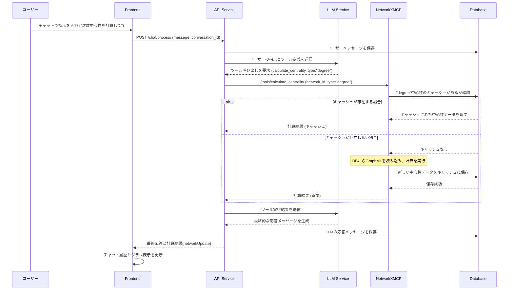
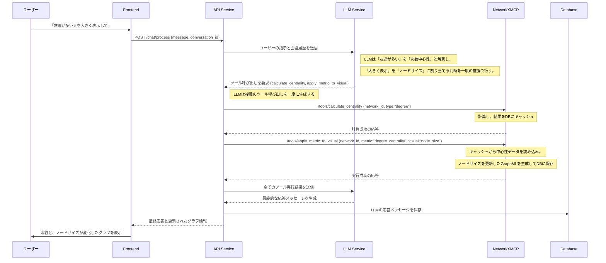
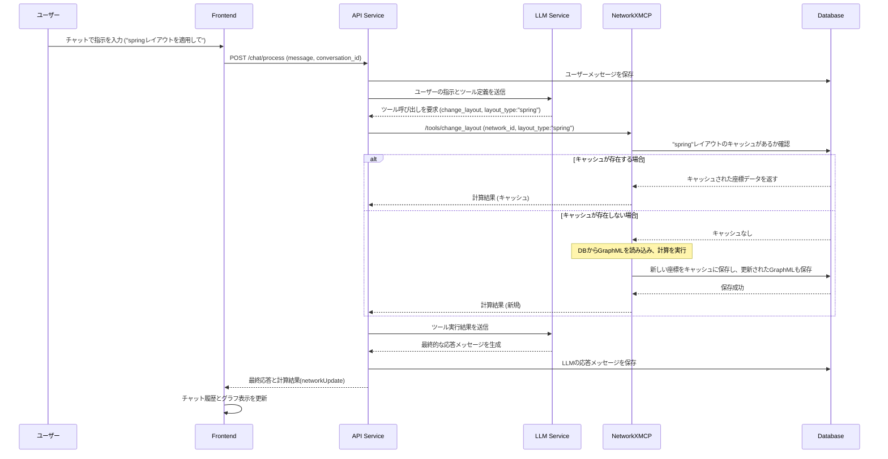

# 3. 主要な処理フロー

このドキュメントでは、主要なユースケースにおけるコンポーネント間の動的なやり取りをシーケンス図で示します。

## 3.1. 認証とデータ永続化フロー

ユーザー登録、ログイン時のJWT保存、ファイルアップロード時のデータ保存の流れです。

## 3.2. レイアウト計算とキャッシュ利用フロー

キャッシュを利用した効率的なレイアウト計算処理のフローです。

## 3.3. チャットによる分析とキャッシュ利用フロー

ユーザーの指示による分析処理とキャッシュ利用の流れです。

## 3.4. LLMによる複数ツール呼び出しフロー

ユーザーの自然言語指示に対し、LLMが一度の推論で複数のツール呼び出しを生成し、連続して処理を実行するフローです。

## 3.5. チャットによるレイアウト計算フロー

ユーザーの自然言語指示に対し、LLMがレイアウト計算ツールを呼び出し、グラフのレイアウトを更新するフローです。

