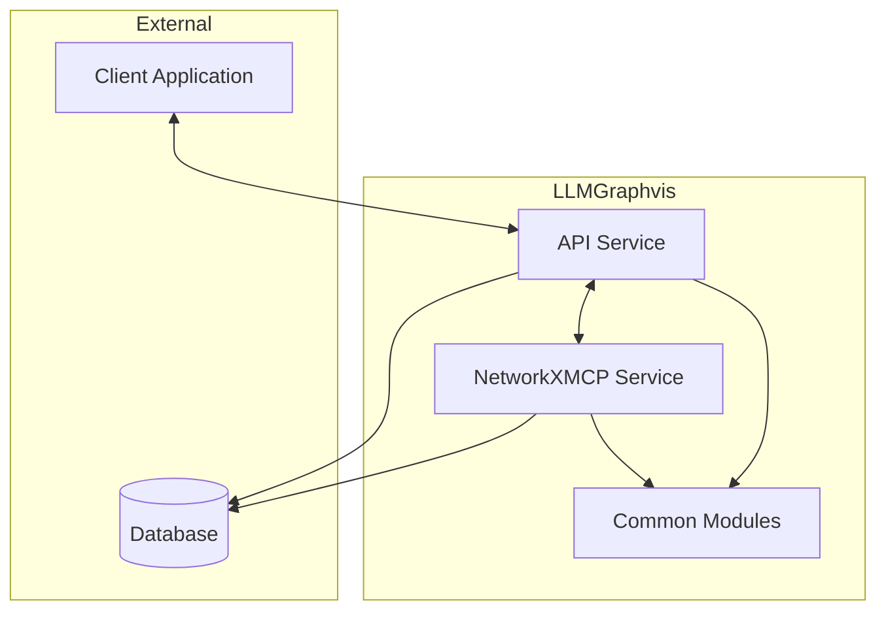
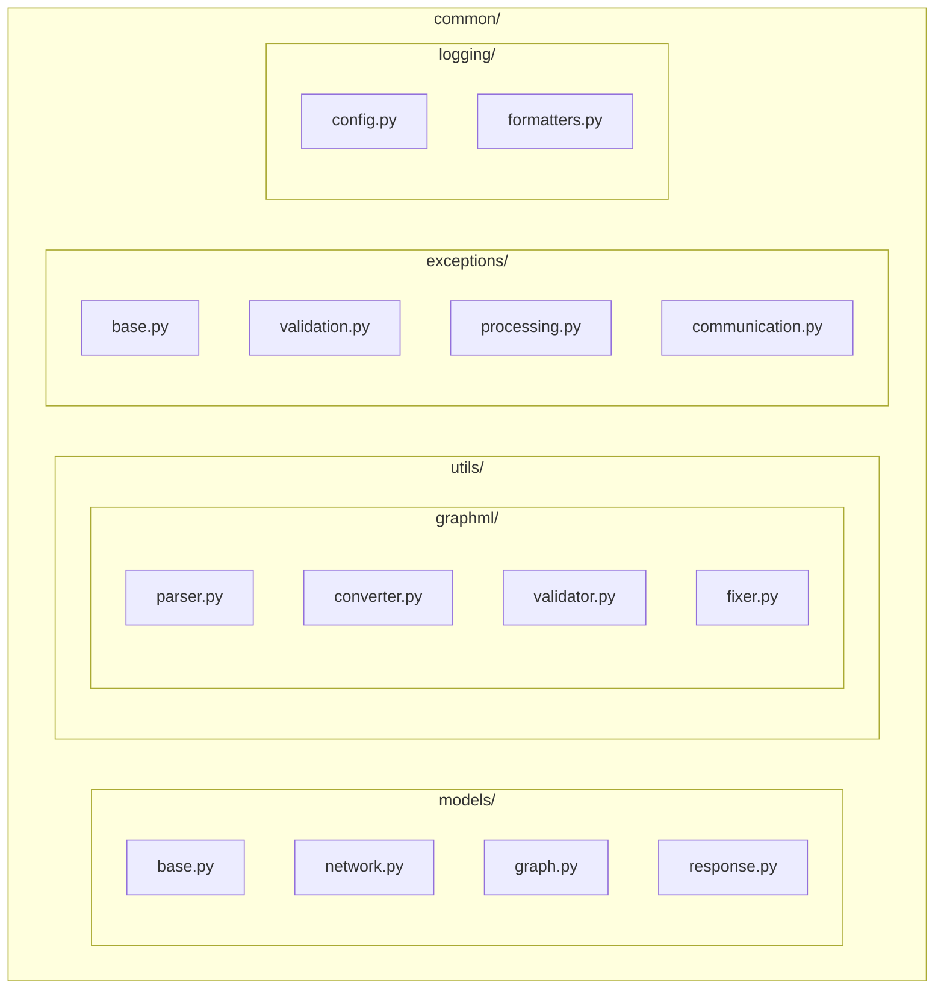
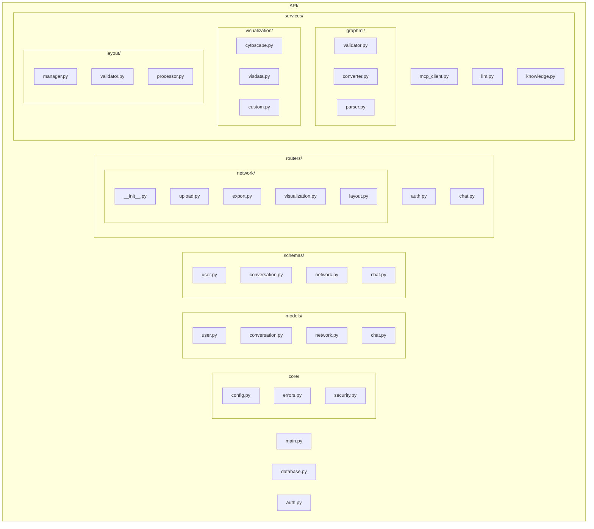
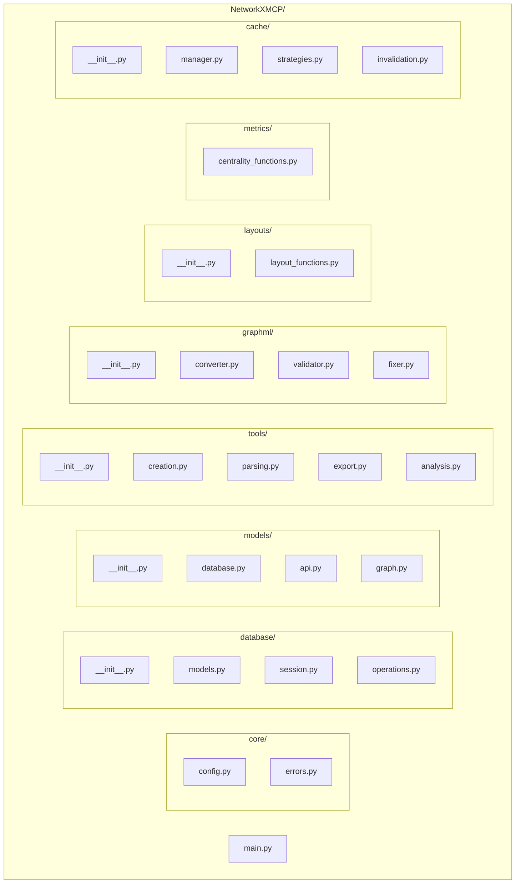
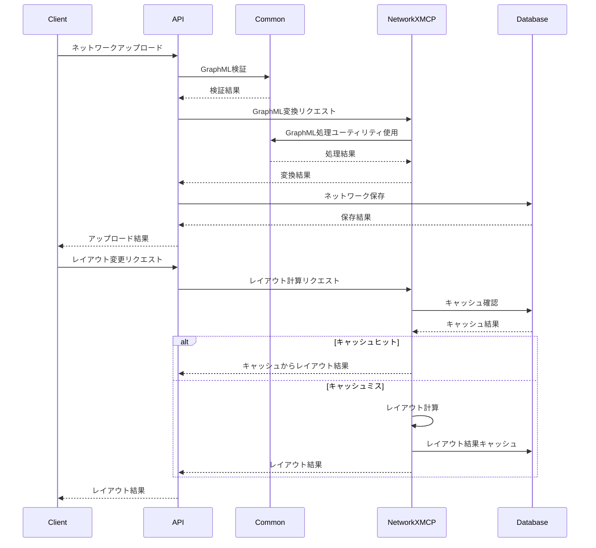
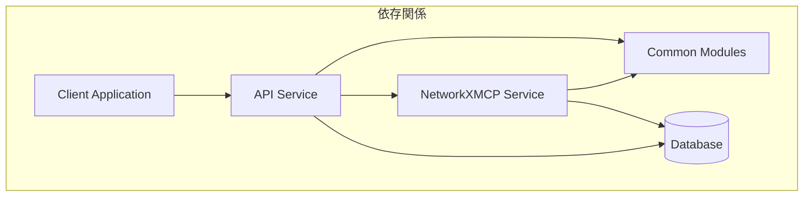

# LLMGraphvis アーキテクチャ図

## 全体構造図



## 共通モジュール構造



## API サービス構造



## NetworkXMCP サービス構造



## データフロー図



## 依存関係図



## リファクタリング前後の比較

```mermaid
graph TB
    subgraph "リファクタリング前"
        API_Before[API Service<br>- 大きなファイル<br>- 責務混在<br>- 重複コード]
        NMCP_Before[NetworkXMCP Service<br>- 大きなファイル<br>- 責務混在<br>- 重複コード]
        
        API_Before <--> NMCP_Before
    end
    
    subgraph "リファクタリング後"
        API_After[API Service<br>- モジュール分割<br>- 責務明確化<br>- コード再利用]
        NMCP_After[NetworkXMCP Service<br>- モジュール分割<br>- 責務明確化<br>- コード再利用]
        Common_After[Common Modules<br>- 共通機能<br>- 標準化<br>- 再利用性]
        
        API_After --> Common_After
        NMCP_After --> Common_After
        API_After <--> NMCP_After
    end