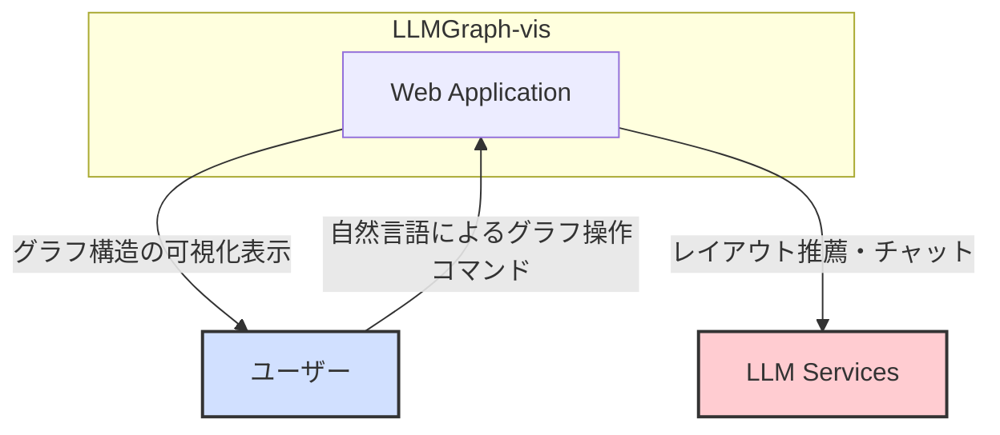
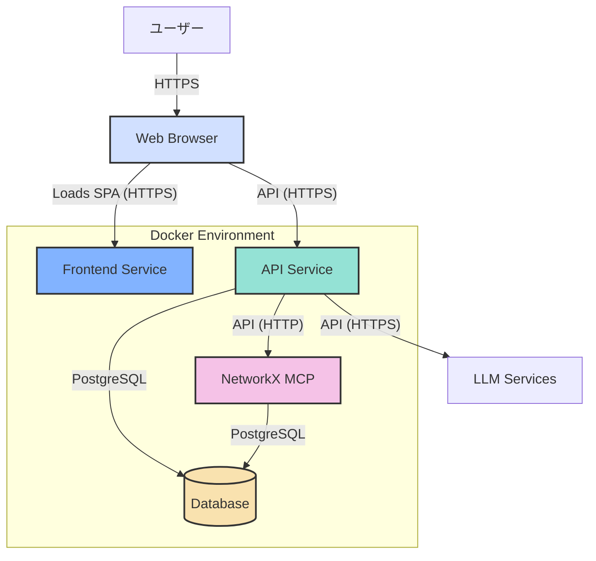

# 1. アーキテクチャ設計

## 1.1. C4モデル

本ドキュメントでは、システムの構造を段階的に理解しやすくするために「C4モデル」という考え方を採用し、概観（コンテキスト）から詳細（コンテナ）へと掘り下げて説明します。

### 1.1.1. コンテキスト図 (Context Diagram)

システム全体の概観を示します。ユーザーがどのようにシステムとやり取りし、どの外部システムと連携するかを表します。

| 要素 | 説明 |
|:---|:---|
| **ユーザー** | グラフの可視化や分析を行う研究者や開発者。 |
| **Web Application** | 本システムのコア機能を提供するWebアプリケーション。 |
| **LLM Services** | グラフのレイアウト推薦やチャット機能のために利用する外部の大規模言語モデルサービス。(OpenAI API, Google Geminiなど) |

### 1.1.2. コンテナ図 (Container Diagram)

アプリケーションを構成する主要なコンテナ（サービス）と、それらの間のデータの流れを示します。

| コンテナ | 説明 | 技術スタック |
|:---|:---|:---|
| **Frontend Service** | ユーザーにUIを提供するためのSPA（Single Page Application）を配信するWebサーバー。詳細は[フロントエンド仕様](./Frontend.md)を参照。 | React, Vite, react-force-graph-2d, Zustand, axios |
| **API Service** | ビジネスロジック、認証、外部API連携を担当するバックエンド。詳細は[バックエンド仕様](./Backend.md)を参照。 | FastAPI, SQLAlchemy, (LLM SDKs) |
| **NetworkX Model Context Protocol (NetworkXMCP)** | グラフ計算やレイアウト処理に特化した計算サービス。**ステートフル**であることで、計算結果をキャッシュし、高コストな再計算を回避します。詳細は[グラフ計算サービス仕様](./NetworkXMCP.md)を参照。 | FastAPI, NetworkX, Python, SQLAlchemy |
| **Database** | ユーザー情報、グラフデータ、計算結果のキャッシュなどを永続化するデータベース。詳細は[データベーススキーマ仕様](./database-schema.md)を参照。 | PostgreSQL |

## 1.2. データ永続化

本システムにおけるデータの永続化は、目的の異なる2つの仕組みによって実現されています。

- **サーバーサイド (Database)**:
    - **目的**: アプリケーションのコアとなるデータを安全に保管し、ユーザーセッションを跨いで状態を維持する。
    - **技術**: PostgreSQL
    - **永続化されるデータ**:
        - ユーザーアカウント情報（ハッシュ化されたパスワードを含む）
        - 各ユーザーの会話履歴
        - メッセージ（ユーザーの発言、LLMの応答）
        - GraphMLデータ本体
        - 計算結果のキャッシュ（レイアウト座標、中心性指標など）
    - **補足**: 主要なテーブルの構造については、[データベーススキーマ仕様](./database-schema.md)で詳細を定義しています。

- **クライアントサイド (Web Browser)**:
    - **目的**: ユーザーの利便性向上。再ログインの手間を省き、シームレスな認証状態を維持する。
    - **技術**: `localStorage`
    - **永続化されるデータ**:
        - 認証用のJSON Web Token (JWT)
    - **役割**: ユーザーがアプリケーションを再訪問した際に、保存されたトークンを使って自動的に認証を行う。トークンの有効期限が切れた場合は、再認証が要求されます。