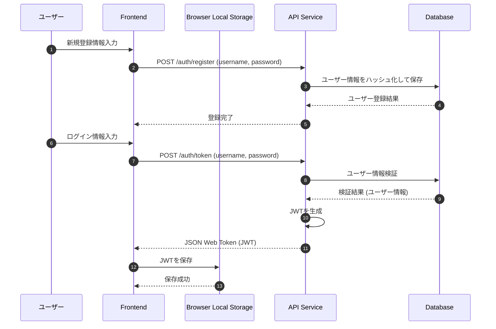

# 認証フロー

**目的:** ユーザーが安全にシステムを利用するための、ユーザー登録およびログインのフローです。

認証後のデータ永続化やグラフ操作については、[主要な処理フロー](./Interactions.md)を参照してください。

## シーケンス図

```mermaid
sequenceDiagram
    autonumber
    participant U as ユーザー
    participant F as Frontend
    participant LS as Browser Local Storage
    participant B as API Service
    participant DB as Database

    %% User Registration
    U->>F: 新規登録情報入力
    F->>B: POST /auth/register (username, password)
    B->>DB: ユーザー情報をハッシュ化して保存
    DB-->>B: ユーザー登録結果
    B-->>F: 登録完了

    %% User Login
    U->>F: ログイン情報入力
    F->>B: POST /auth/token (username, password)
    B->>DB: ユーザー情報検証
    DB-->>B: 検証結果 (ユーザー情報)
    B->>B: JWTを生成
    B-->>F: JSON Web Token (JWT)
    F->>LS: JWTを保存
    LS-->>F: 保存成功
```
