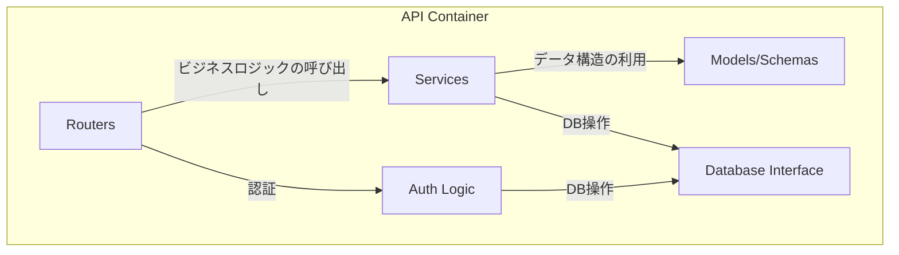

# 2.1. バックエンド仕様 (API)

FastAPIで構築されたバックエンドAPI。主な責務は、認証、ビジネスロジックの実行、外部サービス連携です。

## コンポーネント図



| コンポーネント | 説明 |
|:---|:---|
| **Routers** | APIエンドポイントを定義し、リクエストを適切なサービスにルーティングする。 |
| **Services** | ビジネスロジックを実装する。LLMサービス連携やNetworkXMCPの呼び出しなど。 |
| **Models/Schemas** | Pydanticモデルとデータベーススキーマを定義する。 |
| **Database Interface** | SQLAlchemyを使用してデータベースとのやり取りを抽象化する。 |
| **Auth Logic** | OAuth2/JSON Web Tokenによるユーザー認証・認可のロジックを実装する。 |

## APIエンドポイント一覧

### 認証 (`/auth`)

| Method | Path | 説明 |
|:---|:---|:---|
| `POST` | `/register` | 新規ユーザーを登録する。 |
| `POST` | `/token` | ユーザー名とパスワードで認証し、JWTアクセストークンを発行する。 |
| `GET` | `/users/me` | 現在認証中のユーザー情報を取得する。 |

### チャット・LLM連携 (`/chat`)

| Method | Path | 説明 |
|:---|:---|:---|
| `POST` | `/conversations` | 新しい会話を作成する。 |
| `GET` | `/conversations` | ユーザーの会話一覧を取得する。 |
| `GET` | `/conversations/{id}` | 特定の会話の詳細を取得する。 |
| `GET` | `/conversations/{id}/messages` | 特定の会話のメッセージ一覧を取得する。 |
| `POST` | `/process` | チャットUIからのメッセージを処理し、LLMやツール呼び出しを実行して最終結果を返す。 |
| `POST` | `/recommend-layout` | ネットワーク概要に基づき、LLMが最適なレイアウトを推薦する。 |

#### `/chat/process` の詳細

- **Request Body:**

```json
{
  "conversation_id": "conv_12345",
  "message": {
    "role": "user",
    "content": "次数中心性を計算して、重要なノードを大きく表示してください。"
  }
}
```

- **Response Body (Success):**

```json
{
  "message": {
    "role": "assistant",
    "content": "次数中心性を計算し、ノードのサイズに反映しました。"
  },
  "graph_updated": true,
  "new_cytoscape_data": { ... } // 更新後のグラフデータ
}
```

このエンドポイントが呼び出された際の、Backend、LLM、NetworkXMCP間のより詳細な連携フローについては、以下のドキュメントを参照してください。
- **[3. 主要な処理フロー](./Interactions.md)**: 全体のやり取りをシーケンス図で解説しています。
- **[LLM Function Callingによるレンダリングデータ生成フロー](./rendering-data-flow.md)**: Function Callingにおけるデータの流れと責務を詳細に定義しています。

### ネットワーク (`/network`)

| Method | Path | 説明 |
|:---|:---|:---|
| `POST` | `/upload` | GraphMLファイルをアップロードし、新しい会話とネットワークを作成する。 `multipart/form-data` を使用。また、この処理の中でNetworkXMCPを呼び出し、デフォルトのレイアウト（Spring Layout）を計算して初期座標を保存する。詳細は[初期グラフ表示フロー](./Interactions.md#31-初期グラフ表示フロー)を参照。 |
| `GET` | `/{network_id}/cytoscape` | ネットワークをCytoscape.js形式のJSONで取得する。 |
| `POST` | `/{network_id}/layout` | `NetworkXMCP`を呼び出してレイアウトを計算・適用する。 |
| `GET` | `/{network_id}/export` | ネットワークをGraphMLファイルとしてダウンロードする。 |

## 主要なデータモデル (Pydantic Schemas)

APIで送受信される主要なデータ構造です。

- **User**

| フィールド名 | 型 | 説明 |
|:---|:---|:---|
| `id` | `int` | ユーザーID |
| `username` | `str` | ユーザー名 |

- **Token**

| フィールド名 | 型 | 説明 |
|:---|:---|:---|
| `access_token` | `str` | JWTアクセストークン |
| `token_type` | `str` | トークン種別 (例: "bearer") |

- **Conversation**

| フィールド名 | 型 | 説明 |
|:---|:---|:---|
| `id` | `str` | 会話ID |
| `title` | `str` | 会話のタイトル |
| `user_id` | `int` | この会話を所有するユーザーのID |
| `created_at` | `datetime` | 作成日時 |

- **ChatMessage**

| フィールド名 | 型 | 説明 |
|:---|:---|:---|
| `id` | `str` | メッセージID |
| `conversation_id` | `str` | 所属する会話のID |
| `role` | `str` | 発言者の役割 (`user` or `assistant`) |
| `content` | `str` | メッセージの本文 |
| `created_at` | `datetime` | 作成日時 |

- **Network** (DBモデル)

| フィールド名 | 型 | 説明 |
|:---|:---|:---|
| `id` | `str` | ネットワークID |
| `name` | `str` | ネットワーク名 |
| `graphml_content` | `str` | GraphML形式の元データ |
| `conversation_id` | `str` | 関連付けられた会話のID |

## 外部サービス連携

- **NetworkXMCP**: グラフ計算が必要なリクエストを `http://networkx-mcp:8001` に転送（プロキシ）します。
- **LLMサービス**: ユーザーの指示解釈、ツールコール変換、結果の要約のために外部LLM（OpenAI, Gemini等）のAPIを呼び出します。