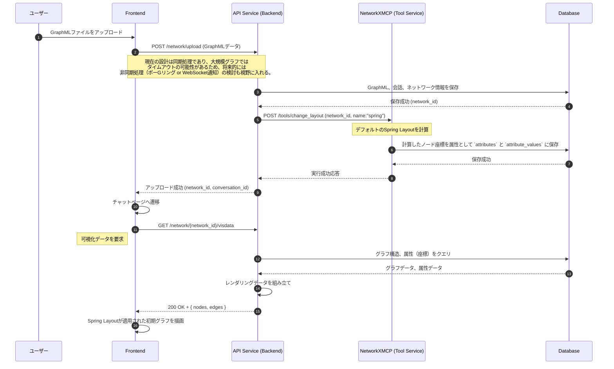
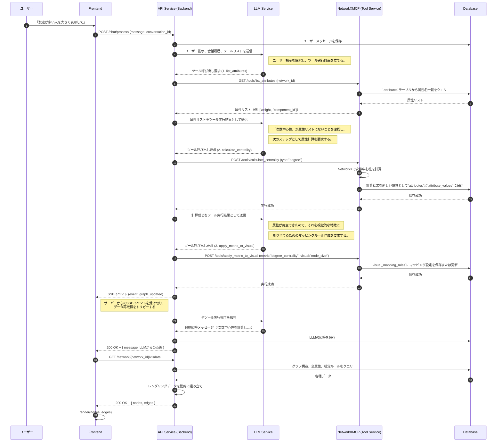
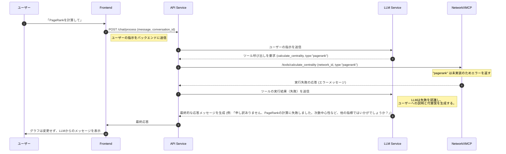

# 3. 主要な処理フロー

このドキュメントでは、主要なユースケースにおけるコンポーネント間の動的なやり取りをシーケンス図で示します。

認証に関するフローは、[認証フロー](./Authentication.md)を参照してください。

## 3.1. 新規会話開始（グラフアップロード）フロー

**目的:** ユーザーが新しい分析サイクルを開始するために、GraphMLファイルをアップロードして新規会話を作成する処理を定義します。

**方針:** アップロード処理の一環として、非同期または同期的にデフォルトのレイアウト（Spring Layout）を計算し、その結果を初期表示に利用します。

## 3.2. 対話によるグラフ操作フロー

**目的:** ユーザーの曖昧な自然言語指示（例:「重要なノードを大きくして」）から、LLMが具体的な「計算」と「可視化」のツール呼び出しを推論し、実行する、本システムの最も中心的なフローです。

このフローでは、計算結果をグラフの属性として保存しておくことで、同じ計算を何度も繰り返す無駄を省く仕組みも示されています。

### フローの補足

上のシーケンス図で示された主要なステップに関する詳細情報は、以下のドキュメントで定義されています。

- **APIエンドポイント**
  - `POST /chat/process` をはじめとするBackendのAPIについては、「[2.1. バックエンド仕様](./Backend.md)」を参照してください。
  - `/tools/calculate_centrality` など、Backendから呼び出される計算サービスのAPIは、「[2.3. グラフ計算サービス仕様 (NetworkXMCP)](./NetworkXMCP.md)」で定義されています。

- **データ永続化**
  - 属性データ(`attributes`, `attribute_values`)など、このフローで利用されるデータベースのスキーマ設計については、「[4. データベーススキーマ仕様](./database-schema.md)」で詳しく解説しています。

- **レンダリングデータ生成**
  - フローの最終段階でBackendがレンダリング用データを組み立てるプロセスと、そのJSONデータの具体的な仕様は、「[LLM Function Callingによるレンダリングデータ生成フロー](./rendering-data-flow.md)」で定義されています。

## 3.3. ツール呼び出し失敗時のエラーハンドリングフロー

**目的:** システムが予期せぬ状況（例: 未実装の計算）に陥った場合でも、LLMが状況を理解し、ユーザーに代替案を提示することで、対話を継続できるようにします。

