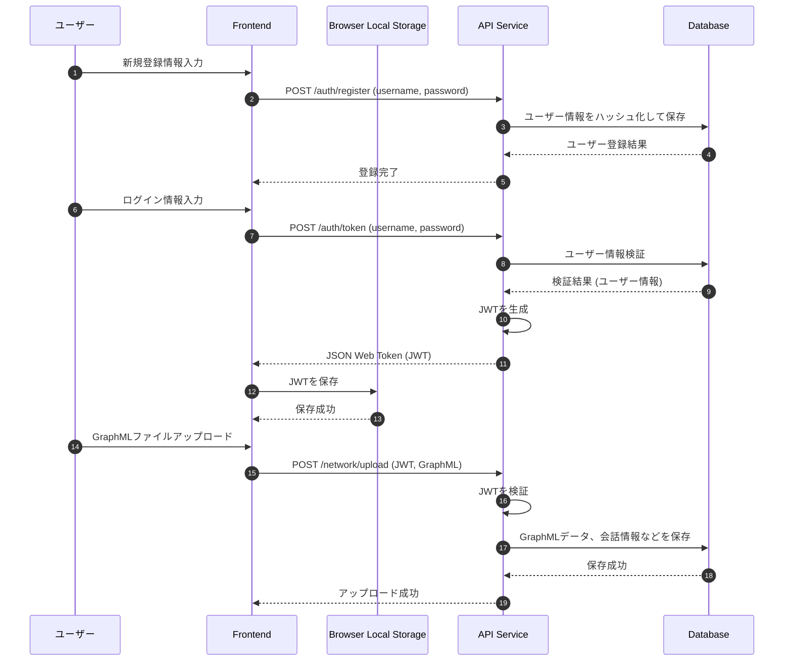
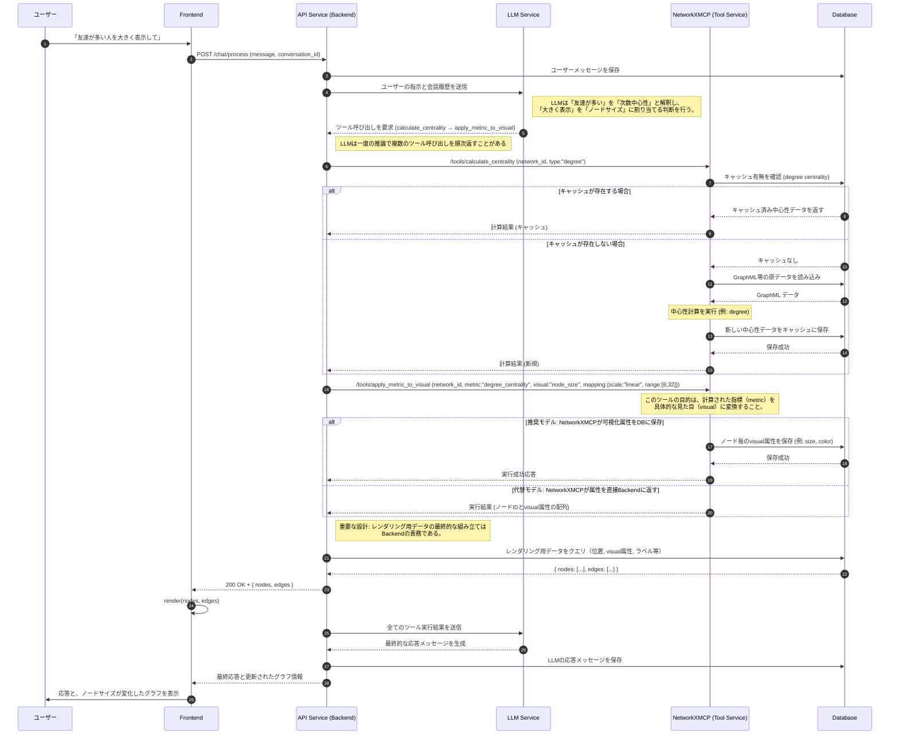
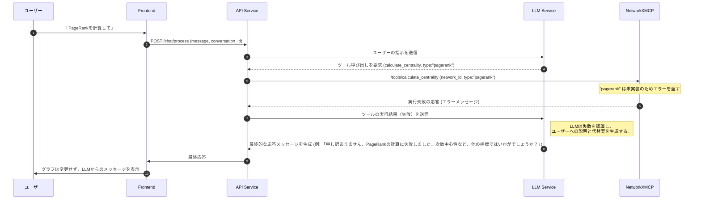

# 3. 主要な処理フロー

このドキュメントでは、主要なユースケースにおけるコンポーネント間の動的なやり取りをシーケンス図で示します。

## 3.1. 認証とデータ永続化フロー

**目的:** ユーザーが安全にシステムを利用し、作業内容（グラフデータなど）を保存できるようにするための基本的なフローです。

ユーザー登録、ログイン、ファイルアップロード時のやり取りを示します。

## 3.2. LLMによる複数ツール呼び出しとキャッシュ利用フロー

**目的:** ユーザーの曖昧な自然言語指示（例:「重要なノードを大きくして」）から、LLMが具体的な「計算」と「可視化」のツール呼び出しを推論し、実行する、本システムの最も中心的なフローです。

このフローでは、計算結果をキャッシュしておくことで、同じ計算を何度も繰り返す無駄を省く仕組みも示されています。

### データベーススキーマ

計算結果のキャッシュや可視化属性の永続化に使用されるデータベーススキーマの詳細は、新しく作成された[データベーススキーマ仕様](./database-schema.md)を参照してください。このドキュメントで、`calculation_results`テーブルなどの設計方針と具体的な構造を定義しています。

## 3.3. ツール呼び出し失敗時のエラーハンドリングフロー

**目的:** システムが予期せぬ状況（例: 未実装の計算）に陥った場合でも、LLMが状況を理解し、ユーザーに代替案を提示することで、対話を継続できるようにします。

