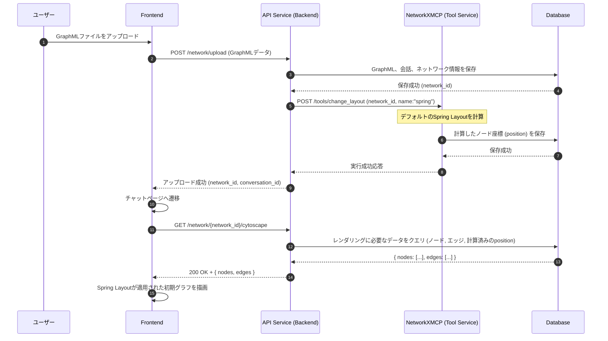
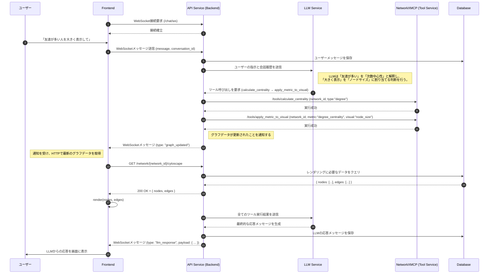
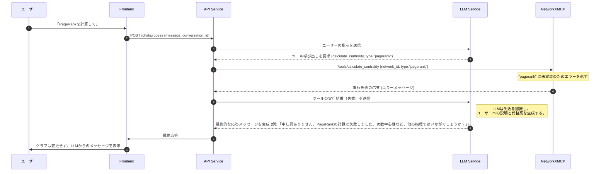

# 3. 主要な処理フロー

このドキュメントでは、主要なユースケースにおけるコンポーネント間の動的なやり取りをシーケンス図で示します。

認証に関するフローは、[認証フロー](./Authentication.md)を参照してください。

## 3.1. 初期グラフ表示フロー

**目的:** ユーザーがGraphMLファイルをアップロードした後、チャットで指示を出す前のデフォルトのグラフ表示処理を定義します。

**方針:** アップロード処理の一環として、非同期または同期的にデフォルトのレイアウト（Spring Layout）を計算し、その結果を初期表示に利用します。

## 3.2. 対話によるグラフ操作フロー

**目的:** ユーザーの曖昧な自然言語指示（例:「重要なノードを大きくして」）から、LLMが具体的な「計算」と「可視化」のツール呼び出しを推論し、実行する、本システムの最も中心的なフローです。

このフローでは、計算結果をキャッシュしておくことで、同じ計算を何度も繰り返す無駄を省く仕組みも示されています。

### フローの補足

上のシーケンス図で示された主要なステップに関する詳細情報は、以下のドキュメントで定義されています。

- **APIエンドポイント**
  - `POST /chat/process` をはじめとするBackendのAPIについては、「[2.1. バックエンド仕様](./Backend.md)」を参照してください。
  - `/tools/calculate_centrality` など、Backendから呼び出される計算サービスのAPIは、「[2.3. グラフ計算サービス仕様 (NetworkXMCP)](./NetworkXMCP.md)」で定義されています。

- **データ永続化**
  - 計算結果のキャッシュ(`calculation_results`)など、このフローで利用されるデータベースのスキーマ設計については、「[4. データベーススキーマ仕様](./database-schema.md)」で詳しく解説しています。

- **レンダリングデータ生成**
  - フローの最終段階でBackendがレンダリング用データを組み立てるプロセスと、そのJSONデータの具体的な仕様は、「[LLM Function Callingによるレンダリングデータ生成フロー](./rendering-data-flow.md)」で定義されています。

## 3.3. ツール呼び出し失敗時のエラーハンドリングフロー

**目的:** システムが予期せぬ状況（例: 未実装の計算）に陥った場合でも、LLMが状況を理解し、ユーザーに代替案を提示することで、対話を継続できるようにします。

