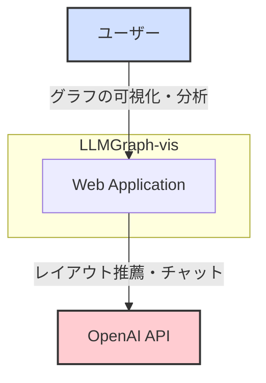
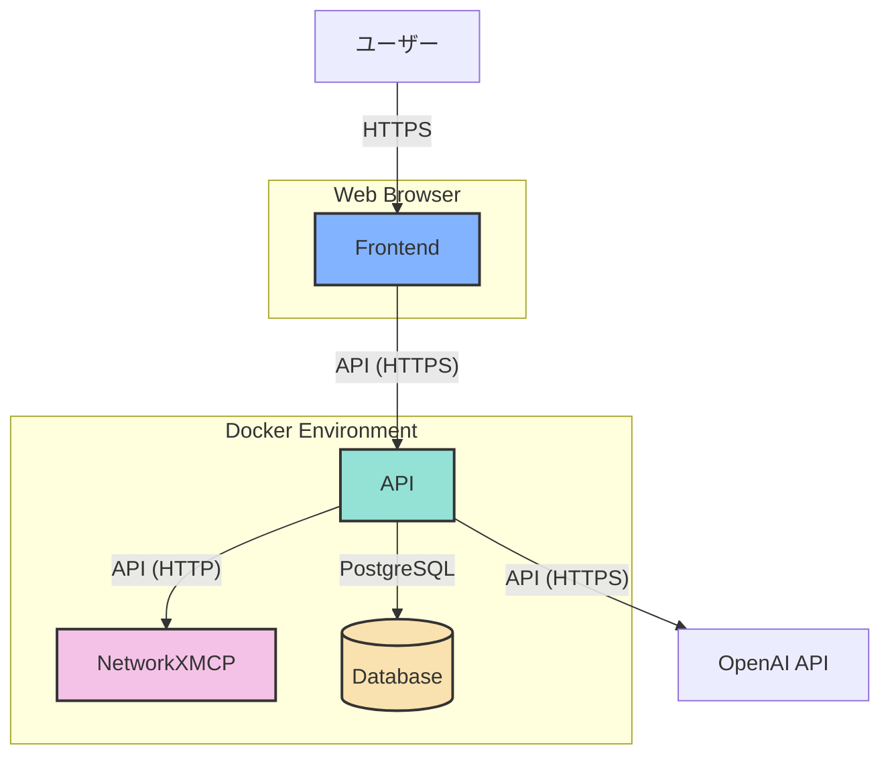
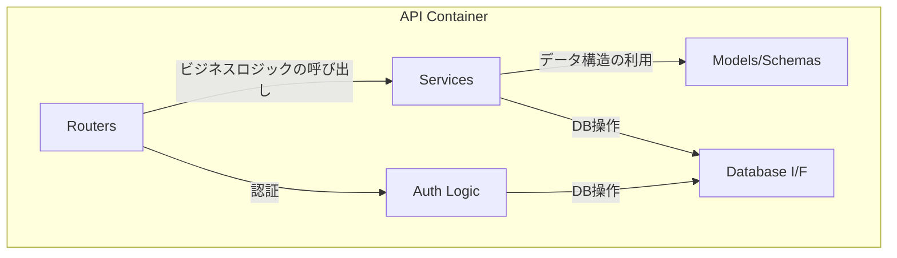
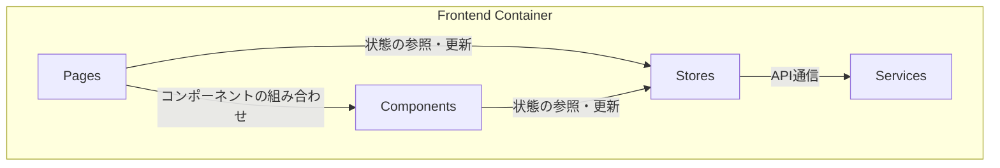
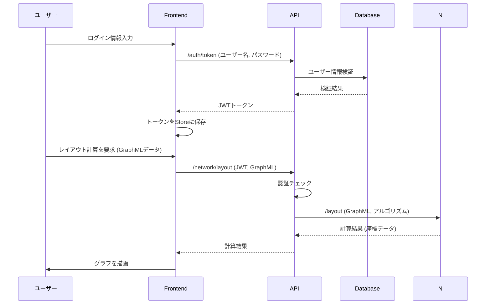

# アーキテクチャ設計

## 1. C4モデル

### 1.1. コンテキスト図 (Context Diagram)

システム全体の概観を示します。ユーザーがどのようにシステムとやり取りし、どの外部システムと連携するかを表します。

| 要素 | 説明 |
|:---|:---|
| **ユーザー** | グラフの可視化や分析を行う研究者や開発者。 |
| **Web Application** | 本システムのコア機能を提供するWebアプリケーション。 |
| **OpenAI API** | グラフのレイアウト推薦やチャット機能のために利用する外部のLLMサービス。 |

### 1.2. コンテナ図 (Container Diagram)

アプリケーションを構成する主要なコンテナ（サービス）と、それらの間のデータの流れを示します。

| コンテナ | 説明 | 技術スタック |
|:---|:---|:---|
| **Frontend** | ユーザーインターフェースを提供し、バックエンドと通信するSPA。 | React, Vite |
| **API** | ビジネスロジック、認証、外部API連携を担当するバックエンド。 | FastAPI, Python |
| **NetworkXMCP** | グラフ計算やレイアウト処理に特化した計算サービス。 | FastAPI, NetworkX, Python |
| **Database** | ユーザー情報やセッションデータを永続化するデータベース。 | PostgreSQL |

## 2. コンポーネント図 (Component Diagram)

各コンテナの内部コンポーネントと責務を示します。

### 2.1. APIコンテナ

| コンポーネント | 説明 |
|:---|:---|
| **Routers** | APIエンドポイントを定義し、リクエストを適切なサービスにルーティングする。 |
| **Services** | ビジネスロジックを実装する。ChatGPT連携やNetworkXMCPの呼び出しなど。 |
| **Models/Schemas** | Pydanticモデルとデータベーススキーマを定義する。 |
| **Database I/F** | SQLAlchemyを使用してデータベースとのやり取りを抽象化する。 |
| **Auth Logic** | OAuth2/JWTによるユーザー認証・認可のロジックを実装する。 |

### 2.2. Frontendコンテナ

| コンポーネント | 説明 |
|:---|:---|
| **Pages** | 各画面（ページ）を構成するコンポーネント。 |
| **Components** | ボタンやナビゲーションバーなど、再利用可能なUI部品。 |
| **Stores** | Zustandを使用してアプリケーション全体の状態（ユーザー情報、グラフデータなど）を管理する。 |
| **Services** | APIクライアントやWebSocket通信など、外部との通信処理をまとめたモジュール。 |

## 3. シーケンス図

### 3.1. ユーザー認証とグラフレイアウト計算

