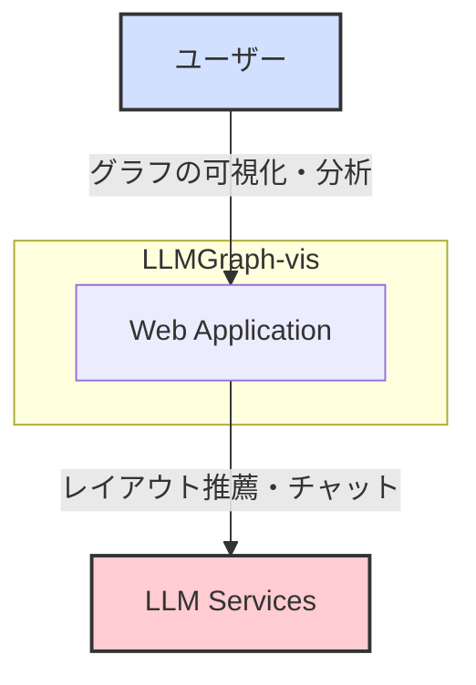
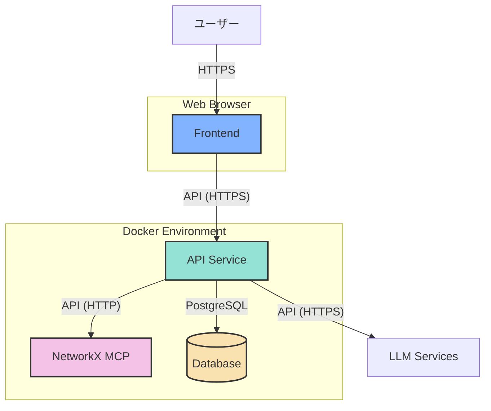
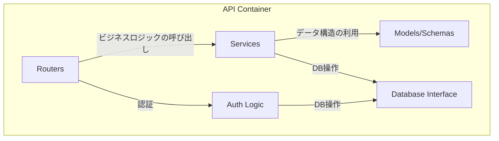
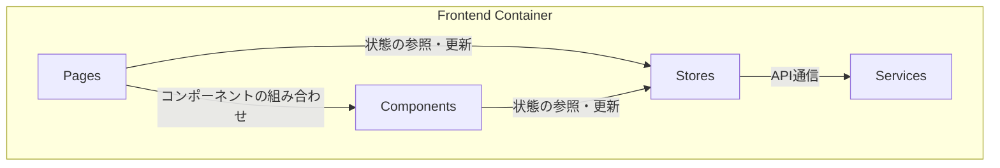
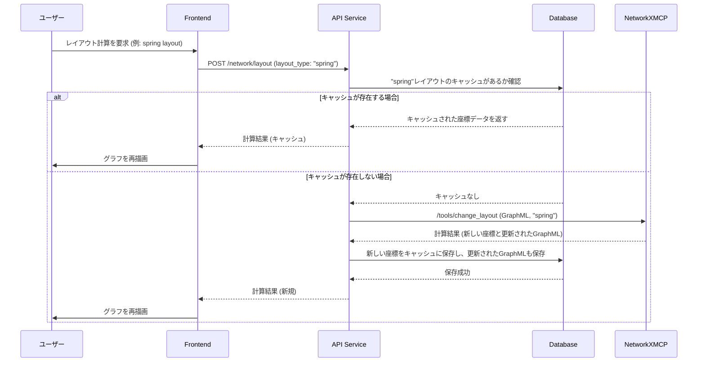
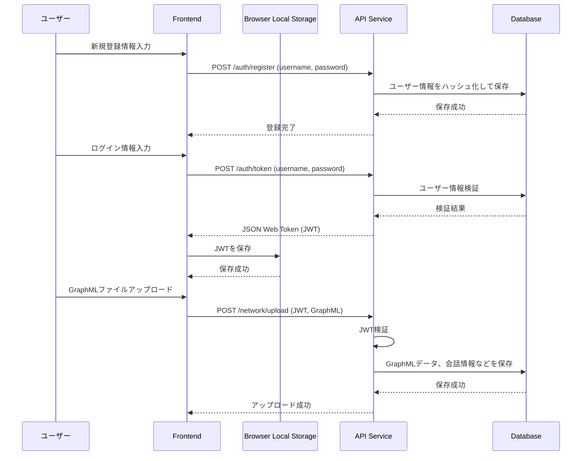
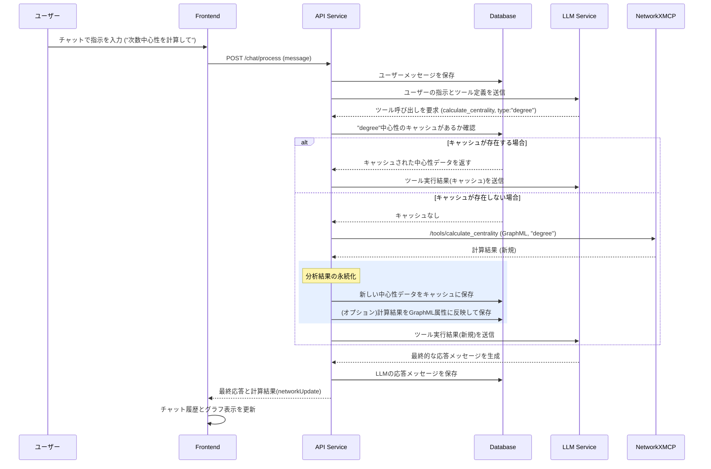
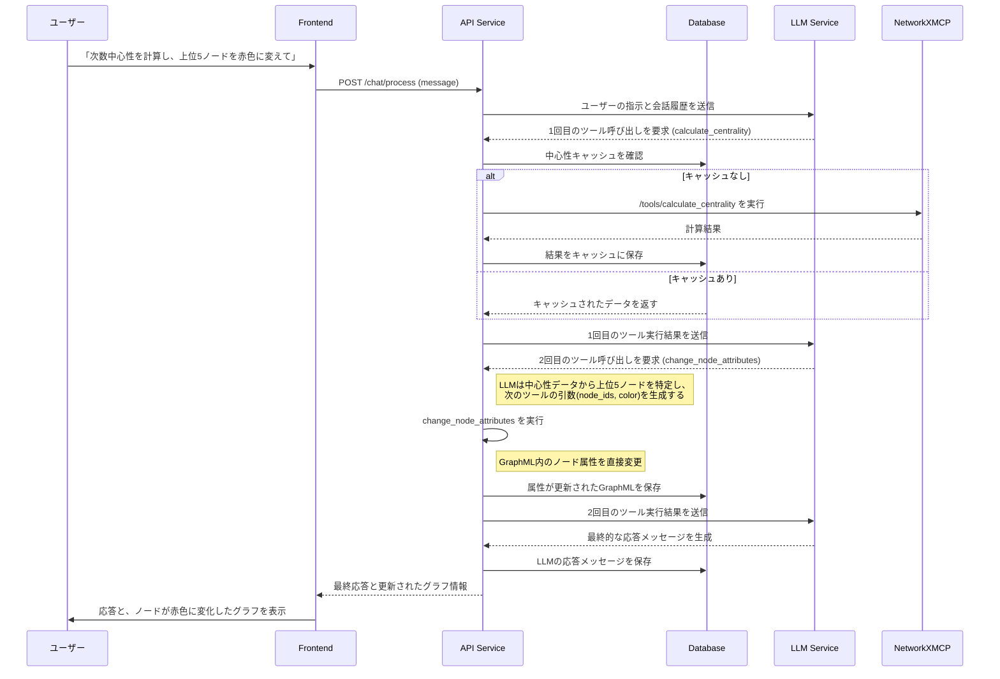

# アーキテクチャ設計

## 1. C4モデル

### 1.1. コンテキスト図 (Context Diagram)

システム全体の概観を示します。ユーザーがどのようにシステムとやり取りし、どの外部システムと連携するかを表します。

| 要素 | 説明 |
|:---|:---|
| **ユーザー** | グラフの可視化や分析を行う研究者や開発者。 |
| **Web Application** | 本システムのコア機能を提供するWebアプリケーション。 |
| **LLM Services** | グラフのレイアウト推薦やチャット機能のために利用する外部の大規模言語モデルサービス。(OpenAI API, Google Geminiなど) |

### 1.2. コンテナ図 (Container Diagram)

アプリケーションを構成する主要なコンテナ（サービス）と、それらの間のデータの流れを示します。

| コンテナ | 説明 | 技術スタック |
|:---|:---|:---|
| **Frontend** | ユーザーインターフェースを提供し、バックエンドと通信するシングルページアプリケーション。 | React, Vite |
| **API Service** | ビジネスロジック、認証、外部API連携を担当するバックエンド。 | FastAPI, Python |
| **NetworkX Model Context Protocol (NetworkXMCP)** | グラフ計算やレイアウト処理に特化した計算サービス。 | FastAPI, NetworkX, Python |
| **Database** | ユーザー情報やセッションデータを永続化するデータベース。 | PostgreSQL |

## 2. コンポーネント図 (Component Diagram)

各コンテナの内部コンポーネントと責務を示します。

### 2.1. APIコンテナ

| コンポーネント | 説明 |
|:---|:---|
| **Routers** | APIエンドポイントを定義し、リクエストを適切なサービスにルーティングする。 |
| **Services** | ビジネスロジックを実装する。LLMサービス連携やNetworkXMCPの呼び出しなど。 |
| **Models/Schemas** | Pydanticモデルとデータベーススキーマを定義する。 |
| **Database Interface** | SQLAlchemyを使用してデータベースとのやり取りを抽象化する。 |
| **Auth Logic** | OAuth2/JSON Web Tokenによるユーザー認証・認可のロジックを実装する。 |

### 2.2. Frontendコンテナ

| コンポーネント | 説明 |
|:---|:---|
| **Pages** | 各画面（ページ）を構成するコンポーネント。 |
| **Components** | ボタンやナビゲーションバーなど、再利用可能なUI部品。 |
| **Stores** | Zustandを使用してアプリケーション全体の状態（ユーザー情報、グラフデータなど）を管理する。 |
| **Services** | APIクライアントなど、外部との通信処理をまとめたモジュール。 |

## 3. データ永続化

本システムにおけるデータの永続化は、以下の2つの仕組みによって実現されています。

- **サーバーサイド (Database)**:
    - **技術**: PostgreSQL
    - **永続化されるデータ**:
        - ユーザーアカウント情報（ハッシュ化されたパスワードを含む）
        - 各ユーザーの会話履歴
        - メッセージ（ユーザーの発言、LLMの応答）
        - GraphMLデータ本体
        - 計算結果のキャッシュ（レイアウト座標、中心性指標など）
    - **役割**: アプリケーションのコアとなるデータを安全に保管し、ユーザーセッションを跨いで状態を維持します。

- **クライアントサイド (Web Browser)**:
    - **技術**: `localStorage`
    - **永続化されるデータ**:
        - 認証用のJSON Web Token (JWT)
    - **役割**: ユーザーがアプリケーションを再訪問した際に、再ログインの手間を省き、シームレスな認証状態を維持します。トークンの有効期限が切れた場合は、再認証が要求されます。

## 4. シーケンス図

### 4.1. レイアウト計算とキャッシュ利用のフロー

ユーザーがレイアウト計算を要求した際の、キャッシュを利用した効率的な処理フローを示します。

### 4.2. データ永続化のフロー

ユーザー登録、ログイン時のJWT保存、ファイルアップロード時のデータ保存といった、クライアントとサーバー双方でのデータ永続化の流れを示します。

### 4.3. チャットによる分析とキャッシュ利用フロー

ユーザーの指示による分析処理において、キャッシュの利用と結果の永続化がどのように行われるかを示します。

### 4.4. 複数ツール呼び出しによる連続処理フロー

一度の指示で複数の分析や操作が必要な場合の、連続的なツール呼び出しフローを示します。

