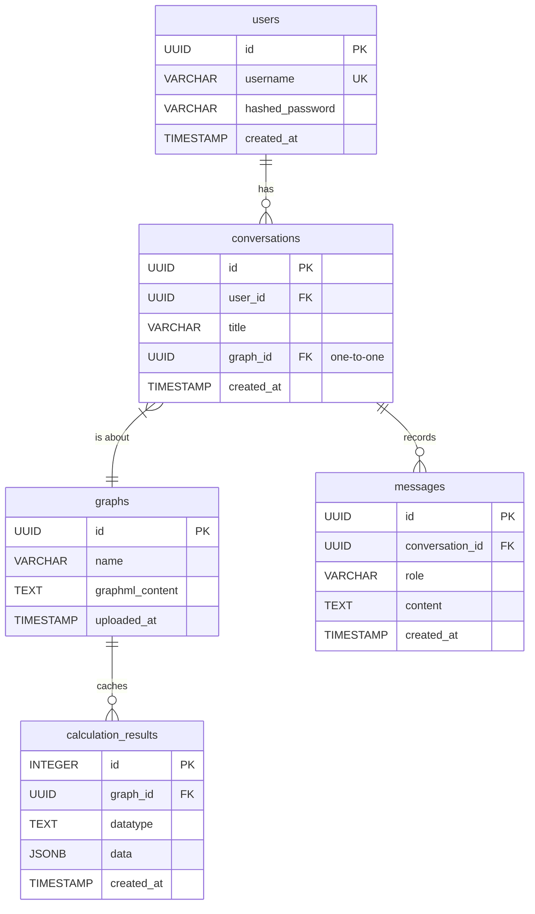

# 4. データベーススキーマ仕様

このドキュメントでは、LLMGraph-visアプリケーションで使用される主要なデータベーススキーマを定義します。

## 4.1. 設計方針の変更

ユーザーからのフィードバックに基づき、データモデルを単純化します。従来の「プロジェクト」という概念を廃止し、「**1つの会話が1つのグラフを扱う**」という、より直感的な1対1の関係を基本構造とします。

## 4.2. ER図



### テーブル定義

| テーブル名 | 説明 |
|:---|:---|
| `users` | アプリケーションのユーザー情報を格納します。 |
| `conversations` | ユーザーが行う個々の分析セッション（会話）を管理します。各会話は必ず1つのグラフに紐付きます。 |
| `graphs` | ユーザーがアップロードしたグラフの元データ（GraphML形式）を格納します。 |
| `messages` | `conversations` に含まれる個々のメッセージ（ユーザーの発言、アシスタントの応答）を時系列で記録します。 |
| `calculation_results` | NetworkX等で計算された中心性指標などの分析結果を永続化するためのキャッシュテーブルです。 |

## 4.3. 計算結果キャッシュ (`calculation_results`)

NetworkX等で計算された中心性指標などの分析結果を永続化するためのテーブルです。高コストな計算の再実行を防ぐことを目的とします。このテーブルの仕様は変更ありません。

### 基本設計方針

- **ハイブリッドモデル**: 柔軟性とパフォーマンスを両立するため、メタデータをリレーショナルカラムで、変動しやすい計算結果を`JSONB`カラムで管理するハイブリッドアプローチを採用します。
- **データ型**: 検索性能と柔軟性に優れた `JSONB` 型を計算結果の格納に使用します。
- **インデックス**: `JSONB` カラムには `GIN` インデックスを作成し、高速な検索を可能にします。

### 推奨スキーマ

```sql
CREATE TABLE calculation_results (
    id SERIAL PRIMARY KEY,
    graph_id UUID NOT NULL,          -- 外部キーとしてgraphsテーブルに関連付け
    datatype TEXT NOT NULL,         -- 'degree_centrality', 'pagerank', 'betweenness_centrality', 'closeness_centrality', 'eigenvector_centrality', 'load_centrality', 'edge_betweenness_centrality', 'clustering', 'transitivity', 'modularity' などの指標名
    data JSONB NOT NULL,            -- 計算結果の本体
    created_at TIMESTAMPTZ DEFAULT NOW(),
    UNIQUE(graph_id, datatype),
    FOREIGN KEY (graph_id) REFERENCES graphs(id)
);

-- 高速な検索のためのGINインデックス
CREATE INDEX idx_gin_calculation_data ON calculation_results USING GIN (data);
```

### `data` カラムのJSONB構造

計算結果は、分析クエリの効率を最大化するため、以下の「オブジェクトの配列」形式で格納します。

- **キーの短縮**: ストレージ効率のため、キーは `"n"` (node) と `"s"` (score) に短縮します。
- **形式**: `[{"n": "node_id", "s": score}, ...]`

#### JSONBデータ格納例

`degree_centrality` の計算結果を格納する場合の例です。

```json
[
  {
    "n": "node_1",
    "s": 0.24
  },
  {
    "n": "node_2",
    "s": 0.16
  },
  {
    "n": "node_3",
    "s": 0.31
  }
]
```

この構造により、スコア (`s`) に基づくフィルタリング、ソート、集計が効率的に行えます。

