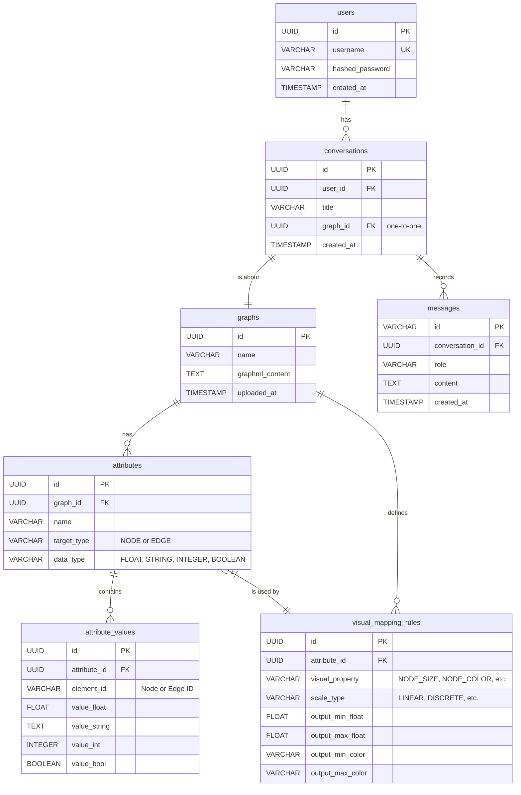

# 4. データベーススキーマ仕様

このドキュメントでは、LLMGraph-visアプリケーションで使用される主要なデータベーススキーマを定義します。

## 4.1. 設計方針の変更

ユーザーからのフィードバックに基づき、データモデルを単純化します。従来の「プロジェクト」という概念を廃止し、「**1つの会話が1つのグラフを扱う**」という、より直感的な1対1の関係を基本構造とします。

## 4.2. ER図



### テーブル定義

| テーブル名 | 説明 |
|:---|:---|
| `users` | アプリケーションのユーザー情報を格納します。 |
| `conversations` | ユーザーが行う個々の分析セッション（会話）を管理します。各会話は必ず1つのグラフに紐付きます。 |
| `graphs` | ユーザーがアップロードしたGraphML形式の元データ、またはNetworkXMCPによって正規化されたGraphMLデータ。 |
| `messages` | `conversations` に含まれる個々のメッセージ（ユーザーの発言、アシスタントの応答）を時系列で記録します。 |
| `attributes` | グラフの属性（列）のメタデータを定義します（例: '次数中心性', 'NODE', 'FLOAT'）。Gephiのデータテーブルの列定義に相当します。 |
| `attribute_values` | `attributes`で定義された各属性の、個々のノード/エッジにおける実際の値を格納します。 |
| `visual_mapping_rules` | どの属性をどの視覚的特徴（ノードサイズ、色など）にマッピングするかのルールを定義します。 |

## 4.3. 属性データ (Attributes & Attribute Values)

グラフの属性（Gephiにおけるデータテーブルの列に相当）とその値を格納します。属性のメタデータ（列名やデータ型）と、実際の値（各ノード/エッジの持つ値）を分離して管理することで、正規化を実現します。

### 4.3.1. `attributes` テーブル

属性のメタデータを定義します。

```sql
CREATE TABLE attributes (
    id UUID PRIMARY KEY,
    graph_id UUID NOT NULL,          -- 外部キーとしてgraphsテーブルに関連付け
    name VARCHAR(255) NOT NULL,     -- 属性名（'degree_centrality', 'component_id'など）
    target_type VARCHAR(50) NOT NULL, -- 'NODE' または 'EDGE'
    data_type VARCHAR(50) NOT NULL,   -- 'FLOAT', 'STRING', 'INTEGER', 'BOOLEAN'
    created_at TIMESTAMPTZ DEFAULT NOW(),
    FOREIGN KEY (graph_id) REFERENCES graphs(id),
    UNIQUE(graph_id, name)
);
```

### 4.3.2. `attribute_values` テーブル

個々のノード/エッジが持つ属性値を格納します。`data_type`に応じて、対応する`value_*`カラムのいずれか一つに値が格納されます。

```sql
CREATE TABLE attribute_values (
    id UUID PRIMARY KEY,
    attribute_id UUID NOT NULL,      -- 外部キーとしてattributesテーブルに関連付け
    element_id VARCHAR(255) NOT NULL, -- 対象となるノードIDまたはエッジID
    value_float FLOAT,
    value_string TEXT,
    value_int INTEGER,
    value_bool BOOLEAN,
    FOREIGN KEY (attribute_id) REFERENCES attributes(id),
    UNIQUE(attribute_id, element_id)
);
```

## 4.4. 視覚マッピングルール (`visual_mapping_rules`)

「どの属性」を「どの視覚的特徴」に「どのようにマッピングするか」というルールを永続化します。このテーブルの定義に基づき、レンダリングデータは動的に生成されます。

```sql
CREATE TABLE visual_mapping_rules (
    id UUID PRIMARY KEY,
    attribute_id UUID NOT NULL,        -- 外部キーとしてattributesテーブルに関連付け
    visual_property VARCHAR(100) NOT NULL, -- 'NODE_SIZE', 'NODE_COLOR', 'EDGE_WIDTH'など
    scale_type VARCHAR(50) NOT NULL,      -- 'LINEAR'（線形）, 'DISCRETE'（離散）, 'PASSTHROUGH'（値の直接利用）など
    
    -- 線形マッピング用の設定
    output_min_float FLOAT,               -- 例: NODE_SIZEの最小値
    output_max_float FLOAT,               -- 例: NODE_SIZEの最大値
    output_min_color VARCHAR(7),          -- 例: NODE_COLORのグラデーション開始色（#RRGGBB）
    output_max_color VARCHAR(7),          -- 例: NODE_COLORのグラデーション終了色（#RRGGBB）

    created_at TIMESTAMPTZ DEFAULT NOW(),
    FOREIGN KEY (attribute_id) REFERENCES attributes(id),
    UNIQUE(attribute_id, visual_property)
);
```

**補足:** `DISCRETE`（離散値）マッピング（例: 特定のカテゴリ文字列を特定の色に割り当てる）を厳密に実装する場合、さらに別のテーブル（`discrete_mapping_pairs`など）が必要になりますが、本仕様ではまず連続値マッピングを主眼に置き、スキーマを単純化しています。

