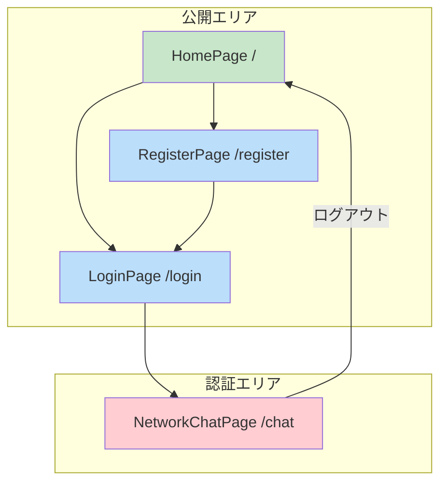

# フロントエンド仕様 (Frontend)

## 1. 概要

React (Vite) で構築されたシングルページアプリケーション (SPA)。主な責務は以下の通り。

- ユーザーインターフェースの提供
- グラフのインタラクティブな可視化 (Cytoscape.js)
- ユーザー入力のハンドリング
- バックエンドAPIとの通信 (Hypertext Transfer Protocolリクエスト)

## 2. 画面一覧と画面遷移

アプリケーションは以下の主要な画面で構成されます。

| 画面 | パス | 認証 | 説明 |
|:---|:---|:---:|:---|
| **HomePage** | `/` | 不要 | アプリケーションのトップページ。ログインや新規登録への導線。 |
| **LoginPage** | `/login` | 不要 | ユーザーがログインするためのフォーム画面。 |
| **RegisterPage** | `/register` | 不要 | 新規ユーザーがアカウントを登録するためのフォーム画面。 |
| **NetworkChatPage** | `/chat` | **必要** | グラフの可視化とチャットUIを統合したメイン画面。グラフ操作、分析、LLMとの対話を行う。初回アクセス時には、操作をすぐに試せるようサンプルネットワークが自動的に表示される。 |

## 3. ディレクトリ構成と主要コンポーネント

`src`ディレクトリは以下の責務で分割されています。

- **`pages/`**: 各画面に対応するトップレベルのコンポーネント。
    - `HomePage.jsx`: ランディングページ。
    - `LoginPage.jsx`: ログインフォームと認証ロジック。
    - `RegisterPage.jsx`: 新規登録フォーム。
    - `NetworkChatPage.jsx`: グラフ表示エリア、チャットウィンドウ、操作パネルなどを組み合わせたメインアプリケーション画面。
- **`components/`**: 複数のページで再利用されるUIコンポーネント。
    - `Navbar.jsx`: 全ページ共通のナビゲーションバー。認証状態に応じて表示を切り替える。
    - `ProtectedRoute.jsx`: 認証が必要なルートを保護するラッパーコンポーネント。未認証の場合はログインページにリダイレクトする。
    - `FileUploadButton.jsx`: GraphMLファイルをアップロードするためのボタンコンポーネント。
- **`services/`**: API通信、状態管理など、UIから分離されたロジック。

## 4. 状態管理とデータ永続化

### 4.1. 状態管理 (Zustand)
アプリケーション全体の状態はZustandを用いて管理されています。状態は機能ごとにストアに分割されています。

- **`authStore.js`**: ユーザーの認証状態、アクセストークン、ユーザー情報を管理する。
    - `login`, `register`, `logout`, `checkAuth`などのアクションを提供。
- **`networkStore.js`**: 現在表示しているネットワークの状態を管理する。
    - グラフデータ (Cytoscape形式)、レイアウト情報、ノードやエッジの選択状態などを保持。
    - `fetchNetwork`, `calculateLayout`などのアクションを提供。
- **`chatStore.js`**: チャットの状態を管理する。
    - 会話の履歴、メッセージ一覧、LLMの応答状態などを保持。
    - `sendMessage`, `fetchHistory`などのアクションを提供。

### 4.2. データ永続化 (Client-Side)
- **技術**: ブラウザの `localStorage`。
- **永続化されるデータ**: 認証用のJSON Web Token (JWT)。
- **目的**: ユーザーがブラウザをリロードしたり、再訪問したりした際に、ログイン状態を維持するため。`authStore`はアプリケーションの初期化時に`localStorage`からトークンを読み込み、認証状態を復元します。

## 5. API連携

### 5.1. APIクライアント (`services/api.js`)

- `axios`をベースにしたAPIクライアント。
- 全てのリクエストに`Authorization: Bearer {token}`ヘッダーを自動的に付与するインターセプターを持つ。
- トークンが失効している場合、自動的にリフレッシュするか、ログインページにリダイレクトする処理も担う。