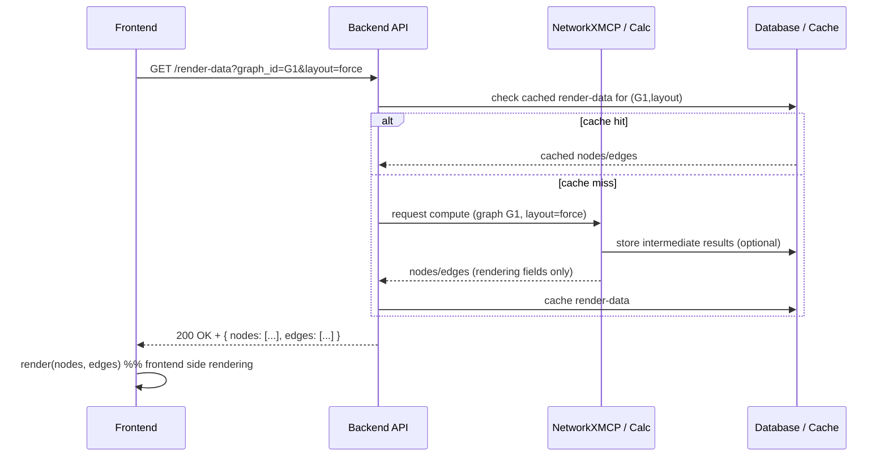

## レンダリング用データ生成フロー（シーケンス図）

次は、フロントエンドでグラフを描画するためにAPIが返す「描画に必要な最小データ」を生成して配信する流れをシーケンス図で表したものです。

### 契約（入力／出力）

- 入力: フロントエンドからのレンダリング要求（例: graph_id, layout 指定, フィルタ条件）
- 出力: フロントエンドがそのまま描画できる JSON ペイロード（nodes, edges の配列）。描画に不要な内部メタデータは含めない。
- エラー: 不整合や未計算のキャッシュなどは 4xx/5xx と簡潔なメッセージで返却。

### シーケンス図 (Mermaid)



### 説明（要点）

- Backend API はフロントからの要求に対し、まずキャッシュ/DB を確認します。
- キャッシュがなければ、NetworkXMCP 等の計算エンジンにレイアウトやスタイル決定を依頼し、描画に必要な最小フィールドのみを含む JSON を受け取ります。
- Backend はその最小データをフロントに返します。フロントは受け取ったデータに忠実に描画します（追加のサーバ側ロジックを前提にしない）。

### レスポンス仕様（例）

レスポンスは JSON オブジェクトで、必ず `nodes` と `edges` を含みます。サンプル:

```json
{
  "nodes": [
    {
      "id": "n1",
      "position": { "x": 120.5, "y": 300.2 },
      "label": "Node 1",
      "style": {
        "size": 18,
        "color": "#4A90E2",
        "borderColor": "#0F172A",
        "borderWidth": 2
      }
    },
    {
      "id": "n2",
      "position": { "x": 240.0, "y": 180.7 },
      "label": "Node 2",
      "style": {
        "size": 14,
        "color": "#F5A623",
        "borderColor": "#8A5A00",
        "borderWidth": 1
      }
    }
  ],
  "edges": [
    {
      "id": "e1",
      "source": "n1",
      "target": "n2",
      "label": "relates to",
      "style": { "color": "#888888", "width": 2 }
    }
  ]
}
```

注記:

- ここに含めるフィールドはあくまで「描画に必要なものだけ」。解析用のスコアや長いメタデータは含めないでください（代わりに必要なら別 API を用意）。
- `position` はサーバ側でレイアウトを計算して決定する場合と、フロント側で力学シミュレーションを行う場合の両方に対応できる形にしておきます（両方を返す場合はサーバの `position` を初期配置として扱うこと）。

### API 実装上の注意

- 返却サイズ: 大規模グラフではページングや篩い（filtering）を必ずサポートすること。
- 一貫性: ノード/エッジの id はフロントが直接使うことを想定して一意で固定可能な文字列推奨。
- バージョニング: レンダリングフィールドを拡張する際は API バージョンを上げるか、`renderSchemaVersion` を返して互換性を保つ。

### フロント側の描画ルール（短く）

- フロントは受け取った `style` を優先して適用する。未定義のプロパティはフロント側のデフォルトにフォールバックする。
- 位置がないノードはフロントでレイアウトを実行して描画する。

以上が、描画のためのデータ生成フローと最小ペイロードの設計指針です。
