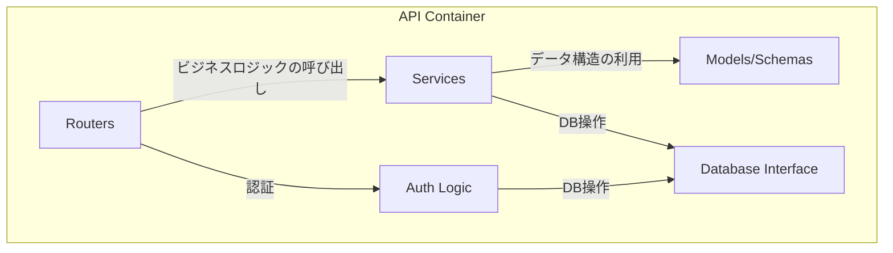

# 2.1. バックエンド仕様 (API)

FastAPIで構築されたバックエンドAPI。主な責務は、認証、ビジネスロジックの実行、外部サービス連携です。

## コンポーネント図

| コンポーネント | 説明 |
|:---|:---|
| **Routers** | APIエンドポイントを定義し、リクエストを適切なサービスにルーティングする。 |
| **Services** | ビジネスロジックを実装する。LLMサービス連携やNetworkXMCPの呼び出しなど。 |
| **Models/Schemas** | Pydanticモデルとデータベーススキーマを定義する。 |
| **Database Interface** | SQLAlchemyを使用してデータベースとのやり取りを抽象化する。 |
| **Auth Logic** | OAuth2/JSON Web Tokenによるユーザー認証・認可のロジックを実装する。 |

## APIエンドポイント一覧

### 認証 (`/auth`)

| Method | Path | 説明 |
|:---|:---|:---|
| `POST` | `/register` | 新規ユーザーを登録する。 |
| `POST` | `/token` | ユーザー名とパスワードで認証し、JWTアクセストークンを発行する。 |
| `GET` | `/users/me` | 現在認証中のユーザー情報を取得する。 |

### チャット・LLM連携 (`/chat`)

| Method | Path | 説明 |
|:---|:---|:---|
| `POST` | `/conversations` | 新しい会話を作成する。 |
| `GET` | `/conversations` | ユーザーの会話一覧を取得する。 |
| `GET` | `/conversations/{id}` | 特定の会話の詳細を取得する。 |
| `GET` | `/conversations/{id}/messages` | 特定の会話のメッセージ一覧を取得する。 |
| `POST` | `/process` | チャットUIからのメッセージを同期的に処理し、LLMやツール呼び出しを実行して最終結果を返す。 |
| `POST` | `/recommend-layout` | ネットワーク概要に基づき、LLMが最適なレイアウトを推薦する。 |

### ネットワーク (`/network`)

| Method | Path | 説明 |
|:---|:---|:---|
| `POST` | `/upload` | GraphMLファイルをアップロードし、新しい会話とネットワークを作成する。 |
| `GET` | `/{network_id}/visdata` | ネットワークを可視化ライブラリ（Cytoscape.js, D3.jsなど）で描画可能な汎用JSON形式で取得する。 |
| `POST` | `/{network_id}/layout` | `NetworkXMCP`を呼び出してレイアウトを計算・適用する。 |
| `GET` | `/{network_id}/export` | ネットワークをGraphMLファイルとしてダウンロードする。 |

## 主要なデータモデル

- **`User`**: ユーザー情報 (`id`, `username`)
- **`Token`**: JWTアクセストークン (`access_token`, `token_type`)
- **`Conversation`**: 会話セッション (`id`, `title`, `user_id`)
- **`ChatMessage`**: 会話内のメッセージ (`id`, `content`, `role`)
- **`Network`**: グラフデータ (`id`, `name`, `graphml_content`, `layout_cache`, `centrality_cache`)

## 外部サービス連携

- **NetworkXMCP**: グラフ計算が必要なリクエストを `http://networkx-mcp:8001` に転送（プロキシ）します。
- **LLMサービス**: ユーザーの指示解釈、ツールコール変換、結果の要約のために外部LLM（OpenAI, Gemini等）のAPIを呼び出します。
